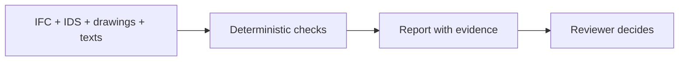

<!-- claims-lint: allow-file reason="Claims-boundary doc citing forbidden phrases as non-claims per pilot-claim-boundary / Claims Lock" -->
<p align="center">
  
  <br><br>
  <b>Presentation · 7 slides</b>
  <br><br>
  <a href="submission/03-presentation/AeroBIM.pptx"></a>
  &nbsp;
  <a href="submission/03-presentation/AeroBIM.pdf"></a>
  <br><br>
  <a href="submission/03-presentation/demo_day_slides.md"><b>Slide text</b></a>
  <br><br>
  <b>Full deck · 43 slides</b>
  <br><br>
  <a href="submission/03-presentation/AeroBIM-full.pptx"></a>
  &nbsp;
  <a href="submission/03-presentation/AeroBIM-full.pdf"></a>
  <br><br>
  <a href="submission/03-presentation/AeroBIM-full.md"><b>Full deck text</b></a>
</p>

# AeroBIM

[Русская версия](README.md)

[](https://github.com/KonkovDV/AeroBIM/actions/workflows/ci.yml)
[](docs/pilot-claim-boundary-2026.md)
[](docs/pilot-claim-boundary-2026.md)
[](https://www.python.org/downloads/)
[](LICENSE)

The green badge is Checkpoint `GO`: the regulatory-measurement MVP; code and fixture packs run. The red badge is appointing-party sign-off still ahead (`customer_go` false).

**AeroBIM** checks a design/working pack against itself: model, sheet, schedule, brief and calculation. Each file can open cleanly on its own. The defect lives in the seam and usually surfaces on site.

A finding carries a clause, a storey or grid, and a GUID. The pack’s final status is set by an expert. Output is HTML, JSON, PDF, and a BCF file.

Three shelves in the process.

| Shelf | What it does | Boundary |
|---|---|---|
| CDE (10D, Pilot-BIM, Sarex) | Presence, route, versions | Does not cross-check file contents |
| Model checker (Tangl, Solibri) | Model, attributes, clashes in the authoring environment | Does not compare the model with the schedule, note and calculation |
| **Pack gateway (AeroBIM)** | Cross-file consistency; acceptance profile is IDS | Does not replace the two shelves above |

It operates on the **seam between files**.

**What a finding looks like.** Demo case: cover 30 mm in the model, 40 mm on the sheet — 10 mm gap. The deterministic layer does the compare. The card traces to the requirement, GUID and sheet row. A person decides. Export is a BCF 2.1/3.0 file.

## For the jury

Moscow TechLab programme, commission № 7: automated verification of design and working documentation (the appointing party is unnamed in the public tree). Demo-day: 21 September 2026. Self-assessed TRL 4 under GOST R 58048.

> We are in *refinement* on the customer contour. One command shows a fail-closed finding on a fixture. Effectiveness validation and deployment have not started. Checkpoint `GO` is the regulatory-measurement MVP. `customer_go` stays false until an independent labeled pack, two raters, a signed appointing-party profile, and CDE proof.

The show is seven slides: [`AeroBIM.pptx`](submission/03-presentation/AeroBIM.pptx) · [`AeroBIM.pdf`](submission/03-presentation/AeroBIM.pdf) · [slide text](submission/03-presentation/demo_day_slides.md). The 43-slide file is an appendix above the buttons, not the show. Live command: `run-jury.bat` or `./run-jury.sh` from the clone root, or `python -m aerobim.tools.run_kt3_jury` from `backend/`.

| Slide | On the deck | In the repo |
|---|---|---|
| 1 | Pack gateway, commission № 7 | This README |
| 2 | Two engineers, roles | [slide 2](submission/03-presentation/demo_day_slides.md#kadr-2) |
| 3 | Pack seam; fixture numbers; pilot hypothesis | [0.86 / 10/10 / 1/8](submission/05-additional/README.md) |
| 4 | Teaching node 30/40 mm → BCF | Illustration on the slide. Live CLI finds planted git-fixture defects, not that node: [prototype](submission/04-prototype/README.md) |
| 5 | Deterministic core; AI does not write the outcome | [ADR-001](docs/architecture/ADR-001-verdict-ownership-2026.md) · [ingest boundary](docs/tz/NATIVE_AUTODESK_INGEST_BOUNDARY_2026.md) |
| 6 | Eight weeks; pilot GO ≠ Checkpoint `GO` | [claim boundary](docs/pilot-claim-boundary-2026.md) · [slide 6](submission/03-presentation/demo_day_slides.md#kadr-6) |
| 7 | Mail and GitHub | PPTX slide 7; phone only there |

| | |
|---|---|
| **Form pack** | [`submission/README.md`](submission/README.md) — five fields |
| **Claim boundary** | [document](docs/pilot-claim-boundary-2026.md) |

### Ask

A paid programme pilot, 2 million ₽, one building, eight weeks from the agreement. By letter: one-revision pack with IFC, an expert validator, data mode and a target-KPI sheet. The aim is minus one pack-review cycle and a revision delta in the appointing party’s CDE.

From 2 April 2026 Moscow requires an AGR CIM in IFC (Moscow Government decree № 17-ПП of 16 January 2026; joint DIT/DGP order № ДГП-Р-1/26/64-16-6/26). From 18 August 2026 joint DGP/DIT order № ДГП-Р-56/26/64-16-473/26 updates 3D-model parameters in Moscow information systems — that is not AeroBIM ingest. Those are **city filing rules**. AeroBIM ingest is IFC.

## Five seats

Two seats are the programme operator; three are the partner by agreement.

| Seat | Role | Where to look |
|---|---|---|
| **Piloting** (operator) | Live run on the fixture pack. Trial programme, method and act are the pilot subject | [prototype](submission/04-prototype/README.md) |
| **Demand** (operator) | No contour rollout: web and file exchange. Pay-on-findings is a speech plan, not the written Ask | [Ask](#ask) · [slide 6](submission/03-presentation/demo_day_slides.md#kadr-6) |
| **Appointing technical customer** (partner) | Minus one pack-review cycle. Revision delta: findings → fixed / ignored / new. HITL | [slide 6](submission/03-presentation/demo_day_slides.md#kadr-6) |
| **Project office** (partner) | The remark leaves as a BCF file (structural ZIP; CDE import is the pilot). The expert sets the outcome | [ADR-001](docs/architecture/ADR-001-verdict-ownership-2026.md) |
| **Information modelling** (partner) | Document seam. Ingest is IFC | [ingest boundary](docs/tz/NATIVE_AUTODESK_INGEST_BOUNDARY_2026.md) |

Protocol on the fixture pack. A deterministic report after an agreed revision.

## What the clone accepts

| | |
|---|---|
| Ingest | IFC 2x3 / 4 / 4x3, IDS 1.0, PDF vector/raster, specification text |
| Cross-check | Deterministic IFC + IDS + cross-document compare (configured ε-band) |
| Workplace | 3D review shell (Vite), RU/EN templates, HITL. Sheet-error highlight is a pilot item, not the expert UI |
| Report | HTML + JSON + PDF + structural BCF 2.1 / 3.0 ZIP |
| Verdict | `summary.passed` is a Shared-gate. LLM/VLM never write it ([ADR-001](docs/architecture/ADR-001-verdict-ownership-2026.md)) |

An unfinished mandatory check cannot yield a positive pack result.

## Status

| | |
|---|---|
| **Runs on this clone** | Fixture packs, fail-closed IDS, CLI, CI, structural BCF, review shell. Sheet-error highlight is a pilot item |
| **Pilot subject** | Dual human raters + pack-specific conclusions (RT-001b) · appointing-party-signed profile (RT-002c) · system-aware clash (**RT-003c**) · customer federated IFC (`c_customer_federated_ifc`) · BCF import into the appointing party’s CDE |

## Try it

Python 3.12 and a venv in `backend/.venv`. The live jury CLI does **not** need Node. The review shell needs Node 20+ and npm. Keep the quotes around `".[dev,raster]"` in PowerShell.

**Windows (PowerShell).** If ExecutionPolicy blocks `Activate.ps1`, skip activation and call `python.exe` directly.

```powershell
git clone https://github.com/KonkovDV/AeroBIM.git
cd AeroBIM\backend
py -3.12 -m venv .venv
.\.venv\Scripts\python.exe -m pip install -e ".[dev,raster]"
.\.venv\Scripts\python.exe -m aerobim.tools.run_kt3_jury
```

Or double-click `run-jury.bat` at the **clone root** (quotes around the extra are inside the file; Node is not required). Do not run `python -m aerobim...` with the system interpreter — the package will be missing. Diagnostics: `.\check-launch.bat`.

`summary.passed=false` on the fixture pack is the expected fail. Do not set `AEROBIM_SIGNOFF_PROFILE=customer_pilot` on a first clone. `requirements-lock.txt` is the Linux/CI lock — do not install it on Windows.

**Linux / macOS**

```bash
git clone https://github.com/KonkovDV/AeroBIM.git
cd AeroBIM/backend

python3.12 -m venv .venv
source .venv/bin/activate
pip install -e ".[dev,raster]"
```

The live CLI is in `backend/`. The fixture pack contains planted defects; the command finds them (`summary.passed=false`). Or from the clone root: `./run-jury.sh`.

```bash
python -m aerobim.tools.run_kt3_jury
python -m aerobim.tools.run_demo_ifc_acceptance_gate
python -m aerobim.tools.run_demo_vertical_slice

pytest tests -q
python -m aerobim.main   # http://127.0.0.1:8080/health
```

Start the review shell **from the clone root** (not from `frontend/`). FastAPI at `http://127.0.0.1:8080`, Vite/React at `http://127.0.0.1:5173`. The UI never writes `summary.passed`. You need `backend/.venv` already created and Node 20+.

- Linux/macOS: `./start.sh`
- Windows PowerShell: `.\start.bat` (the leading `.\` is required; bare `start` is Start-Process and will ask for FilePath)
- from `backend/`: `python -m aerobim.tools.run_review_stand`

If 8080 or 5173 is already bound, stop leftover Docker (`aerobim-backend`) or the previous `.\start.bat` and retry. Details: [`frontend/README.md`](frontend/README.md). Closed contour without pip: Docker image, not a bare wheelhouse — [`docs/offline-deployment-2026.md`](docs/offline-deployment-2026.md). pip TLS errors are a site proxy issue, not a wheelhouse recipe.

Optional extras `.[clash]`, `.[docling]`, `.[enterprise]`, `.[pdf-agpl]` are not needed for the commands above.

If `py -3.12` is missing, install CPython 3.12 from python.org — not the Microsoft Store stub. Do not type bare `py`: the launcher may pick 3.13. Use `git clone`, not the GitHub ZIP. If IfcOpenShell fails to import on Windows, install the Microsoft VC++ 2015-2022 x64 redistributable. Diagnostics: `.\check-launch.bat` from the clone root (not `python -m aerobim.tools.check_local_launch` without the venv). Doctor warnings do not stop the jury CLI; a fatal (exit 2) does. Clone into a short Latin path (`C:\AeroBIM`), not a user profile with non-ASCII characters.

<details>
<summary>uv, hashed Windows lock, Dev Container, closed contour</summary>

**uv** is faster when it is already on PATH. The attested first clone without uv remains `python.exe -m pip` above.

```powershell
cd AeroBIM\backend
uv venv --python 3.12
uv pip install -e ".[dev,raster]"
.\.venv\Scripts\python.exe -m aerobim.tools.run_kt3_jury
```

Hashed Windows deps (online, not air-gap): [`backend/requirements-win-lock.txt`](backend/requirements-win-lock.txt), then `.\.venv\Scripts\python.exe -m pip install -e . --no-deps`. Do not install the Linux [`requirements-lock.txt`](backend/requirements-lock.txt) on Windows (`uvloop`). This is not a wheelhouse.

Closed contour without pip is the Docker image: [`docs/offline-deployment-2026.md`](docs/offline-deployment-2026.md). `install_offline.ps1` loads the tar, not a lock.

Dev Container / Codespaces is a contributor environment, not the jury CLI: [`.devcontainer/`](.devcontainer/). Python 3.12, Node 22, `.[dev,raster]`. Do not set `customer_pilot`.
</details>

## What a run does



<details>
<summary>Model, rules, documents, report</summary>

1. **The model.** Properties and quantities are validated with IfcOpenShell. IFC2x3 (buildingSMART schema; no ISO publication), IFC4 ADD2 (ISO 16739-1:2018) and IFC4x3 (ISO 16739-1:2024) go through one kernel. ISO/PAS 16739:2005 is the IFC2x Platform, not IFC2x3. Where property-set names diverge between releases, the difference is a `ValidationIssue`, not a silent skip. Per-feature rules: [`docs/ifc-compatibility-matrix.md`](docs/ifc-compatibility-matrix.md).
2. **The rules.** IDS 1.0 is validated with IfcTester. Official rule sets from Moscow Region State Expertise and SPb GAU CGE (CIM OKS ed. 3.1.0 + CIM RII ed. 1.1.0) ship in `samples/`; the CGE profile ([`samples/profiles/spb-cge/`](samples/profiles/spb-cge/)) is a published rule set, not a customer-signed acceptance profile. CI checks the committed profile. A requested rule set that cannot load fails the check.
3. **The other documents.** The model is compared with drawing notes, specifications and calculation texts, with a configured ε-band and Russian/European grouped decimals. Sources are compared; the calculation is not recomputed.
4. **The report.** Each finding carries `finding_id`, `source_id` and `evidence_refs` (persistence refuses a finding without them). People get HTML; machines get JSON; issue exchange gets a structural BCF 2.1 / 3.0 ZIP. The browser review shell (web-ifc + Three.js) shows the IFC in 3D. Drawing overlay is a fixture CLI, not the expert UI.

`summary.passed` is assembled from deterministic errors and the capability table ([ADR-001](docs/architecture/ADR-001-verdict-ownership-2026.md)). Advisory LLM/VLM text, if enabled, drafts remark wording only and never writes that flag; under customer sign-off profiles outbound advisory calls are forbidden. Every optional engine reports `ok`, `skipped` or `failed`; any `FAILED` forces `summary.passed=false`. The same boundary is served on `GET /v1/system/capabilities`. That flag is a Shared-gate under configured rules.

</details>

## Checkpoint: `GO` (`regulatory_measurement_mvp`)

Checkpoint is the **regulatory-measurement MVP**. `customer_go` stays **false**. Code and fixtures work. Public rule sets and fixture packs stand in until the appointing-party pack is in. Undifferentiated `closes_rt001/002/003` stay false.

<details>
<summary>RT-001 · RT-002 · RT-003 — closed on the clone / pilot subject</summary>

| ID | Now | Pilot |
|---|---|---|
| **RT-001** | `a_content_pairing` **CLOSED** (**RT-001a**) — RF expertise typical-error catalogs + public examination IDS + fixture pack. `b_protocol_rehearsal` **CLOSED** — two simulated independent passes on the same fixture pack, κ/α/AC1 on the simulation | `b_criterion_dual_rater` **OPEN** (**RT-001b**) (two humans + conclusions on the *same* pack). `c_customer_corpus` **OPEN**. Simulation is not two people |
| **RT-002** | `a_regulatory` **CLOSED** (**RT-002a**) — public IDS (Moscow Region State Expertise, SPb GAU CGE, city AGR) as the measurement ruler. `b_eir_carrier` **CLOSED** (**RT-002b**) — EIR v4.0 workbook + BIM-standard v4.0 present as **text** on the channel pack. Public examination IDS is not the appointing-party EIR | `c_corporate_signed` **OPEN** (**RT-002c**; `b_corporate` stays OPEN) — the appointing party signature / `customer_approved` IDS |
| **RT-003** | `a_federated_geometric_rehearsal` **CLOSED** (**RT-003a**) — planted IfcClash (crossing walls; pipe vs wall). `b_navis_federation_carrier` **CLOSED** — three NWD federations on the channel pack. `b_ifc_system_graph_rehearsal` **CLOSED** (**RT-003b**) — sample HVAC `IfcSystem` graph (two systems, `IfcRelAssignsToGroup`); not pipe vs wall | `b_mep_system_clash` **OPEN** (**RT-003c**, `NOT_VERIFIED`) — 0 duct/pipe/cable on customer IFC; EIR names OV/VK/ITP/EOM/SS LOD, models absent. `c_customer_federated_ifc` **OPEN** |

BCF ZIP export is structural. Import into an independent CDE is **NOT_VERIFIED**. Ingest is IFC.

GOST R 21.101-2026 (Rosstandart order № 129-ст of 12 February 2026; **in force 1 April 2026**, replacing 21.101-2020), clause 8.2.4: GUID is the identifier of an electronic design document in the pack. AeroBIM addresses findings to a GUID. The standard’s in-force date (1 April) is not the Moscow AGR IFC filing date (2 April).

</details>

## Clone capabilities

<details>
<summary>On fixture packs</summary>

- IFC property and quantity validation; IDS 1.0 fails if the rule set cannot load
- Cross-document contradictions and drawing notes vs IFC
- Configured ε-band (SI-normalised); deterministic requirement extraction from narrative text; advisory LLM does not sign anything off
- Every check reports `ok` / `skipped` / `failed`; tenant/object ACL on artifacts under `customer_pilot` / `production` (off by default in development); HTML/JSON; PDF; structural BCF 2.1 / 3.0 ZIP
- PDF via pypdfium2 + pdfminer; default `AEROBIM_PDF_BACKEND=pdfium`
- Browser IFC viewer. Drawing overlay is a fixture CLI, not the expert workplace
- Norm rule packs (a fixture pack is not a customer-signed profile) and an opt-in completeness inventory
- Quality measurement protocol (Wilson intervals, sample-size planner)

Optional: geometry clash `.[clash]`; OCR `.[raster]`; PyMuPDF `pdf-agpl`; advisory LLM/VLM drafts (never write `summary.passed`); OpenCDE BCF push (experimental; not CDE import proof); DXF via ezdxf.

</details>

## HTTP API

<details>
<summary>Local <code>python -m aerobim.main</code></summary>

`GET /health` is unauthenticated. `/v1/*` requires `AEROBIM_API_BEARER_TOKEN` unless `AEROBIM_ALLOW_ANONYMOUS_DEV=true` (development only).

| Method | Path | Purpose |
|---|---|---|
| `GET` | `/health` | Readiness |
| `GET` | `/v1/auth/bff` | Auth discovery. Default **501**. Lab `200 LAB` is not customer SSO |
| `GET` | `/v1/system/capabilities` | Capability boundary |
| `POST` | `/v1/uploads` | Multipart ingest |
| `POST` | `/v1/validate/ifc` | Validate IFC against requirements and IDS |
| `POST` | `/v1/analyze/project-package` | Full package analysis |
| `POST` | `/v1/analyze/project-package/submit` | Queue a larger package in Redis for the dedicated `aerobim.worker` |
| `GET` | `/v1/analyze/project-package/jobs/{job_id}` | Poll a background job |
| `POST` | `/v1/analyze/project-package/jobs/{job_id}/cancel` | Cancel |
| `GET` | `/v1/reports` | List persisted reports |
| `GET` | `/v1/reports/{id}` | Fetch one report |
| `GET` | `/v1/reports/{id}/coverage` | Check coverage map |
| `GET` | `/v1/reports/{id}/revision-diff` | Finding delta; `no_longer_reported` does not mean resolved |
| `GET` | `/v1/reports/{id}/export/{json,html,pdf,bcf}` | Export; `?version=3` switches BCF 3.0 |
| `POST` | `/v1/reports/{id}/review-events` | Append reviewer HITL; never changes `summary.passed` |
| `GET` | `/v1/reports/{id}/review-events` | HITL history |
| `GET` | `/v1/reports/{id}/review-kpi` | Triage summary (not cycle-days in a CDE) |

Package analysis optionally accepts an OpenRebar reinforcement report with a SHA-256 provenance digest. This compares declared sources; it does not recompute anything. OpenCDE `POST .../export/bcf-api/push` is an experimental hub push, not proof of import into the customer CDE.

</details>

## Architecture

**48 domain Protocol ports** wire to **77 infrastructure adapter modules** through **63 DI tokens** in `bootstrap_container()`. Counts: [`docs/evidence/runtime-baseline-latest.json`](docs/evidence/runtime-baseline-latest.json).

<details>
<summary>Layers and storage</summary>

Five layers, dependencies pointing inward only:

```
core/            DI container, tokens, configuration
domain/          Immutable models, Protocol ports, logging contract
application/     Requirement assembly, contradiction detection
infrastructure/  IfcOpenShell, IfcTester, BCF, storage; IfcClash and Docling are optional extras
presentation/    FastAPI
```

Artifacts sit behind an `ObjectStore` port: a local disk or an S3-compatible bucket. That is one port and two adapters. Report summaries are indexed in Postgres when `AEROBIM_DB_URL` is set.

</details>

## Configuration

A local clone runs on defaults. CI checks the table against `settings.py` both ways.

<details>
<summary>Full <code>AEROBIM_*</code> table</summary>

| Variable | Default | Description |
|---|---|---|
| `AEROBIM_HOST` | `127.0.0.1` | Bind address |
| `AEROBIM_PORT` | `8080` | Bind port |
| `AEROBIM_DEBUG` | `false` | Debug mode (also enables localhost CORS defaults when origins unset) |
| `AEROBIM_STORAGE_DIR` | `var/reports` | Report persistence directory |
| `AEROBIM_CORS_ORIGINS` | *(auto)* | Comma-separated CORS origins |
| `AEROBIM_CORS_ALLOW_CREDENTIALS` | *(auto)* | `true` in development/test for a finite origin list; `customer_pilot`/`production` require explicit `true` |
| `AEROBIM_ENV` | `development` | Environment name; non-dev requires bearer/OIDC (fail-closed) |
| `AEROBIM_SIGNOFF_PROFILE` | *(auto)* | `customer_pilot` and `production` are closed customer contours: capabilities fail closed and outbound advisory LLM calls are forbidden. `customer_pilot_demo` and `moscow_agr_2026` are **honest-scope** contours (development/test only): clash/MEP/bSI-submit stay out of scope (honest SKIPPED, not faked); FAILED engines still block; LLM egress still forbidden. `moscow_agr_2026` cites DGP-R-1/26 CIM AGR, not demo convenience, and does not close RT-003 or the appointing party RT-002. Unset outside development resolves to `production`. Also accepts `development` and `fixture` |
| `AEROBIM_API_BEARER_TOKEN` | *(unset)* | Bearer for `/v1/*`; required unless `AEROBIM_ALLOW_ANONYMOUS_DEV` |
| `AEROBIM_ALLOW_ANONYMOUS_DEV` | `false` | Opt-in anonymous API in development/test only (`from_env`) |
| `AEROBIM_CLASH_AFFECTS_PASS` | `false` | Soft only in development/fixture; forced `true` under pilot/production sign-off |
| `AEROBIM_CLASH_SKIP_TINY` | `true` | Skip degenerate/tiny IFC products before IfcClash; all-skipped still FAILED |
| `AEROBIM_CLASH_MIN_AABB_VOLUME_M3` | `1e-6` | AABB volume threshold used when `AEROBIM_CLASH_SKIP_TINY` is on |
| `AEROBIM_REQUIRE_CLASH` | `false` | Soft only in development/fixture; forced under pilot/production |
| `AEROBIM_REQUIRE_MEP_SYSTEM_CLASH` | `false` | When true, MEP `NOT_VERIFIED` blocks Shared-gate pass |
| `AEROBIM_MEP_FEDERATED_SCOPE_PATH` | *(unset)* | Federated MEP scope JSON (VERIFIED customer or ENG_FIXTURE) |
| `AEROBIM_MEP_AABB_FILTER` | `true` | Optional AABB broadphase for MEP matrix pairs; still `geometry_verified=False` |
| `AEROBIM_PDF_BACKEND` | `pdfium` | Core PDF: `pdfium` / `none`; optional legacy `pymupdf` only with `pdf-agpl` |
| `AEROBIM_MAX_IFC_BYTES` | `268435456` | Max **SPF in-memory** IFC open: 256 MiB. Comparable to the buildingSMART Validation Service cap of 256 MB on an uncompressed `.ifc`, not the same unit. Files above this and up to the model ingest cap open via IfcOpenShell RocksDB |
| `AEROBIM_MAX_OFFICE_BYTES` | `268435456` (dev); `500000000` on `customer_pilot`/`production` unless `AEROBIM_APPLY_PILOT_UPLOAD_CAPS=0` | Office ingest cap (PDF/Office). Customer stated 500 MB decimal (2026-08-25) |
| `AEROBIM_MAX_MODEL_BYTES` | `268435456` (dev); `1500000000` on `customer_pilot`/`production` unless `AEROBIM_APPLY_PILOT_UPLOAD_CAPS=0` | Model ingest **and disk-analyze** cap (IFC/ZIP/CAD). Customer stated 1.5 GB decimal. WASM viewer stays 256 MiB |
| `AEROBIM_APPLY_PILOT_UPLOAD_CAPS` | `true` under `customer_pilot`/`production`; ignored in development | Apply the stated 500 MB / 1.5 GB caps. SPF open stays 256 MiB; 1.5 GB IFC uses RocksDB |
| `AEROBIM_CROSS_DOC_SEVERITY` | `warning` | Severity for cross-document contradictions: `error` (blocking), `warning`, `info` |
| `AEROBIM_REMARK_LOCALE` | `ru` | Remark template language for deterministic generators (`ru` / `en`) |
| `AEROBIM_PRIORITY_PROFILE` | `default` | Review priority weighting profile (`default`; `customer` in fixture SLA smoke only) |
| `AEROBIM_DB_URL` | *(unset)* | Optional Postgres URL for report summary indexing. Bootstrap issues `CREATE`/`ALTER`, so production should migrate schema out of band and then grant a DML-only role |
| `AEROBIM_REPORT_TTL_DAYS` | *(unset)* | Optional TTL for persisted report payloads; unset means unlimited retention |
| `AEROBIM_S3_BUCKET` | *(unset)* | Optional S3/MinIO bucket for object storage |
| `AEROBIM_S3_ENDPOINT_URL` | *(unset)* | Optional MinIO/custom S3 endpoint |
| `AEROBIM_S3_REGION` | `us-east-1` | Signing region for S3-compatible storage |
| `AEROBIM_S3_ACCESS_KEY_ID` | *(unset)* | Optional access key for S3-compatible storage |
| `AEROBIM_S3_SECRET_ACCESS_KEY` | *(unset)* | Optional secret key for S3-compatible storage |
| `AEROBIM_S3_PREFIX` | `aerobim` | Prefix applied to object keys in S3-compatible storage |
| `AEROBIM_LLM_ADVISORY_ENABLED` | `false` | Development only: opt-in OpenAI-compatible advisory model. Never sets `summary.passed`; reports `ready=false` under `customer_pilot` and `production`. The deprecated alias `AEROBIM_LLM_LOCAL_ENABLED` still works but warns at boot |
| `AEROBIM_LLM_BASE_URL` | *(unset; Studio default when provider=`yandex-ai-studio`)* | Loopback or RF HTTPS OpenAI-compat base (`…/v1`); SSRF-gated at boot |
| `AEROBIM_LLM_API_KEY` | *(unset)* | Optional bearer for Studio; never logged / never in `audit_event` |
| `AEROBIM_LLM_PROVIDER` | `qwen-local` | Provider label (`qwen-local` / `yandex-ai-studio`) |
| `AEROBIM_LLM_MODEL` | `Qwen3.6-27B` | Local bare id, or Yandex `gpt://{folder}/{model}` |
| `AEROBIM_LLM_MODEL_REVISION` | *(required if enabled)* | Exact catalog version (not `latest`/`rc`); composed into URI |
| `AEROBIM_LLM_FOLDER_ID` | *(unset)* | Yandex folder → `x-folder-id` + URI composition |
| `AEROBIM_LLM_AUTH_SCHEME` | `Bearer` | `Bearer` or `Api-Key`, depending on the provider |
| `AEROBIM_LLM_SEND_SEED` | `true` (`false` for Studio) | Omit `seed` when false (Yandex may 400) |
| `AEROBIM_LLM_RESPONSE_FORMAT_MODE` | `json_object` (`json_schema` for Studio) | Yandex prefers `json_schema` + `REMARK_JSON_SCHEMA` |
| `AEROBIM_LLM_DATA_LOGGING_ENABLED` | `false` | When false, send `x-data-logging-enabled: false` (audit-recorded) |
| `AEROBIM_LLM_MODEL_SHA256` | *(unset)* | Optional checkpoint hash in usage/audit |
| `AEROBIM_LLM_MAX_TOKENS_PER_CALL` | `4096` | Fail-closed token cap per call |
| `AEROBIM_LLM_MAX_TOKENS_PER_RUN` | `100000` | Fail-closed per-run cap |
| `AEROBIM_LLM_MAX_TOKENS_PER_DAY` | `300000` | Fail-closed daily cap |
| `AEROBIM_LLM_BUDGET_TZ` | `Europe/Moscow` | IANA timezone for day-roll of the daily cap |
| `AEROBIM_LLM_BUDGET_LEDGER` | *(unset)* | Shared JSON ledger path across workers; **required** for grant ops (without it: process-local ≈ N× day cap) |
| `AEROBIM_LLM_MAX_COMPLETION_TOKENS` | `512` | Completion budget passed to the API |
| `AEROBIM_LLM_MAX_CONCURRENT` | `4` | Semaphore for parallel advisory calls |
| `AEROBIM_LLM_ADVISORY_MAX_ISSUES` | `32` | Max findings to overlay with AI remark drafts per analyze |
| `AEROBIM_LLM_429_RETRIES` | `3` | Linear backoff retries on HTTP 429 before SKIPPED |
| `AEROBIM_LLM_ALLOWED_HOSTS` | *(built-in)* | Extra allowlisted hostnames (comma-separated); `-`/`none` replaces the set with empty. Alibaba/OpenAI always forbidden |
| `AEROBIM_CUSTOMER_PACK_LLM_EGRESS` | `deny` under pilot/production; `allow` in development | Customer-pack LLM/VLM host preset. `deny` empties the allowlist. `allow` under pilot/production requires written consent ref |
| `AEROBIM_CUSTOMER_PACK_LLM_EGRESS_CONSENT_REF` | *(unset)* | Required when egress=`allow` under `customer_pilot`/`production`. Letter/id of written consent; not a GO claim |
| `AEROBIM_HYBRID_PROVIDER_CONFIG` | *(unset)* | Path to hybrid provider JSON (`schema_version` ≥1.1 requires `model_revision`) |
| `AEROBIM_API_TENANT_ID` | *(unset)* | Optional tenant id for multi-tenant API auth |
| `AEROBIM_APP_NAME` | `aerobim` | Application name for logs / OpenAPI title |
| `AEROBIM_BCF_API_BASE_URL` | *(unset)* | Optional BCF API base URL (enterprise sync) |
| `AEROBIM_BCF_API_PROJECT_ID` | *(unset)* | Optional BCF project id |
| `AEROBIM_BCF_API_TOKEN` | *(unset)* | Optional BCF API bearer token |
| `AEROBIM_BCF_API_VERSION` | `2.1` | BCF API version label |
| `AEROBIM_BSI_API_TOKEN` | *(unset)* | Optional buildingSMART Validation Service token |
| `AEROBIM_BSI_VALIDATION_URL` | *(built-in)* | Optional override for bSI Validation Service URL |
| `AEROBIM_GATES_ATTESTED` | *(CI only)* | Comma-separated CI job names attested into the runtime baseline; ignored locally, and must equal the required gate set under GitHub Actions |
| `AEROBIM_HTTP_RATE_LIMIT_PER_MINUTE` | `120` | Pre-auth **per-IP** bucket for mutating `/v1` POSTs and GET `/v1/auth/login` + `/callback` + `/session`; after successful auth a second **per-principal** (`tenant_id:subject`) bucket applies to those POSTs. `0` disables in development; **must be >0** under pilot/production |
| `AEROBIM_TRUSTED_PROXY_IPS` | *(unset)* | Comma-separated peer IPs allowed to supply `X-Forwarded-For` for rate-limit keys; empty = never trust XFF |
| `AEROBIM_IFC_PARSE_CACHE_DIR` | *(unset)* | Optional on-disk IFC parse cache directory |
| `AEROBIM_KIMI_API_BASE_URL` | *(unset)* | Deprecated alias of the primary VLM base URL (internal name). Default unset. Under `customer_pilot`/`production` VLM is not ready even if set. See [`docs/security/BUILD_WITHOUT_EXTERNAL_MODELS_2026.md`](docs/security/BUILD_WITHOUT_EXTERNAL_MODELS_2026.md) |
| `AEROBIM_KIMI_API_KEY` | *(unset)* | Optional Kimi API key (never logged) |
| `AEROBIM_KIMI_CACHE_DIR` | *(unset)* | Optional Kimi response cache directory |
| `AEROBIM_KIMI_CACHE_NAMESPACE` | *(unset)* | Optional Kimi cache namespace |
| `AEROBIM_KIMI_CACHE_PROJECT` | *(unset)* | Optional Kimi cache project key |
| `AEROBIM_KIMI_MODEL` | *(unset)* | Optional Kimi model id |
| `AEROBIM_KIMI_REASONING_EFFORT` | *(unset)* | Optional Kimi reasoning effort knob |
| `AEROBIM_LLM_TIMEOUT_SECONDS` | `120` | Advisory LLM HTTP timeout seconds |
| `AEROBIM_MEP_SCOPE_MEMO_REF` | *(unset)* | Optional memo ref for federated MEP scope provenance |
| `AEROBIM_NORM_RULE_PACK` | *(unset)* | Optional norm rule-pack id/path |
| `AEROBIM_OIDC_AUDIENCE` | *(unset)* | OIDC audience claim required under pilot/production |
| `AEROBIM_OIDC_ISSUER` | *(unset)* | OIDC issuer URL |
| `AEROBIM_OIDC_JWKS_EXTRA_HOSTS` | *(unset)* | Extra allowlisted JWKS hostnames |
| `AEROBIM_OIDC_JWKS_URL` | *(unset)* | OIDC JWKS URL |
| `AEROBIM_OIDC_ROLES_CLAIM` | `roles` | OIDC claim name for roles |
| `AEROBIM_OIDC_TENANT_CLAIM` | `tenant_id` | OIDC claim name for tenant (no `tid`/`org_id` fallback) |
| `AEROBIM_OIDC_BFF_CLIENT_ID` | *(unset)* | Lab-only OIDC BFF public client id; `auth_bff` stays **NOT_IMPLEMENTED** unless lab Phase 3 is fully configured |
| `AEROBIM_OIDC_BFF_AUTHORIZE_URL` | *(unset)* | Lab-only IdP authorize URL draft; not a production login |
| `AEROBIM_OIDC_BFF_REDIRECT_URI_ALLOWLIST` | *(unset)* | Comma-separated exact `redirect_uri` allowlist for lab BFF redirects |
| `AEROBIM_OIDC_BFF_TOKEN_URL` | *(unset)* | Lab-only token endpoint; required for Phase 3; SSRF-gated at boot |
| `AEROBIM_OIDC_BFF_CLIENT_SECRET` | *(unset)* | Confidential BFF client secret (lab); never a production SSO claim |
| `AEROBIM_OIDC_BFF_COOKIE_SECRET` | *(unset)* | HMAC secret for the lab session cookie; unset keeps Phase 3 off |
| `AEROBIM_REDIS_URL` | *(unset in dev)* | Required outside development/test for durable jobs and shared rate limits |
| `AEROBIM_VLM_ENABLED` | `false` | Opt-in advisory VLM drawing read; never sets `summary.passed` |

</details>

<!-- AEROBIM_DOCUMENTED_ENV:BEGIN -->
<!-- machine-checked parity list (export_runtime_baseline --check-readme)
AEROBIM_ALLOW_ANONYMOUS_DEV
AEROBIM_API_BEARER_TOKEN
AEROBIM_API_TENANT_ID
AEROBIM_APP_NAME
AEROBIM_APPLY_PILOT_UPLOAD_CAPS
AEROBIM_BCF_API_BASE_URL
AEROBIM_BCF_API_PROJECT_ID
AEROBIM_BCF_API_TOKEN
AEROBIM_BCF_API_VERSION
AEROBIM_BSI_API_TOKEN
AEROBIM_BSI_VALIDATION_URL
AEROBIM_CLASH_AFFECTS_PASS
AEROBIM_CLASH_MIN_AABB_VOLUME_M3
AEROBIM_CLASH_SKIP_TINY
AEROBIM_CORS_ALLOW_CREDENTIALS
AEROBIM_CORS_ORIGINS
AEROBIM_CROSS_DOC_SEVERITY
AEROBIM_CUSTOMER_PACK_LLM_EGRESS
AEROBIM_CUSTOMER_PACK_LLM_EGRESS_CONSENT_REF
AEROBIM_DB_URL
AEROBIM_DEBUG
AEROBIM_ENV
AEROBIM_GATES_ATTESTED
AEROBIM_HOST
AEROBIM_HTTP_RATE_LIMIT_PER_MINUTE
AEROBIM_HYBRID_PROVIDER_CONFIG
AEROBIM_IFC_PARSE_CACHE_DIR
AEROBIM_KIMI_API_BASE_URL
AEROBIM_KIMI_API_KEY
AEROBIM_KIMI_CACHE_DIR
AEROBIM_KIMI_CACHE_NAMESPACE
AEROBIM_KIMI_CACHE_PROJECT
AEROBIM_KIMI_MODEL
AEROBIM_KIMI_REASONING_EFFORT
AEROBIM_LLM_429_RETRIES
AEROBIM_LLM_ADVISORY_ENABLED
AEROBIM_LLM_ADVISORY_MAX_ISSUES
AEROBIM_LLM_ALLOWED_HOSTS
AEROBIM_LLM_API_KEY
AEROBIM_LLM_AUTH_SCHEME
AEROBIM_LLM_BASE_URL
AEROBIM_LLM_BUDGET_LEDGER
AEROBIM_LLM_BUDGET_TZ
AEROBIM_LLM_DATA_LOGGING_ENABLED
AEROBIM_LLM_FOLDER_ID
AEROBIM_LLM_LOCAL_ENABLED
AEROBIM_LLM_MAX_COMPLETION_TOKENS
AEROBIM_LLM_MAX_CONCURRENT
AEROBIM_LLM_MAX_TOKENS_PER_CALL
AEROBIM_LLM_MAX_TOKENS_PER_DAY
AEROBIM_LLM_MAX_TOKENS_PER_RUN
AEROBIM_LLM_MODEL
AEROBIM_LLM_MODEL_REVISION
AEROBIM_LLM_MODEL_SHA256
AEROBIM_LLM_PROVIDER
AEROBIM_LLM_RESPONSE_FORMAT_MODE
AEROBIM_LLM_SEND_SEED
AEROBIM_LLM_TIMEOUT_SECONDS
AEROBIM_MAX_IFC_BYTES
AEROBIM_MAX_MODEL_BYTES
AEROBIM_MAX_OFFICE_BYTES
AEROBIM_MEP_AABB_FILTER
AEROBIM_MEP_FEDERATED_SCOPE_PATH
AEROBIM_MEP_SCOPE_MEMO_REF
AEROBIM_NORM_RULE_PACK
AEROBIM_OIDC_AUDIENCE
AEROBIM_OIDC_BFF_AUTHORIZE_URL
AEROBIM_OIDC_BFF_CLIENT_ID
AEROBIM_OIDC_BFF_CLIENT_SECRET
AEROBIM_OIDC_BFF_COOKIE_SECRET
AEROBIM_OIDC_BFF_REDIRECT_URI_ALLOWLIST
AEROBIM_OIDC_BFF_TOKEN_URL
AEROBIM_OIDC_ISSUER
AEROBIM_OIDC_JWKS_EXTRA_HOSTS
AEROBIM_OIDC_JWKS_URL
AEROBIM_OIDC_ROLES_CLAIM
AEROBIM_OIDC_TENANT_CLAIM
AEROBIM_PDF_BACKEND
AEROBIM_PORT
AEROBIM_PRIORITY_PROFILE
AEROBIM_REDIS_URL
AEROBIM_REMARK_LOCALE
AEROBIM_REPORT_TTL_DAYS
AEROBIM_REQUIRE_CLASH
AEROBIM_REQUIRE_MEP_SYSTEM_CLASH
AEROBIM_S3_ACCESS_KEY_ID
AEROBIM_S3_BUCKET
AEROBIM_S3_ENDPOINT_URL
AEROBIM_S3_PREFIX
AEROBIM_S3_REGION
AEROBIM_S3_SECRET_ACCESS_KEY
AEROBIM_SIGNOFF_PROFILE
AEROBIM_STORAGE_DIR
AEROBIM_TRUSTED_PROXY_IPS
AEROBIM_VLM_ENABLED
-->
<!-- AEROBIM_DOCUMENTED_ENV:END -->

## Repository

```text
backend/      FastAPI: core → domain → application → infrastructure → presentation
frontend/     Review shell (Vite + React; IFC 3D viewer)
samples/      IFC, IDS, drawing and specification fixtures
docs/         Documentation and evidence
audit/        Blocker register
submission/   TechLab jury pack (show — 7 slides; full deck — 43)
```

CI pass counts:

<!-- AEROBIM_RUNTIME_BASELINE:BEGIN -->
<!-- regenerated by: python -m aerobim.tools.export_runtime_baseline -->
tests_passed: backend=3334, frontend=403; commit ea44f2613a57; see docs/evidence/runtime-baseline-latest.json · src ~107782 LOC; tests ~70405 LOC; extraction macro_f1=0.8600000000000001 (fixture corpus; not product accuracy)
<!-- AEROBIM_RUNTIME_BASELINE:END -->

## Documentation

<details>
<summary>Pack, show, claim boundary</summary>

| Topic | Document |
|---|---|
| Form pack | [index](submission/README.md) |
| Demo-day presentation | [PowerPoint, 7 slides](submission/03-presentation/AeroBIM.pptx) · [PDF](submission/03-presentation/AeroBIM.pdf) · [slide text](submission/03-presentation/demo_day_slides.md) |
| Full deck | [PowerPoint, 43 slides](submission/03-presentation/AeroBIM-full.pptx) · [PDF](submission/03-presentation/AeroBIM-full.pdf) · [text](submission/03-presentation/AeroBIM-full.md) |
| Prototype | [run command](submission/04-prototype/README.md) |
| Slide 3 numbers | [what was measured, what it is not](submission/05-additional/README.md) |
| Claim boundary | [document](docs/pilot-claim-boundary-2026.md) |
| TRL | [TRL 4 self-assessment](docs/quality/TRL_GOST_R_58048_SELF_ASSESS_2026.md) |
| Architecture | [ADR-001](docs/architecture/ADR-001-verdict-ownership-2026.md) |
| Review shell | [Frontend](frontend/README.md) |
| Licensing | [License policy](docs/license-policy-2026.md) |

</details>

## Cite

[`CITATION.cff`](CITATION.cff) or [`docs/CITATION.bib`](docs/CITATION.bib). Cite the Git tag or commit SHA, not a floating `latest`.

## Stack

Python 3.12+, FastAPI, Uvicorn. IFC — IfcOpenShell, IfcTester; IfcClash optional. Review shell — Vite, React, web-ifc, Three.js. PDF — pypdfium2, pdfminer.six, reportlab; PyMuPDF, RapidOCR and Docling optional.

## License

MIT for code authored in this repository. Third-party components keep their own licences: pypdfium2, pdfminer.six, Pillow and reportlab are permissive; IfcOpenShell and IfcTester are LGPL-3.0-or-later; web-ifc is MPL-2.0; PyMuPDF is dual AGPL-3.0 / Artifex and therefore stays an optional extra, absent from the runtime lock and the Docker image.

Inventory: [`audit/dependency_license_inventory.json`](audit/dependency_license_inventory.json) · policy: [`docs/license-policy-2026.md`](docs/license-policy-2026.md). This is not a legal opinion, and the product as a whole must not be described as MIT without disclosing third-party components.
