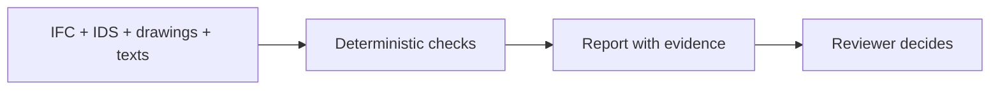

<!-- claims-lint: allow-file reason="Claims-boundary doc citing forbidden phrases as non-claims per pilot-claim-boundary / Claims Lock" -->
<p align="center">
  
</p>

# AeroBIM

[Русская версия](README.ru.md)

[](https://github.com/KonkovDV/AeroBIM/actions/workflows/ci.yml)
[](docs/pilot-claim-boundary-2026.md)
[](audit/reports/CRITICAL_BLOCKERS.md)
[](https://www.python.org/downloads/)
[](LICENSE)

The green badge is Checkpoint `GO`: the regulatory-measurement MVP; code and fixture packs run. The red badge is missing appointing-party sign-off (`customer_go` false). Do not read it as “the product does not start”.

**AeroBIM checks a construction pack against itself.** A schedule area against the IFC area, a PD elevation against an RD elevation, a brief requirement against what the files contain — on public machine-readable examination rules (IFC + IDS + sheets + specification text). Each file can open cleanly on its own. The defect lives in the seam and usually surfaces on site.

This is an assistant to the expert: a finding with a trail to the sheet and a GUID; the person still decides. Output is HTML, JSON, a PDF coverage draft, and structural BCF. AeroBIM is not a CDE, not a model viewer, and not a replacement for the expert. Model checkers such as Tangl operate on the model; a CDE such as 10D operates on presence, versions and routes. This repository operates on the **seam between files**. It is not a Tangl connector and not a CDE.

## For the jury

Moscow TechLab programme: automated verification of design and working documentation. Programme status is not a measured result on the appointing party's own pack. Demo-day: 29–30 September 2026. Self-assessed TRL 4 under GOST R 58048; TRL 5 and 6 are not claimed.

| | |
|---|---|
| **Show** | `python -m aerobim.tools.run_kt3_jury` — live CLI on the git fixture pack. Customer files are not in the repository |
| **Deck** | [`AeroBIM_demo_day_09.pptx`](submission/03-presentation/AeroBIM_demo_day_09.pptx) (43 slides, 18.09.2026) · [speech canon](submission/03-presentation/demo_day_slides.md). There is no PDF deck in git |
| **Form pack** | [`submission/README.md`](submission/README.md) — five fields |
| **Map** | [jury map](docs/TIER0_INDEX.md) · [claim boundary](docs/pilot-claim-boundary-2026.md) · [blockers](audit/reports/CRITICAL_BLOCKERS.md) · [glossary](docs/partners/GLOSSARY_JURY_RU_2026_08.md) |
| **Speech** | [KT#3, 30 s](docs/demo/KT3_JURY_FAQ_2026_08_25.md) · [stage formula](docs/demo/KT2_JURY_FAQ_2026_08_12.md) |

> We are in *refinement* on the customer contour. One command shows a fail-closed finding on a fixture. Effectiveness validation and deployment have not started. Checkpoint `GO` is the regulatory-measurement MVP. `customer_go` stays false until an independent labeled pack, two raters, a signed appointing-party profile, and CDE proof.

From 2 April 2026 Moscow requires an AGR CIM in IFC (Moscow Government decree № 17-ПП of 16 January 2026; joint DIT/DGP order № ДГП-Р-1/26/64-16-6/26). From 18 August 2026 joint DGP/DIT order № ДГП-Р-56/26/64-16-473/26 updates 3D models placed in Moscow information systems. Those are **city filing rules**, not an appointing-party-signed acceptance profile and not a product accuracy claim. City AGR IFC mapping is published for Revit; AeroBIM does not ingest native RVT.

## What the clone does

| | |
|---|---|
| Ingest | IFC 2x3 / 4 / 4x3, IDS 1.0, PDF vector/raster, specification text |
| Cross-check | Deterministic IFC + IDS + cross-document compare (configured ε-band) |
| Workplace | 2D overlay, 3D review shell (Vite), RU/EN remark templates, expert HITL |
| Report | HTML + JSON + PDF coverage draft + structural BCF 2.1 / 3.0 ZIP |
| Verdict | `summary.passed` is a Shared-gate. LLM/VLM never write it ([ADR-001](docs/architecture/ADR-001-verdict-ownership-2026.md)) |

A skipped mandatory engine cannot hide inside a green report.

## Status

| | |
|---|---|
| **Runs on this clone** | Fixture packs, fail-closed IDS, CLI, CI, overlay, structural BCF, review shell (findings → remark → sheet/3D → BCF) |
| **Waits on residual volumes** | Dual human raters + pack-specific conclusions (RT-001b) · appointing-party-signed profile (RT-002c) · system-aware clash (speech **RT-003c**) · customer federated IFC (`c_customer_federated_ifc`) · BCF import into their CDE |
| **Not claimed** | Product accuracy >90% · customer SLA ≤30 min · native DWG · native RVT/NWD · MEP delivered · CDE-ready BCF · production-ready |

## Try it

Python 3.12 and a venv in `backend/.venv`:

```bash
git clone https://github.com/KonkovDV/AeroBIM.git
cd AeroBIM/backend

python3.12 -m venv .venv            # Windows: py -3.12 -m venv .venv
source .venv/bin/activate           # Windows PowerShell: .\.venv\Scripts\Activate.ps1
pip install -e ".[dev,raster]"
```

The jury show is the live CLI, not an HTML snapshot. `summary.passed=false` is expected: the fixture pack contains planted defects. Those numbers are not product accuracy.

```bash
python -m aerobim.tools.run_kt3_jury
# artifacts/kt3-jury/latest.json
# artifacts/kt3-without-customer/latest.json

python -m aerobim.tools.run_demo_ifc_acceptance_gate
python -m aerobim.tools.run_demo_vertical_slice

pytest tests -q
python -m aerobim.main   # http://127.0.0.1:8080/health
```

The review shell is not a substitute for the jury CLI. FastAPI at `http://127.0.0.1:8080`, Vite/React at `http://127.0.0.1:5173` (not Next.js). The UI never writes `summary.passed`. Native RVT/NWD/DWG are rejected before upload.

- Linux/macOS: `./start.sh`
- Windows PowerShell: `.\start.bat` (the leading `.\` is required; `start` is Start-Process and will ask for FilePath)
- from `backend/`: `python -m aerobim.tools.run_review_stand`
- script: `python scripts/run_review_shell.py`

If 8080 or 5173 is already bound, stop that process and retry. In development, one rehearsal click: `POST /v1/demo/seed-fixture` (unpublished in OpenAPI; git fixtures). Details: [`frontend/README.md`](frontend/README.md).

Optional extras `.[clash]`, `.[docling]`, `.[enterprise]`, `.[pdf-agpl]` are not needed for the commands above. Default `GET /v1/auth/bff` is 501.

## What a run actually does



1. **The model.** Properties and quantities are validated with IfcOpenShell. IFC2x3 (buildingSMART schema; no ISO publication), IFC4 ADD2 (ISO 16739-1:2018) and IFC4x3 (ISO 16739-1:2024) go through one kernel. ISO/PAS 16739:2005 is the IFC2x Platform, not IFC2x3. Where property-set names diverge between releases, the difference is a `ValidationIssue`, not a silent skip. Per-feature rules: [`docs/ifc-compatibility-matrix.md`](docs/ifc-compatibility-matrix.md).
2. **The rules.** IDS 1.0 is validated with IfcTester. Official rule sets from Moscow Region State Expertise and SPb GAU CGE (CIM OKS ed. 3.1.0 + CIM RII ed. 1.1.0) ship in `samples/`; the CGE profile ([`samples/profiles/spb-cge/`](samples/profiles/spb-cge/manifest.json)) is a published rule set (OFFICIAL_PUBLISHED), not a customer-signed acceptance profile. CI on `ubuntu-latest` runs `python -m aerobim.tools.validate_spb_cge_profile --no-write --verify-committed-evidence`. A requested rule set that cannot load fails the check.
3. **The other documents.** The model is compared with drawing notes, specifications and calculation texts, with a configured ε-band and Russian/European grouped decimals. Sources are compared; nothing is recomputed. Independent correctness of calculations is not implemented.
4. **The report.** Each finding carries `finding_id`, `source_id` and `evidence_refs` (persistence refuses a finding without them). People get HTML; machines get JSON; issue exchange gets a structural BCF 2.1 / 3.0 ZIP. The browser review shell (web-ifc + Three.js) shows the IFC in 3D and the evidence on the sheet.

`summary.passed` is assembled from deterministic errors and the capability table ([ADR-001](docs/architecture/ADR-001-verdict-ownership-2026.md)). Advisory LLM/VLM text, if enabled, drafts remark wording only and never writes that flag; under customer sign-off profiles outbound advisory calls are forbidden. Every optional engine reports `ok`, `skipped` or `failed`; any `FAILED` forces `summary.passed=false`. The same boundary is served on `GET /v1/system/capabilities`. That flag is a Shared-gate under configured rules. It is not contractual fitness and not permission to build. Target architecture: [`docs/architecture/TARGET_HYBRID_ARCHITECTURE_TZ_2026.md`](docs/architecture/TARGET_HYBRID_ARCHITECTURE_TZ_2026.md).

## Checkpoint: `GO` (`regulatory_measurement_mvp`)

Product Checkpoint is the **regulatory-measurement MVP**. `customer_go` stays **false**. Code and fixtures work. **Measurement substitutes** replace what the appointing party did not hand over. Undifferentiated `closes_rt001/002/003` stay false. Do not read the red customer-sign-off badge as product `NO_GO`.

| ID | Measurement substitute (no customer pack) | Residual (not substitutable) |
|---|---|---|
| **RT-001** | `a_content_pairing` **CLOSED** (**RT-001a**) — RF expertise typical-error catalogs (Experiment B) + public examination IDS + fixture / injection gold. `b_protocol_rehearsal` **CLOSED** — two simulated independent passes on the same fixture pack, live κ/α/AC1 | `b_criterion_dual_rater` **OPEN** (**RT-001b**) (two humans + conclusions on the *same* pack). `c_customer_corpus` **OPEN**. Open benches are a different contour. Simulation is not two people. Not product accuracy |
| **RT-002** | `a_regulatory` **CLOSED** (**RT-002a**) — public IDS (Moscow Region State Expertise, SPb GAU CGE, city AGR) as the measurement ruler. `b_eir_carrier` **CLOSED** (**RT-002b**) — EIR v4.0 workbook + BIM-standard v4.0 present as **text** on the channel pack (git-safe pin; no filenames). Public examination IDS is not the appointing-party EIR | `c_corporate_signed` **OPEN** (**RT-002c**; `b_corporate` stays OPEN) — the appointing party signature / `customer_approved` IDS. Text EIR is not a signed profile. City-as-publisher is not a customer signature. Never write undifferentiated “RT-002 CLOSED” |
| **RT-003** | `a_federated_geometric_rehearsal` **CLOSED** (**RT-003a**) — planted IfcClash (crossing walls; pipe vs wall). `b_navis_federation_carrier` **CLOSED** — three NWD federations on the channel pack. `b_ifc_system_graph_rehearsal` **CLOSED** (**RT-003b**) — HVAC fixture `IfcSystem` graph (two systems, `IfcRelAssignsToGroup`); not pipe vs wall | `b_mep_system_clash` **OPEN** (**RT-003c**, `NOT_VERIFIED`) — 0 duct/pipe/cable on customer IFC; EIR names OV/VK/ITP/EOM/SS LOD, models absent. `c_customer_federated_ifc` **OPEN** — NWD→IFC export not delivered. MEP delivered is not claimed |

Machine SSOT: [`docs/evidence/rt-blocker-volumes-2026-09.md`](docs/evidence/rt-blocker-volumes-2026-09.md) · `python -m aerobim.tools.export_rt_blocker_volumes`.

BCF ZIP export is structural T1 ([`audit/evidence/bcf-structural-handoff-2026-07-25.json`](audit/evidence/bcf-structural-handoff-2026-07-25.json)). Import into an independent CDE is **NOT_VERIFIED**. Native DWG and native RVT/NWD are missing (fail-closed; IFC-first ingest). Independent calculation correctness is not implemented — sources are compared, not recomputed.

GOST R 21.101-2026 (Rosstandart order № 129-ст of 12 February 2026; **in force 1 April 2026**, replacing 21.101-2020; GUID as an identifier of an electronic design document) is a **document-identity** rule. AeroBIM has addressed findings to stable identifiers from day one. That is a coincidence of mechanism, not a claim of full conformity with the standard. The standard’s in-force date (1 April) is not the Moscow AGR IFC filing date (2 April).

Register: [`audit/reports/CRITICAL_BLOCKERS.md`](audit/reports/CRITICAL_BLOCKERS.md). Speech: [`docs/demo/KT2_JURY_FAQ_2026_08_12.md`](docs/demo/KT2_JURY_FAQ_2026_08_12.md) · [`docs/demo/KT3_JURY_FAQ_2026_08_25.md`](docs/demo/KT3_JURY_FAQ_2026_08_25.md).

## OpenBIM and how we measure

| Practice (Aug 2026) | In this repo | Gap |
|---|---|---|
| IDS 1.0 as a machine information contract | IfcTester, fail-closed on version/load | Customer pack hash + signed profile (RT-002c) |
| Dual-rater precision before published accuracy | Wilson planner and κ/α harness exist; no κ without customer labels | Customer corpus + two adjudicators (RT-001b / RT-001c) |
| BCF → CDE | Structural ZIP (T1) | T2 import log in the appointing party's CDE |
| ISO 19650 | Lite fields on the report (Shared-gate metadata) | Not a CDE; ISO 19650-6 is H&S sharing, not this gate |
| FAIR research software | `CITATION.cff`, licence inventory, reproducible commands | Fixture F1 ≠ product accuracy |

## What runs today

<details>
<summary>Fixture capabilities (not product accuracy; customer corpus is RT-001)</summary>

- IFC property and quantity validation; IDS 1.0 fails if the rule set cannot load
- Cross-document contradictions (`ConflictKind`) and drawing annotation ↔ IFC (a claimed GUID becomes `ifc_guid` only after it is present in the spatial index)
- Configured ε-band (SI-normalised); deterministic requirement extraction from narrative text (no model signs anything off)
- Capability honesty on every report; tenant/object ACL on artifacts under `customer_pilot` / `production` (off by default in development); HTML/JSON; PDF coverage draft; structural BCF 2.1 / 3.0 ZIP
- PDF via pypdfium2 + pdfminer; default `AEROBIM_PDF_BACKEND=pdfium`
- Browser IFC viewer and 2D overlay; Docker `closed-contour --smoke`
- Norm rule packs (a fixture pack is not a customer-signed profile) and an opt-in completeness inventory
- Quality measurement protocol (Wilson intervals, sample-size planner; interim target 0.60) — protocol, not a published product score

Optional or missing: geometry clash `.[clash]` (engine rehearsal, not MEP system clash); OCR `.[raster]`; PyMuPDF `pdf-agpl` (absent from the runtime lock and the Docker image); advisory LLM/VLM drafts (never write `summary.passed`); experimental OpenCDE BCF push; DXF via ezdxf (not DWG); detached signature envelope — hashes only, trust chain **NOT_VERIFIED**; browser OIDC default 501.

</details>

## HTTP API

<details>
<summary>Local <code>python -m aerobim.main</code></summary>

`GET /health` is unauthenticated. `/v1/*` requires `AEROBIM_API_BEARER_TOKEN` unless `AEROBIM_ALLOW_ANONYMOUS_DEV=true` (development only). Mutating routes share one `require_bearer_auth` callable.

| Method | Path | Purpose |
|---|---|---|
| `GET` | `/health` | Readiness |
| `GET` | `/v1/auth/bff` | Auth discovery. Default **501**. Lab `200 LAB` is not customer SSO |
| `GET` | `/v1/system/capabilities` | Declared capability boundary, including what is missing |
| `POST` | `/v1/uploads` | Multipart ingest |
| `POST` | `/v1/validate/ifc` | Validate IFC against requirements and IDS |
| `POST` | `/v1/analyze/project-package` | Full package analysis |
| `POST` | `/v1/analyze/project-package/submit` | Queue a larger package as an **in-process** FastAPI `BackgroundTasks` job (not a durable worker). `Idempotency-Key`; same key + different payload → 409; per-tenant concurrency → 429; cancel via `request_cancel`; Redis stores job records outside development; a process crash can leave `QUEUED` until `reclaim_stale_queued` |
| `GET` | `/v1/analyze/project-package/jobs/{job_id}` | Poll a background job |
| `POST` | `/v1/analyze/project-package/jobs/{job_id}/cancel` | Cancel |
| `GET` | `/v1/reports` | List persisted reports |
| `GET` | `/v1/reports/{id}` | Fetch one report |
| `GET` | `/v1/reports/{id}/coverage` | Four-state check coverage map |
| `GET` | `/v1/reports/{id}/revision-diff` | Finding delta; `no_longer_reported` does not mean resolved |
| `GET` | `/v1/reports/{id}/export/{json,html,pdf,bcf}` | Export; `?version=3` switches BCF 3.0. PDF is a coverage draft. No XLSX |
| `POST` | `/v1/reports/{id}/review-events` | Append reviewer HITL; never changes `summary.passed` |
| `GET` | `/v1/reports/{id}/review-events` | HITL history |
| `GET` | `/v1/reports/{id}/review-kpi` | Aggregate triage metrics (not cycle-days in a CDE) |
| `POST` | `/v1/demo/seed-fixture` | Development-only git fixture; omitted from the published OpenAPI |

Package analysis optionally accepts an OpenRebar reinforcement report (`reinforcement_report_path`) with a SHA-256 provenance digest. This compares declared sources; it does not recompute anything. Generate the digest with `python -m aerobim.tools.openrebar_provenance_digest`. OpenCDE `POST .../export/bcf-api/push` is an experimental hub push, not proof of import into the customer CDE.

</details>

## Architecture

Five layers, dependencies pointing inward only:

```
core/            DI container, tokens, configuration
domain/          Immutable models, Protocol ports, logging contract
application/     Requirement fusion, contradiction detection
infrastructure/  IfcOpenShell, IfcTester, Docling, IfcClash, BCF, storage
presentation/    FastAPI
```

**48 domain Protocol ports** wire to **76 infrastructure adapter modules** through **63 DI tokens** in `bootstrap_container()`. These counts are regenerated into [`docs/evidence/runtime-baseline-latest.json`](docs/evidence/runtime-baseline-latest.json) and verified in CI against both READMEs.

Artifacts sit behind an `ObjectStore` port, so local storage and S3-compatible buckets are the same code path. Report summaries are additionally indexed in Postgres when `AEROBIM_DB_URL` is set; that path is acceptable for a pilot but expects schema migration out of band before production use.

## Configuration

A local clone runs on defaults. CI checks the table against `settings.py` **both ways** (code → docs and docs → code). Helper-read aliases and lab-only knobs live in [`audit/internal_env_vars.json`](audit/internal_env_vars.json).

<details>
<summary>Full <code>AEROBIM_*</code> table (CI-checked against <code>backend/.env.example</code>)</summary>

| Variable | Default | Description |
|---|---|---|
| `AEROBIM_HOST` | `127.0.0.1` | Bind address |
| `AEROBIM_PORT` | `8080` | Bind port |
| `AEROBIM_DEBUG` | `false` | Debug mode (also enables localhost CORS defaults when origins unset) |
| `AEROBIM_STORAGE_DIR` | `var/reports` | Report persistence directory |
| `AEROBIM_CORS_ORIGINS` | *(auto)* | Comma-separated CORS origins |
| `AEROBIM_CORS_ALLOW_CREDENTIALS` | *(auto)* | `true` in development/test for a finite origin list; `customer_pilot`/`production` require explicit `true` |
| `AEROBIM_ENV` | `development` | Environment name; non-dev requires bearer/OIDC (fail-closed) |
| `AEROBIM_SIGNOFF_PROFILE` | *(auto)* | `customer_pilot` and `production` are closed customer contours: capabilities fail closed and outbound advisory LLM calls are forbidden. `customer_pilot_demo` and `moscow_agr_2026` are **honest-scope** contours (development/test only): clash/MEP/bSI-submit stay out of scope (honest SKIPPED, not faked); FAILED engines still block; LLM egress still forbidden. `moscow_agr_2026` cites DGP-R-1/26 CIM AGR, not demo convenience, and does not close RT-003 or the appointing party RT-002. Unset outside development resolves to `production`. Also accepts `development` and `fixture` |
| `AEROBIM_API_BEARER_TOKEN` | *(unset)* | Bearer for `/v1/*`; required unless `AEROBIM_ALLOW_ANONYMOUS_DEV` |
| `AEROBIM_ALLOW_ANONYMOUS_DEV` | `false` | Opt-in anonymous API in development/test only (`from_env`) |
| `AEROBIM_CLASH_AFFECTS_PASS` | `false` | Soft only in development/fixture; forced `true` under pilot/production sign-off |
| `AEROBIM_CLASH_SKIP_TINY` | `true` | Skip degenerate/tiny IFC products before IfcClash; all-skipped still FAILED |
| `AEROBIM_CLASH_MIN_AABB_VOLUME_M3` | `1e-6` | AABB volume threshold used when `AEROBIM_CLASH_SKIP_TINY` is on |
| `AEROBIM_REQUIRE_CLASH` | `false` | Soft only in development/fixture; forced under pilot/production |
| `AEROBIM_REQUIRE_MEP_SYSTEM_CLASH` | `false` | When true, MEP `NOT_VERIFIED` blocks Shared-gate pass |
| `AEROBIM_MEP_FEDERATED_SCOPE_PATH` | *(unset)* | Federated MEP scope JSON (VERIFIED customer or ENG_FIXTURE) |
| `AEROBIM_MEP_AABB_FILTER` | `true` | Optional AABB broadphase for MEP matrix pairs; still `geometry_verified=False` |
| `AEROBIM_PDF_BACKEND` | `pdfium` | Core PDF: `pdfium` / `none`; optional legacy `pymupdf` only with `pdf-agpl` |
| `AEROBIM_MAX_IFC_BYTES` | `268435456` | Max **SPF in-memory** IFC open: 256 MiB. Comparable to the buildingSMART Validation Service cap of 256 MB on an uncompressed `.ifc`, not the same unit. Files above this and up to the model ingest cap open via IfcOpenShell RocksDB |
| `AEROBIM_MAX_OFFICE_BYTES` | `268435456` (dev); `500000000` on `customer_pilot`/`production` unless `AEROBIM_APPLY_PILOT_UPLOAD_CAPS=0` | Office ingest cap (PDF/Office). Customer stated 500 MB decimal (2026-08-25) |
| `AEROBIM_MAX_MODEL_BYTES` | `268435456` (dev); `1500000000` on `customer_pilot`/`production` unless `AEROBIM_APPLY_PILOT_UPLOAD_CAPS=0` | Model ingest **and disk-analyze** cap (IFC/ZIP/CAD). Customer stated 1.5 GB decimal. WASM viewer stays 256 MiB |
| `AEROBIM_APPLY_PILOT_UPLOAD_CAPS` | `true` under `customer_pilot`/`production`; ignored in development | Apply the stated 500 MB / 1.5 GB caps. SPF open stays 256 MiB; 1.5 GB IFC uses RocksDB |
| `AEROBIM_CROSS_DOC_SEVERITY` | `warning` | Severity for cross-document contradictions: `error` (blocking), `warning`, `info` |
| `AEROBIM_REMARK_LOCALE` | `ru` | Remark template language for deterministic generators (`ru` / `en`) |
| `AEROBIM_PRIORITY_PROFILE` | `default` | Review priority weighting profile (`default`; `customer` in fixture SLA smoke only) |
| `AEROBIM_DB_URL` | *(unset)* | Optional Postgres URL for report summary indexing. Bootstrap issues `CREATE`/`ALTER`, so production should migrate schema out of band and then grant a DML-only role |
| `AEROBIM_REPORT_TTL_DAYS` | *(unset)* | Optional TTL for persisted report payloads; unset means unlimited retention |
| `AEROBIM_S3_BUCKET` | *(unset)* | Optional S3/MinIO bucket for object storage |
| `AEROBIM_S3_ENDPOINT_URL` | *(unset)* | Optional MinIO/custom S3 endpoint |
| `AEROBIM_S3_REGION` | `us-east-1` | Signing region for S3-compatible storage |
| `AEROBIM_S3_ACCESS_KEY_ID` | *(unset)* | Optional access key for S3-compatible storage |
| `AEROBIM_S3_SECRET_ACCESS_KEY` | *(unset)* | Optional secret key for S3-compatible storage |
| `AEROBIM_S3_PREFIX` | `aerobim` | Prefix applied to object keys in S3-compatible storage |
| `AEROBIM_LLM_ADVISORY_ENABLED` | `false` | Development only: opt-in OpenAI-compatible advisory model. Never sets `summary.passed`; reports `ready=false` under `customer_pilot` and `production`. The deprecated alias `AEROBIM_LLM_LOCAL_ENABLED` still works but warns at boot |
| `AEROBIM_LLM_BASE_URL` | *(unset; Studio default when provider=`yandex-ai-studio`)* | Loopback or RF HTTPS OpenAI-compat base (`…/v1`); SSRF-gated at boot |
| `AEROBIM_LLM_API_KEY` | *(unset)* | Optional bearer for Studio; never logged / never in `audit_event` |
| `AEROBIM_LLM_PROVIDER` | `qwen-local` | Provider label (`qwen-local` / `yandex-ai-studio`) |
| `AEROBIM_LLM_MODEL` | `Qwen3.6-27B` | Local bare id, or Yandex `gpt://{folder}/{model}` |
| `AEROBIM_LLM_MODEL_REVISION` | *(required if enabled)* | Exact catalog version (not `latest`/`rc`); composed into URI |
| `AEROBIM_LLM_FOLDER_ID` | *(unset)* | Yandex folder → `x-folder-id` + URI composition |
| `AEROBIM_LLM_AUTH_SCHEME` | `Bearer` | `Bearer` or `Api-Key`, depending on the provider |
| `AEROBIM_LLM_SEND_SEED` | `true` (`false` for Studio) | Omit `seed` when false (Yandex may 400) |
| `AEROBIM_LLM_RESPONSE_FORMAT_MODE` | `json_object` (`json_schema` for Studio) | Yandex prefers `json_schema` + `REMARK_JSON_SCHEMA` |
| `AEROBIM_LLM_DATA_LOGGING_ENABLED` | `false` | When false, send `x-data-logging-enabled: false` (audit-recorded) |
| `AEROBIM_LLM_MODEL_SHA256` | *(unset)* | Optional checkpoint hash in usage/audit |
| `AEROBIM_LLM_MAX_TOKENS_PER_CALL` | `4096` | Fail-closed token cap per call |
| `AEROBIM_LLM_MAX_TOKENS_PER_RUN` | `100000` | Fail-closed per-run cap |
| `AEROBIM_LLM_MAX_TOKENS_PER_DAY` | `300000` | Fail-closed daily cap |
| `AEROBIM_LLM_BUDGET_TZ` | `Europe/Moscow` | IANA timezone for day-roll of the daily cap |
| `AEROBIM_LLM_BUDGET_LEDGER` | *(unset)* | Shared JSON ledger path across workers; **required** for grant ops (without it: process-local ≈ N× day cap) |
| `AEROBIM_LLM_MAX_COMPLETION_TOKENS` | `512` | Completion budget passed to the API |
| `AEROBIM_LLM_MAX_CONCURRENT` | `4` | Semaphore for parallel advisory calls |
| `AEROBIM_LLM_ADVISORY_MAX_ISSUES` | `32` | Max findings to overlay with AI remark drafts per analyze |
| `AEROBIM_LLM_429_RETRIES` | `3` | Linear backoff retries on HTTP 429 before SKIPPED |
| `AEROBIM_LLM_ALLOWED_HOSTS` | *(built-in)* | Extra allowlisted hostnames (comma-separated); `-`/`none` replaces the set with empty. Alibaba/OpenAI always forbidden |
| `AEROBIM_CUSTOMER_PACK_LLM_EGRESS` | `deny` under pilot/production; `allow` in development | Customer-pack LLM/VLM host preset. `deny` empties the allowlist. `allow` under pilot/production requires written consent ref |
| `AEROBIM_CUSTOMER_PACK_LLM_EGRESS_CONSENT_REF` | *(unset)* | Required when egress=`allow` under `customer_pilot`/`production`. Letter/id of written consent; not a GO claim |
| `AEROBIM_HYBRID_PROVIDER_CONFIG` | *(unset)* | Path to hybrid provider JSON (`schema_version` ≥1.1 requires `model_revision`) |
| `AEROBIM_API_TENANT_ID` | *(unset)* | Optional tenant id for multi-tenant API auth |
| `AEROBIM_APP_NAME` | `aerobim` | Application name for logs / OpenAPI title |
| `AEROBIM_BCF_API_BASE_URL` | *(unset)* | Optional BCF API base URL (enterprise sync) |
| `AEROBIM_BCF_API_PROJECT_ID` | *(unset)* | Optional BCF project id |
| `AEROBIM_BCF_API_TOKEN` | *(unset)* | Optional BCF API bearer token |
| `AEROBIM_BCF_API_VERSION` | `2.1` | BCF API version label |
| `AEROBIM_BSI_API_TOKEN` | *(unset)* | Optional buildingSMART Validation Service token |
| `AEROBIM_BSI_VALIDATION_URL` | *(built-in)* | Optional override for bSI Validation Service URL |
| `AEROBIM_GATES_ATTESTED` | *(CI only)* | Comma-separated CI job names attested into the runtime baseline; ignored locally, and must equal the required gate set under GitHub Actions |
| `AEROBIM_HTTP_RATE_LIMIT_PER_MINUTE` | `120` | Pre-auth **per-IP** bucket for mutating `/v1` POSTs and GET `/v1/auth/login` + `/callback` + `/session`; after successful auth a second **per-principal** (`tenant_id:subject`) bucket applies to those POSTs. `0` disables in development; **must be >0** under pilot/production |
| `AEROBIM_TRUSTED_PROXY_IPS` | *(unset)* | Comma-separated peer IPs allowed to supply `X-Forwarded-For` for rate-limit keys; empty = never trust XFF |
| `AEROBIM_IFC_PARSE_CACHE_DIR` | *(unset)* | Optional on-disk IFC parse cache directory |
| `AEROBIM_KIMI_API_BASE_URL` | *(unset)* | Deprecated alias of the primary VLM base URL (internal name). Default unset. Under `customer_pilot`/`production` VLM is not ready even if set. See [`docs/security/BUILD_WITHOUT_EXTERNAL_MODELS_2026.md`](docs/security/BUILD_WITHOUT_EXTERNAL_MODELS_2026.md) |
| `AEROBIM_KIMI_API_KEY` | *(unset)* | Optional Kimi API key (never logged) |
| `AEROBIM_KIMI_CACHE_DIR` | *(unset)* | Optional Kimi response cache directory |
| `AEROBIM_KIMI_CACHE_NAMESPACE` | *(unset)* | Optional Kimi cache namespace |
| `AEROBIM_KIMI_CACHE_PROJECT` | *(unset)* | Optional Kimi cache project key |
| `AEROBIM_KIMI_MODEL` | *(unset)* | Optional Kimi model id |
| `AEROBIM_KIMI_REASONING_EFFORT` | *(unset)* | Optional Kimi reasoning effort knob |
| `AEROBIM_LLM_TIMEOUT_SECONDS` | `120` | Advisory LLM HTTP timeout seconds |
| `AEROBIM_MEP_SCOPE_MEMO_REF` | *(unset)* | Optional memo ref for federated MEP scope provenance |
| `AEROBIM_NORM_RULE_PACK` | *(unset)* | Optional norm rule-pack id/path |
| `AEROBIM_OIDC_AUDIENCE` | *(unset)* | OIDC audience claim required under pilot/production |
| `AEROBIM_OIDC_ISSUER` | *(unset)* | OIDC issuer URL |
| `AEROBIM_OIDC_JWKS_EXTRA_HOSTS` | *(unset)* | Extra allowlisted JWKS hostnames |
| `AEROBIM_OIDC_JWKS_URL` | *(unset)* | OIDC JWKS URL |
| `AEROBIM_OIDC_ROLES_CLAIM` | `roles` | OIDC claim name for roles |
| `AEROBIM_OIDC_TENANT_CLAIM` | `tenant_id` | OIDC claim name for tenant (no `tid`/`org_id` fallback) |
| `AEROBIM_OIDC_BFF_CLIENT_ID` | *(unset)* | Lab-only OIDC BFF public client id; `auth_bff` stays **NOT_IMPLEMENTED** unless lab Phase 3 is fully configured |
| `AEROBIM_OIDC_BFF_AUTHORIZE_URL` | *(unset)* | Lab-only IdP authorize URL draft; not a production login |
| `AEROBIM_OIDC_BFF_REDIRECT_URI_ALLOWLIST` | *(unset)* | Comma-separated exact `redirect_uri` allowlist for lab BFF redirects |
| `AEROBIM_OIDC_BFF_TOKEN_URL` | *(unset)* | Lab-only token endpoint; required for Phase 3; SSRF-gated at boot |
| `AEROBIM_OIDC_BFF_CLIENT_SECRET` | *(unset)* | Confidential BFF client secret (lab); never a production SSO claim |
| `AEROBIM_OIDC_BFF_COOKIE_SECRET` | *(unset)* | HMAC secret for the lab session cookie; unset keeps Phase 3 off |
| `AEROBIM_REDIS_URL` | *(unset in dev)* | Required outside development/test for durable jobs and shared rate limits |
| `AEROBIM_VLM_ENABLED` | `false` | Opt-in advisory VLM drawing read; never sets `summary.passed` |

</details>

<!-- AEROBIM_DOCUMENTED_ENV:BEGIN -->
<!-- machine-checked parity list (export_runtime_baseline --check-readme)
AEROBIM_ALLOW_ANONYMOUS_DEV
AEROBIM_API_BEARER_TOKEN
AEROBIM_API_TENANT_ID
AEROBIM_APP_NAME
AEROBIM_APPLY_PILOT_UPLOAD_CAPS
AEROBIM_BCF_API_BASE_URL
AEROBIM_BCF_API_PROJECT_ID
AEROBIM_BCF_API_TOKEN
AEROBIM_BCF_API_VERSION
AEROBIM_BSI_API_TOKEN
AEROBIM_BSI_VALIDATION_URL
AEROBIM_CLASH_AFFECTS_PASS
AEROBIM_CLASH_MIN_AABB_VOLUME_M3
AEROBIM_CLASH_SKIP_TINY
AEROBIM_CORS_ALLOW_CREDENTIALS
AEROBIM_CORS_ORIGINS
AEROBIM_CROSS_DOC_SEVERITY
AEROBIM_CUSTOMER_PACK_LLM_EGRESS
AEROBIM_CUSTOMER_PACK_LLM_EGRESS_CONSENT_REF
AEROBIM_DB_URL
AEROBIM_DEBUG
AEROBIM_ENV
AEROBIM_GATES_ATTESTED
AEROBIM_HOST
AEROBIM_HTTP_RATE_LIMIT_PER_MINUTE
AEROBIM_HYBRID_PROVIDER_CONFIG
AEROBIM_IFC_PARSE_CACHE_DIR
AEROBIM_KIMI_API_BASE_URL
AEROBIM_KIMI_API_KEY
AEROBIM_KIMI_CACHE_DIR
AEROBIM_KIMI_CACHE_NAMESPACE
AEROBIM_KIMI_CACHE_PROJECT
AEROBIM_KIMI_MODEL
AEROBIM_KIMI_REASONING_EFFORT
AEROBIM_LLM_429_RETRIES
AEROBIM_LLM_ADVISORY_ENABLED
AEROBIM_LLM_ADVISORY_MAX_ISSUES
AEROBIM_LLM_ALLOWED_HOSTS
AEROBIM_LLM_API_KEY
AEROBIM_LLM_AUTH_SCHEME
AEROBIM_LLM_BASE_URL
AEROBIM_LLM_BUDGET_LEDGER
AEROBIM_LLM_BUDGET_TZ
AEROBIM_LLM_DATA_LOGGING_ENABLED
AEROBIM_LLM_FOLDER_ID
AEROBIM_LLM_LOCAL_ENABLED
AEROBIM_LLM_MAX_COMPLETION_TOKENS
AEROBIM_LLM_MAX_CONCURRENT
AEROBIM_LLM_MAX_TOKENS_PER_CALL
AEROBIM_LLM_MAX_TOKENS_PER_DAY
AEROBIM_LLM_MAX_TOKENS_PER_RUN
AEROBIM_LLM_MODEL
AEROBIM_LLM_MODEL_REVISION
AEROBIM_LLM_MODEL_SHA256
AEROBIM_LLM_PROVIDER
AEROBIM_LLM_RESPONSE_FORMAT_MODE
AEROBIM_LLM_SEND_SEED
AEROBIM_LLM_TIMEOUT_SECONDS
AEROBIM_MAX_IFC_BYTES
AEROBIM_MAX_MODEL_BYTES
AEROBIM_MAX_OFFICE_BYTES
AEROBIM_MEP_AABB_FILTER
AEROBIM_MEP_FEDERATED_SCOPE_PATH
AEROBIM_MEP_SCOPE_MEMO_REF
AEROBIM_NORM_RULE_PACK
AEROBIM_OIDC_AUDIENCE
AEROBIM_OIDC_BFF_AUTHORIZE_URL
AEROBIM_OIDC_BFF_CLIENT_ID
AEROBIM_OIDC_BFF_CLIENT_SECRET
AEROBIM_OIDC_BFF_COOKIE_SECRET
AEROBIM_OIDC_BFF_REDIRECT_URI_ALLOWLIST
AEROBIM_OIDC_BFF_TOKEN_URL
AEROBIM_OIDC_ISSUER
AEROBIM_OIDC_JWKS_EXTRA_HOSTS
AEROBIM_OIDC_JWKS_URL
AEROBIM_OIDC_ROLES_CLAIM
AEROBIM_OIDC_TENANT_CLAIM
AEROBIM_PDF_BACKEND
AEROBIM_PORT
AEROBIM_PRIORITY_PROFILE
AEROBIM_REDIS_URL
AEROBIM_REMARK_LOCALE
AEROBIM_REPORT_TTL_DAYS
AEROBIM_REQUIRE_CLASH
AEROBIM_REQUIRE_MEP_SYSTEM_CLASH
AEROBIM_S3_ACCESS_KEY_ID
AEROBIM_S3_BUCKET
AEROBIM_S3_ENDPOINT_URL
AEROBIM_S3_PREFIX
AEROBIM_S3_REGION
AEROBIM_S3_SECRET_ACCESS_KEY
AEROBIM_SIGNOFF_PROFILE
AEROBIM_STORAGE_DIR
AEROBIM_TRUSTED_PROXY_IPS
AEROBIM_VLM_ENABLED
-->
<!-- AEROBIM_DOCUMENTED_ENV:END -->

## Repository

```text
backend/      FastAPI: core → domain → application → infrastructure → presentation
frontend/     Review shell (Vite + React; IFC 3D + drawing overlay)
samples/      IFC, IDS, drawing and specification fixtures
docs/         Documentation and evidence
audit/        Claims lock, blocker register
submission/   TechLab jury pack (PowerPoint 43 slides; no PDF deck)
```

CI pass counts are generated, not typed by hand:

<!-- AEROBIM_RUNTIME_BASELINE:BEGIN -->
<!-- regenerated by: python -m aerobim.tools.export_runtime_baseline -->
tests_passed: backend=3300, frontend=400; commit 4742d56d9574; see docs/evidence/runtime-baseline-latest.json · src ~106669 LOC; tests ~69812 LOC; extraction macro_f1=0.8600000000000001 (fixture corpus; not product accuracy)
<!-- AEROBIM_RUNTIME_BASELINE:END -->

## Documentation

| Topic | Document |
|---|---|
| Start here | [Jury map](docs/TIER0_INDEX.md) · [Technical justification](docs/docs.md) · [glossary](docs/partners/GLOSSARY_JURY_RU_2026_08.md) |
| Checkpoint pack | [Submission pack](submission/README.md) |
| Demo-day presentation | [PowerPoint, 43 slides](submission/03-presentation/AeroBIM_demo_day_09.pptx) · [speech canon](submission/03-presentation/demo_day_slides.md) |
| KT#3 speech | [Jury FAQ](docs/demo/KT3_JURY_FAQ_2026_08_25.md) |
| Blockers | [Critical blockers](audit/reports/CRITICAL_BLOCKERS.md) |
| What is claimed | [Claim boundary](docs/pilot-claim-boundary-2026.md) |
| TRL | [TRL 4 self-assessment](docs/quality/TRL_GOST_R_58048_SELF_ASSESS_2026.md) |
| Architecture | [ADR-001](docs/architecture/ADR-001-verdict-ownership-2026.md) · [ADR-005 data handling](docs/architecture/ADR-005-customer-data-handling-2026.md) |
| Review shell | [Frontend](frontend/README.md) |
| Licensing | [License policy](docs/license-policy-2026.md) |

## Cite

[`CITATION.cff`](CITATION.cff) or [`docs/CITATION.bib`](docs/CITATION.bib). Cite the Git tag or commit SHA, not a floating `latest`. The FAIR Principles for Research Software ([Chue Hong et al., 2022](https://doi.org/10.15497/RDA00068); [Barker et al., *Sci Data*](https://doi.org/10.1038/s41597-022-01710-x)) are the documentation target, not a certified assessment.

## Stack

Python 3.12+, FastAPI, Uvicorn. IFC — IfcOpenShell, IfcTester, IfcClash. Review shell — Vite, React, web-ifc, Three.js. PDF — pypdfium2, pdfminer.six, reportlab; PyMuPDF, RapidOCR and Docling optional.

## License

MIT for code authored in this repository. Third-party components keep their own licences: pypdfium2, pdfminer.six, Pillow and reportlab are permissive; IfcOpenShell and IfcTester are LGPL-3.0-or-later; web-ifc is MPL-2.0; PyMuPDF is dual AGPL-3.0 / Artifex and therefore stays an optional extra, absent from the runtime lock and the Docker image.

Inventory: [`audit/dependency_license_inventory.json`](audit/dependency_license_inventory.json) · policy: [`docs/license-policy-2026.md`](docs/license-policy-2026.md). This is not a legal opinion, and the product as a whole must not be described as MIT without disclosing third-party components.
