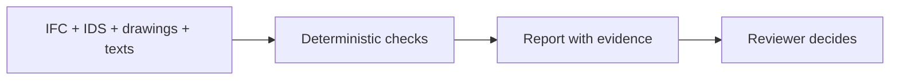

<!-- claims-lint: allow-file reason="Claims-boundary doc citing forbidden phrases as non-claims per pilot-claim-boundary / Claims Lock (WP-A5)" -->
# AeroBIM

[Русская версия](README.ru.md)

[](https://github.com/KonkovDV/AeroBIM/actions/workflows/ci.yml)
[](audit/reports/CRITICAL_BLOCKERS.md)
[](https://www.python.org/downloads/)
[](LICENSE)

**AeroBIM checks a construction pack the way an expert starts: the model against the rules, the drawings against the model, the texts against both.**

IFC + IDS + sheets + specification texts go in. Findings you can follow to a sheet and a GUID come out — HTML, JSON, BCF. The reviewer still decides. AeroBIM is not a CDE, not a model viewer, and not a replacement for the expert.

> **Checkpoint #2 (20 Aug 2026), Moscow TechLab task 07, customer Samolet Group.** Intake pack: [`submission/README.md`](submission/README.md). We are in *refinement*. One command shows a fail-closed finding on a fixture. Effectiveness validation and deployment have not started. Checkpoint `NO_GO` until a Samolet corpus, two raters, a signed acceptance profile, and CDE proof.
>
> Мы на стадии доработки. Одна команда показывает находку с доказательствами на учебном комплекте. Валидация эффективности и внедрение ещё не начались. `NO_GO` сохраняется, пока нет корпуса Самолёта, двух разметчиков, подписанного профиля приёмки и подтверждения импорта в СОД.

## The seam where packs break

A schedule on a PDF sheet states one area. The IFC wall with the same identifier states another. Each file opens cleanly on its own. The defect lives *between* them and usually surfaces on site.

AeroBIM raises that class of finding with provenance to the sheet and the GUID, leaves the verdict to the reviewer, and never authorises the ISO 19650 Shared → Published transition. Participation in TechLab is a programme status, not a measured result on Samolet's own pack.

## What you can clone today

| TZ / Task 07 ask | What the clone actually does |
|---|---|
| Ingest 2D + BIM + texts | IFC 2x3 / 4 / 4x3, IDS 1.0, PDF vector/raster, specification text |
| Cross-check model, drawings, rules | Deterministic IFC + IDS + cross-document compare (ISO 12006-3 tolerance) |
| Highlight and remark | 2D overlay, 3D review shell, RU/EN remark templates, expert edit |
| Report for coordination | HTML + JSON + structural BCF 2.1 / 3.0 ZIP |
| Expert stays accountable | `summary.passed` is a Shared-gate. LLM/VLM never write it ([ADR-001](docs/architecture/ADR-001-verdict-ownership-2026.md)) |

Silence is never success: a skipped mandatory engine cannot hide inside a green report.

## Status at a glance

| | |
|---|---|
| **Runs on this clone** | Fixture packs, fail-closed IDS, live CLI, CI, overlay, structural BCF |
| **Waits on the customer** | RT-001 corpus · RT-002 signed Samolet profile · RT-003 federated MEP · BCF import into their CDE |
| **Not claimed** | Product accuracy >90% · customer SLA ≤30 min · native DWG · MEP delivered · CDE-ready BCF · production-ready |

Full boundary: [`docs/pilot-claim-boundary-2026.md`](docs/pilot-claim-boundary-2026.md). Blockers: [`audit/reports/CRITICAL_BLOCKERS.md`](audit/reports/CRITICAL_BLOCKERS.md).

## Try it

```bash
git clone https://github.com/KonkovDV/AeroBIM.git
cd AeroBIM/backend

# CPython 3.12, the version CI pins.
python3.12 -m venv .venv            # Windows: py -3.12 -m venv .venv
source .venv/bin/activate           # Windows PowerShell: .\.venv\Scripts\Activate.ps1

# Core PDF is pypdfium2; the overlay does not need PyMuPDF
pip install -e ".[dev,raster]"

# 1. Acceptance gate on an IFC + IDS fixture
python -m aerobim.tools.run_demo_ifc_acceptance_gate
# → artifacts/ifc-acceptance-gate-demo/{report.html,acceptance-gate.json}

# 2. Same package with the drawing overlay
python -m aerobim.tools.run_demo_vertical_slice
# → artifacts/vertical-slice-demo/report.html: sheet fragment, overlay,
#   text evidence, capability table, run manifest, BCF ZIP

pytest tests -q
python -m aerobim.main   # → http://127.0.0.1:8080/health
```

Both demos end with `summary.passed=false`, which is the expected result: the fixture pack contains planted defects. These are fixtures, not customer data, and the numbers they produce are not product accuracy. A local `pytest` count is not the CI pin in the runtime baseline below.

Optional extras: `.[clash]` for geometry clash detection, `.[docling]` for non-text document extraction, `.[enterprise]` for S3 and Postgres adapters, `.[pdf-agpl]` for legacy PyMuPDF tools (not needed for anything above). The review shell: `cd frontend && npm ci && npm run dev`.

## Who this page is for

Routing only — none of these people have endorsed the product.

| Reader | Start here |
|---|---|
| TechLab / MIK jury | Formula above → [`submission/README.md`](submission/README.md) → the command just above |
| Samolet (TZ) | Coverage map [`submission/TZ_REQUIREMENTS_COVERAGE_2026_08.md`](submission/TZ_REQUIREMENTS_COVERAGE_2026_08.md) · ask [`docs/partners/_08_15.md`](docs/partners/_08_15.md) |
| Tracker | [`docs/demo/TRACKER_MEETING_2026_08_14.md`](docs/demo/TRACKER_MEETING_2026_08_14.md) (14.08 + addendum 17.08) — Tangl checks the **model**; AeroBIM checks the **pack**; we do not replace 10D |
| IT mentor | Fail-closed IDS, live CLI `run_demo_ifc_acceptance_gate`, five-layer architecture below. CI pin ≠ local pytest |
| Scientific mentor | Protocol before numbers: [`docs/pilot/QUALITY_MEASUREMENT_PROTOCOL_2026_08.md`](docs/pilot/QUALITY_MEASUREMENT_PROTOCOL_2026_08.md) · Kane IUA [`docs/quality/INTERPRETATION_USE_LEDGER_2026_08.md`](docs/quality/INTERPRETATION_USE_LEDGER_2026_08.md) · fixture F1 is not product accuracy |
| Investor / diligence | No legal entity, no round this week. Ask = calendar slot + labeled pack, not a SAFE. [`docs/quality/RED_TEAM_FUNDING_ATTACKS_KT2_2026_08_15.md`](docs/quality/RED_TEAM_FUNDING_ATTACKS_KT2_2026_08_15.md) |

## What a run actually does

A pack goes in. Deterministic checks run. One fused report comes out.

1. **The model.** Properties and quantities are validated with IfcOpenShell. IFC2x3 (ISO 16739:2005), IFC4 ADD2 (ISO 16739-1:2018) and IFC4x3 (ISO 16739-1:2024) go through one kernel. Where property-set names diverge between releases, the difference is a `ValidationIssue`, not a silent skip. Per-feature rules: [`docs/ifc-compatibility-matrix.md`](docs/ifc-compatibility-matrix.md).
2. **The rules.** IDS 1.0 is validated with IfcTester. Official Moscow Region State Expertise rule sets ship in `samples/`. A requested rule set that cannot load fails closed — it cannot look like a pass.
3. **The other documents.** The model is compared with drawing notes, specifications and calculation texts, with an ISO 12006-3 tolerance band and Russian/European grouped decimals. Sources are compared; nothing is recomputed. Independent correctness of calculations is not implemented.
4. **The report.** Each finding carries `finding_id`, `source_id` and `evidence_refs` (persistence refuses a finding without them). People get HTML; machines get JSON; issue exchange gets a structural BCF 2.1 / 3.0 ZIP. The browser review shell (web-ifc + Three.js) shows the IFC in 3D and the evidence on the sheet.

Two properties make the result auditable.

- **Same input, same `summary.passed`.** The technical flag is assembled from deterministic errors and the capability table ([ADR-001](docs/architecture/ADR-001-verdict-ownership-2026.md)). Advisory LLM/VLM text, if enabled at all, drafts remark wording only and never writes `summary.passed`. Under customer sign-off profiles, outbound advisory calls are forbidden.
- **Silence is never success.** Every optional engine reports `ok`, `skipped` or `failed`. Any `FAILED` capability forces `summary.passed=false`. A missing clash engine cannot hide inside a green report. The same boundary is served on `GET /v1/system/capabilities`.

`summary.passed` is a Shared-gate under configured rules. It is not contractual fitness and not permission to build. Target architecture: [`docs/architecture/TARGET_HYBRID_ARCHITECTURE_TZ_2026.md`](docs/architecture/TARGET_HYBRID_ARCHITECTURE_TZ_2026.md).



## Checkpoint: `NO_GO`

This is readiness for *customer sign-off*, not “the system does not run”. Code and fixtures work. Three blockers stay open, and none of them can be closed by writing more code:

| ID | Still open | Not the same thing |
|---|---|---|
| **RT-001** | No Russian PD pack paired with expertise conclusions | Open benches (AEC-Bench, IFC-Bench, GNI) are a different contour |
| **RT-002** | No Samolet-signed acceptance profile | Official Moscow Region State Expertise IDS files already ship in `samples/` |
| **RT-003** | Federated MEP clash **NOT_VERIFIED** | Public federated inventory is measured; MEP delivered is not claimed |

BCF ZIP export is structural T1 ([`audit/evidence/bcf-structural-handoff-2026-07-25.json`](audit/evidence/bcf-structural-handoff-2026-07-25.json)). Import into an independent CDE is **NOT_VERIFIED**. Native DWG is missing (fail-closed). Independent calculation correctness is not implemented — sources are compared, not recomputed.

GOST R 21.101-2026 §8.2.4 (from 1 April 2026) requires a stable GUID on each electronic design document. AeroBIM has addressed findings to stable identifiers from day one. That is a coincidence of mechanism, not a claim of full conformity with the standard.

Register: [`audit/reports/CRITICAL_BLOCKERS.md`](audit/reports/CRITICAL_BLOCKERS.md) · engineering status: [`docs/ENGINEERING_STATUS_2026_08.md`](docs/ENGINEERING_STATUS_2026_08.md). Speech card: [`docs/demo/KT2_JURY_FAQ_2026_08_12.md`](docs/demo/KT2_JURY_FAQ_2026_08_12.md).

## OpenBIM and how we measure

| Practice (Aug 2026) | In this repo | Gap before “done” |
|---|---|---|
| IDS 1.0 as a machine information contract | IfcTester, fail-closed on version/load | Customer pack hash + signed profile (RT-002) |
| Dual-rater precision before published accuracy | Wilson planner and κ/α harness exist; no κ without customer labels | Customer corpus + two adjudicators (RT-001) |
| BCF → CDE | Structural ZIP (T1) | T2 import log in Samolet CDE |
| ISO 19650 | Lite fields on the report (Shared-gate metadata) | Not a CDE; ISO 19650-6 is H&S sharing, not this gate |
| FAIR research software | `CITATION.cff`, licence inventory, reproducible commands | Fixture F1 ≠ product accuracy |

Alignment map: [`docs/tz/KT2_TRI_SOURCE_ALIGNMENT_2026_08_12.md`](docs/tz/KT2_TRI_SOURCE_ALIGNMENT_2026_08_12.md).

## What runs today

Every status below is a **repository or fixture** capability unless stated otherwise. Fixture results are not product accuracy: the customer corpus that would allow such a claim is blocker RT-001.

**On the fixture packs you can clone today**

- IFC property and quantity validation; IDS 1.0, fail-closed if the rule set cannot load
- Cross-document contradictions (`ConflictKind` taxonomy, configurable severity) and drawing annotation ↔ IFC (a claimed GUID becomes `ifc_guid` only after it is present in the spatial index)
- ISO 12006-3 tolerance algebra; deterministic requirement extraction from narrative text (no model signs anything off)
- Capability honesty on every report; tenant/object ACL on artifacts under `samolet_pilot` / `production` sign-off (off by default in development); HTML/JSON export; structural BCF 2.1 / 3.0 ZIP
- Deterministic PDF text and crop (pypdfium2 + pdfminer; default `AEROBIM_PDF_BACKEND=pdfium`)
- Browser IFC viewer and 2D overlay; offline Docker bundle (`closed-contour --smoke`; bare metal without Docker is out of scope)
- Norm rule packs (eligibility + expert journal; a fixture pack is not a customer-signed profile) and an opt-in package completeness inventory (not a regulatory completeness verdict)
- Quality measurement protocol (Wilson intervals, sample-size planner; interim target 0.60) — protocol, not a published product score

**Optional, partial, or missing**

- Geometry clash: optional extra `.[clash]` — engine rehearsal, not MEP system clash; SKIPPED becomes FAILED when clash is required
- Image OCR: optional extra `.[raster]`; zero yield becomes FAILED when OCR was requested
- PyMuPDF: optional extra `pdf-agpl` (AGPL-3.0 / Artifex); absent from the runtime lock and the Docker image
- Advisory LLM/VLM overlay: experimental drafts only; never writes `summary.passed`
- OpenCDE BCF API push: experimental; not a substitute for proven import into a customer CDE
- IFC knowledge graph: experimental advisory query scaffold
- DXF ingest: optional ezdxf, partial and not verified; not DWG support
- Detached signature envelope: hashes and roles only; the trust chain stays **NOT_VERIFIED**
- Browser OIDC session: not implemented (default 501); the lab cookie path is not production SSO
- Customer accuracy >90% and approved norms: blocked on RT-001 and RT-002

## HTTP API

<details>
<summary>Endpoints (local <code>python -m aerobim.main</code>)</summary>

`GET /health` is unauthenticated. `/v1/*` requires `AEROBIM_API_BEARER_TOKEN` unless `AEROBIM_ALLOW_ANONYMOUS_DEV=true` (development only).

| Method | Path | Purpose |
|---|---|---|
| `GET` | `/health` | Readiness probe |
| `GET` | `/v1/system/capabilities` | Declared capability boundary, including what is missing |
| `POST` | `/v1/uploads` | Multipart ingest; returns a storage-relative path for analysis |
| `POST` | `/v1/validate/ifc` | Validate an IFC file against requirements and IDS |
| `POST` | `/v1/analyze/project-package` | Full package analysis: model, drawings, specification, calculation |
| `POST` | `/v1/analyze/project-package/submit` | Queue a larger package as a background job |
| `GET` | `/v1/analyze/project-package/jobs/{job_id}` | Poll a background job |
| `GET` | `/v1/reports` | List persisted reports, filtered by project, discipline or verdict |
| `GET` | `/v1/reports/{id}` | Fetch one report |
| `GET` | `/v1/reports/{id}/export/{json,html,bcf}` | Export a report; `?version=3` switches BCF 3.0 |
| `POST` | `/v1/reports/{id}/review-events` | Append reviewer telemetry; never changes the verdict |
| `GET` | `/v1/reports/{id}/review-kpi` | Aggregate triage and acceptance metrics |

Package analysis optionally accepts an OpenRebar reinforcement report (`reinforcement_report_path`) with a SHA-256 provenance digest, and raises cross-document warnings on contract, solver, project-context or digest mismatch. This compares declared sources; it does not recompute anything. Generate the digest with `python -m aerobim.tools.openrebar_provenance_digest`.

</details>

## Architecture

Five layers, dependencies pointing inward only:

```
core/            DI container, tokens, configuration (no project imports)
domain/          Immutable models, Protocol ports, logging contract
application/     Use case orchestration: requirement fusion, contradiction detection
infrastructure/  Adapters: IfcOpenShell, IfcTester, Docling, IfcClash, BCF, storage
presentation/    FastAPI HTTP layer, correlation middleware
```

**48 domain Protocol ports** wire to **72 infrastructure adapter modules** through **63 DI tokens** in `bootstrap_container()`. These counts are live inventory: they are regenerated into [`docs/evidence/runtime-baseline-latest.json`](docs/evidence/runtime-baseline-latest.json) and verified in CI against both READMEs, so they cannot be edited by hand.

Artifacts sit behind an `ObjectStore` port, so local storage and S3-compatible buckets are the same code path. Report summaries are additionally indexed in Postgres when `AEROBIM_DB_URL` is set; that path is acceptable for a pilot but expects schema migration out of band before production use.

## Configuration

A local clone runs on defaults. The table is the full configuration surface: every `AEROBIM_*` knob the code reads is listed here and checked in CI against [`backend/.env.example`](backend/.env.example).

<details>
<summary>Full <code>AEROBIM_*</code> table (CI-checked against <code>backend/.env.example</code>)</summary>

| Variable | Default | Description |
|---|---|---|
| `AEROBIM_HOST` | `127.0.0.1` | Bind address |
| `AEROBIM_PORT` | `8080` | Bind port |
| `AEROBIM_DEBUG` | `false` | Debug mode (also enables localhost CORS defaults when origins unset) |
| `AEROBIM_STORAGE_DIR` | `var/reports` | Report persistence directory |
| `AEROBIM_CORS_ORIGINS` | *(auto)* | Comma-separated CORS origins |
| `AEROBIM_ENV` | `development` | Environment name; non-dev requires bearer/OIDC (fail-closed) |
| `AEROBIM_SIGNOFF_PROFILE` | *(auto)* | `samolet_pilot` and `production` are closed customer contours: capabilities fail closed and outbound advisory LLM calls are forbidden. Unset outside development resolves to `production`. Also accepts `development` and `fixture` |
| `AEROBIM_API_BEARER_TOKEN` | *(unset)* | Bearer for `/v1/*`; required unless `AEROBIM_ALLOW_ANONYMOUS_DEV` |
| `AEROBIM_ALLOW_ANONYMOUS_DEV` | `false` | Opt-in anonymous API in development/test only (`from_env`) |
| `AEROBIM_CLASH_AFFECTS_PASS` | `false` | Soft only in development/fixture; forced `true` under pilot/production sign-off |
| `AEROBIM_CLASH_SKIP_TINY` | `true` | Skip degenerate/tiny IFC products before IfcClash; all-skipped still FAILED |
| `AEROBIM_CLASH_MIN_AABB_VOLUME_M3` | `1e-6` | AABB volume threshold used when `AEROBIM_CLASH_SKIP_TINY` is on |
| `AEROBIM_REQUIRE_CLASH` | `false` | Soft only in development/fixture; forced under pilot/production |
| `AEROBIM_REQUIRE_MEP_SYSTEM_CLASH` | `false` | When true, MEP `NOT_VERIFIED` blocks Shared-gate pass |
| `AEROBIM_MEP_FEDERATED_SCOPE_PATH` | *(unset)* | Federated MEP scope JSON (VERIFIED customer or ENG_FIXTURE) |
| `AEROBIM_MEP_AABB_FILTER` | `true` | Optional AABB broadphase for MEP matrix pairs; still `geometry_verified=False` |
| `AEROBIM_PDF_BACKEND` | `pdfium` | Core PDF: `pdfium` / `none`; optional legacy `pymupdf` only with `pdf-agpl` |
| `AEROBIM_MAX_IFC_BYTES` | `268435456` | Max IFC size (256 MiB, aligned with bSI Validation Service) |
| `AEROBIM_CROSS_DOC_SEVERITY` | `warning` | Severity for cross-document contradictions: `error` (blocking), `warning`, `info` |
| `AEROBIM_REMARK_LOCALE` | `ru` | Remark template language for deterministic generators (`ru` / `en`) |
| `AEROBIM_PRIORITY_PROFILE` | `default` | Review priority weighting profile (`default`; `samolet` in fixture SLA smoke only) |
| `AEROBIM_DB_URL` | *(unset)* | Optional Postgres URL for report summary indexing. Bootstrap issues `CREATE`/`ALTER`, so production should migrate schema out of band and then grant a DML-only role |
| `AEROBIM_REPORT_TTL_DAYS` | *(unset)* | Optional TTL for persisted report payloads; unset means unlimited retention |
| `AEROBIM_S3_BUCKET` | *(unset)* | Optional S3/MinIO bucket for object storage |
| `AEROBIM_S3_ENDPOINT_URL` | *(unset)* | Optional MinIO/custom S3 endpoint |
| `AEROBIM_S3_REGION` | `us-east-1` | Signing region for S3-compatible storage |
| `AEROBIM_S3_ACCESS_KEY_ID` | *(unset)* | Optional access key for S3-compatible storage |
| `AEROBIM_S3_SECRET_ACCESS_KEY` | *(unset)* | Optional secret key for S3-compatible storage |
| `AEROBIM_S3_PREFIX` | `aerobim` | Prefix applied to object keys in S3-compatible storage |
| `AEROBIM_LLM_ADVISORY_ENABLED` | `false` | Development only: opt-in OpenAI-compatible advisory model. Never sets `summary.passed`; reports `ready=false` under `samolet_pilot` and `production`. The deprecated alias `AEROBIM_LLM_LOCAL_ENABLED` still works but warns at boot |
| `AEROBIM_LLM_BASE_URL` | *(unset; Studio default when provider=`yandex-ai-studio`)* | Loopback or RF HTTPS OpenAI-compat base (`…/v1`); SSRF-gated at boot |
| `AEROBIM_LLM_API_KEY` | *(unset)* | Optional bearer for Studio; never logged / never in `audit_event` |
| `AEROBIM_LLM_PROVIDER` | `qwen-local` | Provider label (`qwen-local` / `yandex-ai-studio`) |
| `AEROBIM_LLM_MODEL` | `Qwen3.6-27B` | Local bare id, or Yandex `gpt://{folder}/{model}` |
| `AEROBIM_LLM_MODEL_REVISION` | *(required if enabled)* | Exact catalog version (not `latest`/`rc`); composed into URI |
| `AEROBIM_LLM_FOLDER_ID` | *(unset)* | Yandex folder → `x-folder-id` + URI composition |
| `AEROBIM_LLM_AUTH_SCHEME` | `Bearer` | `Bearer` or `Api-Key`, depending on the provider |
| `AEROBIM_LLM_SEND_SEED` | `true` (`false` for Studio) | Omit `seed` when false (Yandex may 400) |
| `AEROBIM_LLM_RESPONSE_FORMAT_MODE` | `json_object` (`json_schema` for Studio) | Yandex prefers `json_schema` + `REMARK_JSON_SCHEMA` |
| `AEROBIM_LLM_DATA_LOGGING_ENABLED` | `false` | When false, send `x-data-logging-enabled: false` (audit-recorded) |
| `AEROBIM_LLM_MODEL_SHA256` | *(unset)* | Optional checkpoint hash in usage/audit |
| `AEROBIM_LLM_MAX_TOKENS_PER_CALL` | `4096` | Fail-closed token cap per call |
| `AEROBIM_LLM_MAX_TOKENS_PER_RUN` | `100000` | Fail-closed per-run cap |
| `AEROBIM_LLM_MAX_TOKENS_PER_DAY` | `300000` | Fail-closed daily cap |
| `AEROBIM_LLM_BUDGET_TZ` | `Europe/Moscow` | IANA timezone for day-roll of the daily cap |
| `AEROBIM_LLM_BUDGET_LEDGER` | *(unset)* | Shared JSON ledger path across workers; **required** for grant ops (without it: process-local ≈ N× day cap) |
| `AEROBIM_LLM_MAX_COMPLETION_TOKENS` | `512` | Completion budget passed to the API |
| `AEROBIM_LLM_MAX_CONCURRENT` | `4` | Semaphore for parallel advisory calls |
| `AEROBIM_LLM_ADVISORY_MAX_ISSUES` | `32` | Max findings to overlay with AI remark drafts per analyze |
| `AEROBIM_LLM_429_RETRIES` | `3` | Linear backoff retries on HTTP 429 before SKIPPED |
| `AEROBIM_LLM_ALLOWED_HOSTS` | *(built-in)* | Extra allowlisted hostnames (comma-separated); Alibaba/OpenAI always forbidden |
| `AEROBIM_HYBRID_PROVIDER_CONFIG` | *(unset)* | Path to hybrid provider JSON (`schema_version` ≥1.1 requires `model_revision`) |
| `AEROBIM_API_TENANT_ID` | *(unset)* | Optional tenant id for multi-tenant API auth |
| `AEROBIM_APP_NAME` | `aerobim` | Application name for logs / OpenAPI title |
| `AEROBIM_BCF_API_BASE_URL` | *(unset)* | Optional BCF API base URL (enterprise sync) |
| `AEROBIM_BCF_API_PROJECT_ID` | *(unset)* | Optional BCF project id |
| `AEROBIM_BCF_API_TOKEN` | *(unset)* | Optional BCF API bearer token |
| `AEROBIM_BCF_API_VERSION` | `2.1` | BCF API version label |
| `AEROBIM_BSI_API_TOKEN` | *(unset)* | Optional buildingSMART Validation Service token |
| `AEROBIM_BSI_VALIDATION_URL` | *(built-in)* | Optional override for bSI Validation Service URL |
| `AEROBIM_GATES_ATTESTED` | *(CI only)* | Comma-separated CI job names attested into the runtime baseline; ignored locally, and must equal the required gate set under GitHub Actions |
| `AEROBIM_HTTP_RATE_LIMIT_PER_MINUTE` | `120` | Per-client limit for analyze/validate/upload POSTs and GET `/v1/auth/login` + `/v1/auth/callback`; HD2-RL-02: `0` disables in development; **must be >0** under pilot/production |
| `AEROBIM_TRUSTED_PROXY_IPS` | *(unset)* | Comma-separated peer IPs allowed to supply `X-Forwarded-For` for rate-limit keys; empty = never trust XFF |
| `AEROBIM_IFC_PARSE_CACHE_DIR` | *(unset)* | Optional on-disk IFC parse cache directory |
| `AEROBIM_KIMI_API_BASE_URL` | *(unset)* | Optional Kimi OpenAI-compat base URL |
| `AEROBIM_KIMI_API_KEY` | *(unset)* | Optional Kimi API key (never logged) |
| `AEROBIM_KIMI_CACHE_DIR` | *(unset)* | Optional Kimi response cache directory |
| `AEROBIM_KIMI_CACHE_NAMESPACE` | *(unset)* | Optional Kimi cache namespace |
| `AEROBIM_KIMI_CACHE_PROJECT` | *(unset)* | Optional Kimi cache project key |
| `AEROBIM_KIMI_MODEL` | *(unset)* | Optional Kimi model id |
| `AEROBIM_KIMI_REASONING_EFFORT` | *(unset)* | Optional Kimi reasoning effort knob |
| `AEROBIM_LLM_TIMEOUT_SECONDS` | `120` | Advisory LLM HTTP timeout seconds |
| `AEROBIM_MEP_SCOPE_MEMO_REF` | *(unset)* | Optional memo ref for federated MEP scope provenance |
| `AEROBIM_NORM_RULE_PACK` | *(unset)* | Optional norm rule-pack id/path |
| `AEROBIM_OIDC_AUDIENCE` | *(unset)* | OIDC audience claim required under pilot/production |
| `AEROBIM_OIDC_ISSUER` | *(unset)* | OIDC issuer URL |
| `AEROBIM_OIDC_JWKS_EXTRA_HOSTS` | *(unset)* | Extra allowlisted JWKS hostnames |
| `AEROBIM_OIDC_JWKS_URL` | *(unset)* | OIDC JWKS URL |
| `AEROBIM_OIDC_ROLES_CLAIM` | `roles` | OIDC claim name for roles |
| `AEROBIM_OIDC_TENANT_CLAIM` | `tenant_id` | OIDC claim name for tenant (no `tid`/`org_id` fallback) |
| `AEROBIM_OIDC_BFF_CLIENT_ID` | *(unset)* | Lab-only OIDC BFF public client id; `auth_bff` stays **NOT_IMPLEMENTED** unless lab Phase 3 is fully configured |
| `AEROBIM_OIDC_BFF_AUTHORIZE_URL` | *(unset)* | Lab-only IdP authorize URL draft; not a production login |
| `AEROBIM_OIDC_BFF_REDIRECT_URI_ALLOWLIST` | *(unset)* | Comma-separated exact `redirect_uri` allowlist for lab BFF redirects |
| `AEROBIM_OIDC_BFF_TOKEN_URL` | *(unset)* | Lab-only token endpoint; required for Phase 3; SSRF-gated at boot |
| `AEROBIM_OIDC_BFF_CLIENT_SECRET` | *(unset)* | Confidential BFF client secret (lab); never a production SSO claim |
| `AEROBIM_OIDC_BFF_COOKIE_SECRET` | *(unset)* | HMAC secret for the lab session cookie; unset keeps Phase 3 off |
| `AEROBIM_REDIS_URL` | *(unset in dev)* | Required outside development/test for durable jobs and shared rate limits |
| `AEROBIM_VLM_ENABLED` | `false` | Opt-in advisory VLM drawing read; never sets `summary.passed` |

</details>

<!-- AEROBIM_DOCUMENTED_ENV:BEGIN -->
<!-- machine-checked parity list (export_runtime_baseline --check-readme)
AEROBIM_ALLOW_ANONYMOUS_DEV
AEROBIM_API_BEARER_TOKEN
AEROBIM_API_TENANT_ID
AEROBIM_APP_NAME
AEROBIM_BCF_API_BASE_URL
AEROBIM_BCF_API_PROJECT_ID
AEROBIM_BCF_API_TOKEN
AEROBIM_BCF_API_VERSION
AEROBIM_BSI_API_TOKEN
AEROBIM_BSI_VALIDATION_URL
AEROBIM_CLASH_AFFECTS_PASS
AEROBIM_CLASH_MIN_AABB_VOLUME_M3
AEROBIM_CLASH_SKIP_TINY
AEROBIM_CORS_ORIGINS
AEROBIM_CROSS_DOC_SEVERITY
AEROBIM_DB_URL
AEROBIM_DEBUG
AEROBIM_ENV
AEROBIM_GATES_ATTESTED
AEROBIM_HOST
AEROBIM_HTTP_RATE_LIMIT_PER_MINUTE
AEROBIM_HYBRID_PROVIDER_CONFIG
AEROBIM_IFC_PARSE_CACHE_DIR
AEROBIM_KIMI_API_BASE_URL
AEROBIM_KIMI_API_KEY
AEROBIM_KIMI_CACHE_DIR
AEROBIM_KIMI_CACHE_NAMESPACE
AEROBIM_KIMI_CACHE_PROJECT
AEROBIM_KIMI_MODEL
AEROBIM_KIMI_REASONING_EFFORT
AEROBIM_LLM_429_RETRIES
AEROBIM_LLM_ADVISORY_ENABLED
AEROBIM_LLM_ADVISORY_MAX_ISSUES
AEROBIM_LLM_ALLOWED_HOSTS
AEROBIM_LLM_API_KEY
AEROBIM_LLM_AUTH_SCHEME
AEROBIM_LLM_BASE_URL
AEROBIM_LLM_BUDGET_LEDGER
AEROBIM_LLM_BUDGET_TZ
AEROBIM_LLM_DATA_LOGGING_ENABLED
AEROBIM_LLM_FOLDER_ID
AEROBIM_LLM_LOCAL_ENABLED
AEROBIM_LLM_MAX_COMPLETION_TOKENS
AEROBIM_LLM_MAX_CONCURRENT
AEROBIM_LLM_MAX_TOKENS_PER_CALL
AEROBIM_LLM_MAX_TOKENS_PER_DAY
AEROBIM_LLM_MAX_TOKENS_PER_RUN
AEROBIM_LLM_MODEL
AEROBIM_LLM_MODEL_REVISION
AEROBIM_LLM_MODEL_SHA256
AEROBIM_LLM_PROVIDER
AEROBIM_LLM_RESPONSE_FORMAT_MODE
AEROBIM_LLM_SEND_SEED
AEROBIM_LLM_TIMEOUT_SECONDS
AEROBIM_MAX_IFC_BYTES
AEROBIM_MEP_AABB_FILTER
AEROBIM_MEP_FEDERATED_SCOPE_PATH
AEROBIM_MEP_SCOPE_MEMO_REF
AEROBIM_NORM_RULE_PACK
AEROBIM_OIDC_AUDIENCE
AEROBIM_OIDC_BFF_AUTHORIZE_URL
AEROBIM_OIDC_BFF_CLIENT_ID
AEROBIM_OIDC_BFF_CLIENT_SECRET
AEROBIM_OIDC_BFF_COOKIE_SECRET
AEROBIM_OIDC_BFF_REDIRECT_URI_ALLOWLIST
AEROBIM_OIDC_BFF_TOKEN_URL
AEROBIM_OIDC_ISSUER
AEROBIM_OIDC_JWKS_EXTRA_HOSTS
AEROBIM_OIDC_JWKS_URL
AEROBIM_OIDC_ROLES_CLAIM
AEROBIM_OIDC_TENANT_CLAIM
AEROBIM_PDF_BACKEND
AEROBIM_PORT
AEROBIM_PRIORITY_PROFILE
AEROBIM_REDIS_URL
AEROBIM_REMARK_LOCALE
AEROBIM_REPORT_TTL_DAYS
AEROBIM_REQUIRE_CLASH
AEROBIM_REQUIRE_MEP_SYSTEM_CLASH
AEROBIM_S3_ACCESS_KEY_ID
AEROBIM_S3_BUCKET
AEROBIM_S3_ENDPOINT_URL
AEROBIM_S3_PREFIX
AEROBIM_S3_REGION
AEROBIM_S3_SECRET_ACCESS_KEY
AEROBIM_SIGNOFF_PROFILE
AEROBIM_STORAGE_DIR
AEROBIM_TRUSTED_PROXY_IPS
AEROBIM_VLM_ENABLED
-->
<!-- AEROBIM_DOCUMENTED_ENV:END -->

## Repository

```text
backend/      FastAPI service: core → domain → application → infrastructure → presentation
frontend/     Browser review shell (IFC 3D + drawing overlay)
samples/      IFC, IDS, drawing and specification fixtures; benchmark packs
docs/         Documentation and evidence artifacts
audit/        Claims lock, blocker register, citable honesty fixtures
submission/   Checkpoint #2 submission pack
```

Code volume and the pass counts recorded by CI are generated, never typed by hand:

<!-- AEROBIM_RUNTIME_BASELINE:BEGIN -->
<!-- regenerated by: python -m aerobim.tools.export_runtime_baseline -->
tests_passed: backend=2470, frontend=56; commit 8bdf6d16629e; see docs/evidence/runtime-baseline-latest.json · src ~77837 LOC; tests ~51459 LOC; extraction macro_f1=0.8600000000000001 (fixture corpus; not product accuracy)
<!-- AEROBIM_RUNTIME_BASELINE:END -->

## Development

Run locally what CI runs:

```bash
cd backend
python -m ruff format --check src tests
python -m ruff check src tests
python -m mypy src
pytest tests -q
```

Or all fast CI gates in one command from the repo root (~15 s): `python scripts/pre_push_gate.py` with the backend venv python. A local `pre-push` hook can call it automatically.

Measurements are reproducible commands, not stored numbers:

```bash
python -m aerobim.tools.benchmark_project_package --iterations 1 --warmup-iterations 0
python -m aerobim.tools.measure_package_sla --corpus-kind fixture
python -m aerobim.tools.evaluate_extraction --min-macro-f1 0.70
python -m aerobim.tools.verify_bcf_structural_handoff
python -m aerobim.tools.export_runtime_baseline
python -m aerobim.tools.export_evidence_bundle \
  --pack ../samples/benchmarks/project-package-techlab-demo.json \
  --output ../artifacts/evidence-bundle/techlab-demo
```

Throughput and F1 figures are environment-specific and fixture-scoped. Any performance statement must ship with the pack path, CLI flags, machine fingerprint and artifact hashes. Citation: [`CITATION.cff`](CITATION.cff) · [`docs/CITATION.bib`](docs/CITATION.bib).

## Documentation

This repository publishes the reviewable set: code, requirements, claim boundaries, architecture and evidence. Internal runbooks and working notes are deliberately not published.

| Topic | Document |
|---|---|
| Start here | [Tier-0 jury map](docs/TIER0_INDEX.md) · [Documentation index](docs/README.md) |
| Checkpoint #2 submission pack | [Submission pack](submission/README.md) |
| Jury speech card | [Jury FAQ](docs/demo/KT2_JURY_FAQ_2026_08_12.md) |
| Tracker notes (Tangl / 10D) | [Tracker meeting 14.08](docs/demo/TRACKER_MEETING_2026_08_14.md) |
| MIK / TechLab programme contour | [MIK pilot compliance](docs/partners/MIK_PILOT_COMPLIANCE_2026.md) |
| Diligence attack surface | [Funding / diligence attacks](docs/quality/RED_TEAM_FUNDING_ATTACKS_KT2_2026_08_15.md) |
| Blocker register and checkpoint | [Critical blockers](audit/reports/CRITICAL_BLOCKERS.md) |
| What is claimed and what is not | [Claim boundary](docs/pilot-claim-boundary-2026.md) · [Capability matrix](docs/capability-claim-matrix-2026.md) · [Claims lock](audit/reports/CLAIMS_LOCK_2026_07_17.md) |
| Engineering status | [August 2026 status](docs/ENGINEERING_STATUS_2026_08.md) · [Project status audit](docs/PROJECT_STATUS_AUDIT_2026.md) |
| Accepted risks | [Accepted risks registry](docs/quality/ACCEPTED_RISKS_REGISTRY_KT2_2026_08_09.md) |
| Architecture | [Target architecture](docs/architecture/TARGET_HYBRID_ARCHITECTURE_TZ_2026.md) · [ADR-001](docs/architecture/ADR-001-verdict-ownership-2026.md) |
| Requirements and traceability | [TZ pack](docs/tz/README.md) · [TechLab alignment](docs/samolet-techlab-alignment-2026.md) |
| How quality is measured | [Quality protocol](docs/pilot/QUALITY_MEASUREMENT_PROTOCOL_2026_08.md) · [Benchmark evidence](docs/benchmark-evidence-2026.md) |
| Fixtures, corpora, evidence | [Evidence index](docs/evidence/README.md) · [Benchmarks](samples/benchmarks/README.md) · [Open corpora](samples/benchmarks/open-corpora/README.md) |
| Licensing and offline deployment | [License policy](docs/license-policy-2026.md) · [Offline deployment](docs/offline-deployment-2026.md) |
| Reproducibility | [Reproducibility](docs/REPRODUCIBILITY-2026.md) |

Project governance: [Contributing](CONTRIBUTING.md) · [Code of conduct](CODE_OF_CONDUCT.md) · [Security policy](SECURITY.md) · [Support](SUPPORT.md) · [Maintainers](MAINTAINERS.md) · [Release policy](RELEASE_POLICY.md).

## Cite

Use [`CITATION.cff`](CITATION.cff) (GitHub “Cite this repository”) or [`docs/CITATION.bib`](docs/CITATION.bib). Cite the exact Git tag or commit SHA, not a floating `latest`. The FAIR Principles for Research Software ([Chue Hong et al., 2022](https://doi.org/10.15497/RDA00068); [Barker et al., *Sci Data*](https://doi.org/10.1038/s41597-022-01710-x)) are the documentation target: purpose, install, licence, citation, status. This repository is **not** a certified FAIR assessment.

## Stack

Python 3.12+ with FastAPI and Uvicorn. The buildingSMART toolchain — IfcOpenShell, IfcTester, IfcClash — does the IFC work; web-ifc and Three.js drive the browser review shell; pypdfium2 and pdfminer.six handle PDF, with PyMuPDF, RapidOCR and Docling as optional extras. Five-layer Clean Architecture, constructor injection, Protocol ports.

## License

MIT for code authored in this repository. Third-party components keep their own licences: pypdfium2, pdfminer.six and Pillow are permissive; IfcOpenShell and IfcTester are LGPL-3.0-or-later; web-ifc is MPL-2.0; PyMuPDF is dual AGPL-3.0 / Artifex commercial and therefore stays an optional extra, absent from the runtime lock and the Docker image.

Machine-readable inventory: [`audit/dependency_license_inventory.json`](audit/dependency_license_inventory.json) · policy: [`docs/license-policy-2026.md`](docs/license-policy-2026.md). This is not a legal opinion, and the product as a whole must not be described as MIT without disclosing third-party components.
