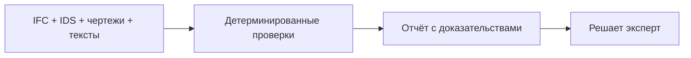

<!-- claims-lint: allow-file reason="Claims-boundary doc citing forbidden phrases as non-claims per pilot-claim-boundary / Claims Lock (WP-A5)" -->
# AeroBIM

[English version](README.md)

[](https://github.com/KonkovDV/AeroBIM/actions/workflows/ci.yml)
[](audit/reports/CRITICAL_BLOCKERS.md)
[](https://www.python.org/downloads/)
[](LICENSE)

**AeroBIM ловит расхождения между файлами комплекта: площадь в ведомости против площади в IFC, отметка в ПД против отметки в РД, требование ТЗ против фактического наполнения — и делает это на публичных машиночитаемых требованиях экспертизы. Каждый файл по отдельности открывается чисто. Дефект живёт в шве и всплывает на площадке.**

С 2 апреля 2026 года ЦИМ АГР в IFC обязателен к подаче в Москве (распоряжение ДГП № ДГП-Р-1/26/64-16-6/26). Это **городское требование к комплекту**, не подписанный профиль приёмки Самолёта и не заявление о точности продукта.

На входе — модели IFC, наборы правил IDS, листы и тексты спецификаций. На выходе — находки, которые можно провести до листа и до GUID: HTML, JSON и BCF. Решение остаётся за экспертом. AeroBIM — не среда общих данных, не просмотрщик модели и не замена специалисту.

> **КТ#2 (20.08.2026), Техлаб Москва, задача по автоматизированной верификации проектной и рабочей документации, заказчик — ГК «Самолёт».** Пакет подачи: [`submission/README.md`](submission/README.md).
>
> Мы на стадии доработки. Одна команда показывает находку с доказательствами на учебном комплекте. Валидация эффективности и внедрение ещё не начались. `NO_GO` сохраняется, пока нет независимого размеченного корпуса, двух разметчиков, профиля приёмки (публичные IDS экспертизы — измерение; подпись Самолёта — внедрение) и подтверждения импорта в СОД.

## Где комплект расходится сам с собой

В ведомости на листе PDF стоит одна площадь. У стены IFC с тем же идентификатором — другая. Каждый файл по отдельности открывается без ошибок. Дефект живёт *между* ними и обычно всплывает уже на площадке.

AeroBIM поднимает такой класс находок с прослеживаемостью до листа и до GUID, оставляет вердикт эксперту и никогда не подписывает переход Shared → Published по ISO 19650. Участие в Техлабе — статус программы, а не измеренный результат на комплекте Самолёта.

## Что можно клонировать сегодня

| Запрос ТЗ | Что реально делает клон |
|---|---|
| Приём 2D + BIM + тексты | IFC 2x3 / 4 / 4x3, IDS 1.0, PDF вектор/растр, текст спецификации |
| Сверка модели, чертежей, правил | Детерминированные IFC + IDS + междокументное сравнение (настраиваемая ε-полоса) |
| Подсветка и замечание | Оверлей 2D, оболочка ревью 3D, шаблоны RU/EN, правка экспертом |
| Отчёт для координации | HTML + JSON + структурный архив BCF 2.1 / 3.0 |
| Эксперт остаётся ответственным | `summary.passed` — технический статус Shared-gate. Языковая модель его не пишет ([ADR-001](docs/architecture/ADR-001-verdict-ownership-2026.md)) |

Молчание никогда не считается успехом: пропущенный обязательный движок не может спрятаться внутри зелёного отчёта.

## Статус одним взглядом

| | |
|---|---|
| **Работает на этом клоне** | Учебные комплекты, проверка IDS с отказом при пропуске, живой CLI, CI, оверлей, структурный BCF |
| **Ждёт измерения** | Независимый размеченный комплект (двое разметчиков) для RT-001a · публичные IDS экспертизы как профиль измерения RT-002a · подписанный профиль Самолёта RT-002b · федеративный MEP RT-003 · импорт BCF в их СОД |
| **Не заявляется** | Точность продукта >90% · SLA заказчика ≤30 мин · native DWG · native RVT/NWD · MEP delivered · CDE-ready BCF · production-ready |

Полная граница: [`docs/pilot-claim-boundary-2026.md`](docs/pilot-claim-boundary-2026.md). Блокеры: [`audit/reports/CRITICAL_BLOCKERS.md`](audit/reports/CRITICAL_BLOCKERS.md).

## Попробовать

```bash
git clone https://github.com/KonkovDV/AeroBIM.git
cd AeroBIM/backend

# CPython 3.12 — версия, зафиксированная в CI.
python3.12 -m venv .venv            # Windows: py -3.12 -m venv .venv
source .venv/bin/activate           # Windows PowerShell: .\.venv\Scripts\Activate.ps1

# Базовая работа с PDF — pypdfium2; для оверлея PyMuPDF не нужен
pip install -e ".[dev,raster]"

# 1. Проверка приёмки на учебном комплекте IFC + IDS
python -m aerobim.tools.run_demo_ifc_acceptance_gate
# → artifacts/ifc-acceptance-gate-demo/{report.html,acceptance-gate.json}

# 2. Тот же комплект с оверлеем на чертеже
python -m aerobim.tools.run_demo_vertical_slice
# → artifacts/vertical-slice-demo/report.html: фрагмент листа, оверлей,
#   текстовые доказательства, таблица проверок, манифест прогона, архив BCF

# 3. КТ#3 одной командой: живой гейт на фикстуре + пакет + шесть задач трекера (всё ещё NO_GO)
python -m aerobim.tools.run_kt3_jury
# → artifacts/kt3-jury/latest.json (passed=false, GUID-находка)
# → artifacts/kt3-without-customer/latest.json (пакет пересчёта)
# эквивалент двух команд: run_demo_ifc_acceptance_gate + run_kt3_without_customer

pytest tests -q
python -m aerobim.main   # → http://127.0.0.1:8080/health
```

Оба демо и команда КТ#3 заканчиваются с `summary.passed=false`, и это ожидаемый результат: в учебном комплекте заложены дефекты. Это не данные заказчика, и полученные на них числа не являются точностью продукта. Локальный счётчик `pytest` — не CI pin в runtime baseline ниже.

Дополнительные наборы: `.[clash]` — геометрические коллизии, `.[docling]` — разбор нетекстовых документов, `.[enterprise]` — адаптеры S3 и Postgres, `.[pdf-agpl]` — устаревшие инструменты на PyMuPDF (для всего выше не нужны). Оболочка ревью: `cd frontend && npm ci && npm run dev`.

## Кому эта страница

Жюри Техлаба и МИК: формула выше → [`submission/README.md`](submission/README.md) → команда запуска. Это пакет доработки, не акт Checkpoint.

## Что происходит за один прогон

Комплект на входе. Детерминированные проверки. Один сводный отчёт.

1. **Модель.** Свойства и величины проверяются через IfcOpenShell. IFC2x3 (схема buildingSMART; публикации ISO нет), IFC4 ADD2 (ISO 16739-1:2018) и IFC4x3 (ISO 16739-1:2024) идут через одно ядро. ISO/PAS 16739:2005 — это IFC2x Platform, не IFC2x3. Расхождение имён наборов свойств между релизами выдаётся как `ValidationIssue`, а не как молчаливый пропуск. Правила по функциям: [`docs/ifc-compatibility-matrix.md`](docs/ifc-compatibility-matrix.md).
2. **Правила.** IDS 1.0 проверяется через IfcTester. Официальные наборы Мособлгосэкспертизы и СПб ГАУ ЦГЭ (ЦИМ ОКС ред. 3.1.0 + ЦИМ РИИ ред. 1.1.0) лежат в `samples/`; профиль ЦГЭ ([`samples/profiles/spb-cge/`](samples/profiles/spb-cge/manifest.json)) — опубликованный набор правил (OFFICIAL_PUBLISHED), а не подписанный заказчиком профиль приёмки. CI на `ubuntu-latest` гоняет `python -m aerobim.tools.validate_spb_cge_profile --no-write --verify-committed-evidence`: подмена `.ids` или устаревший SHA evidence валит сборку. Запрошенный набор, который не загрузился, роняет проверку — он не может выглядеть как чистый проход.
3. **Остальные документы.** Модель сопоставляется с пометками на чертеже, спецификациями и расчётными текстами, с настраиваемой ε-полосой и с русскими/европейскими группированными числами. Источники сверяются; ничего не пересчитывается. Независимая корректность расчётов не реализована.
4. **Отчёт.** У каждой находки есть `finding_id`, `source_id` и `evidence_refs` (без них находка не сохраняется). Людям — HTML, машинам — JSON, для обмена замечаниями — структурный архив BCF 2.1 / 3.0. Оболочка ревью в браузере (web-ifc + Three.js) показывает IFC в 3D и доказательства на листе.

Результат можно проверить по двум причинам.

- **Одинаковый вход — одинаковый `summary.passed`.** Технический флаг собирается из детерминированных ошибок и таблицы доступности проверок ([ADR-001](docs/architecture/ADR-001-verdict-ownership-2026.md)). Если советующий текст языковой модели включён, он только черновит формулировку замечания и никогда не пишет `summary.passed`. На профилях заказчика внешние вызовы советующего контура запрещены.
- **Молчание никогда не считается успехом.** Каждая опциональная проверка отчитывается статусом `ok`, `skipped` или `failed`. Любое значение `FAILED` принудительно ставит `summary.passed=false`. Отключённый движок коллизий не может спрятаться внутри зелёного отчёта. Та же граница отдаётся на `GET /v1/system/capabilities`.

`summary.passed` — прохождение настроенного Shared-gate: технический статус «проверки прошли». Это не контрактная «пригодность документации» и не разрешение строить. Архитектура: [`docs/architecture/TARGET_HYBRID_ARCHITECTURE_TZ_2026.md`](docs/architecture/TARGET_HYBRID_ARCHITECTURE_TZ_2026.md).



## Checkpoint: `NO_GO`

Это готовность к *подписанию у заказчика*, а не утверждение «система не работает». Код и учебные комплекты работают. Открытыми остаются три блокера, и ни один из них не снимается написанием кода:

| ID | Всё ещё открыто | Это не то же самое |
|---|---|---|
| **RT-001** | Нет российского комплекта ПД с заключениями экспертизы | Открытые бенчмарки (AEC-Bench, IFC-Bench, GNI) — другой контур |
| **RT-002** | Нет профиля приёмки, подписанного Самолётом | Официальные IDS Мособлгосэкспертизы и СПб ГАУ ЦГЭ уже лежат в `samples/` |
| **RT-003** | Федеративные коллизии MEP **NOT_VERIFIED** | Публичный инвентарь объединённых моделей измерен; MEP delivered не заявляется |

Экспорт BCF ZIP — структурный T1 ([`audit/evidence/bcf-structural-handoff-2026-07-25.json`](audit/evidence/bcf-structural-handoff-2026-07-25.json)). Импорт в независимую СОД — **NOT_VERIFIED**. Чтение DWG и нативных RVT/NWD отсутствует: отказ, не молчание (вход — IFC). Независимая корректность расчётов не реализована: источники сверяются, а не пересчитываются.

ГОСТ Р 21.101-2026 п. 8.2.4 (с 1 апреля 2026) требует устойчивый GUID у каждого электронного документа проектной документации. AeroBIM с первого дня ведёт находки к устойчивому идентификатору. Это совпадение механизма, а не заявление о полном соответствии стандарту.

Реестр: [`audit/reports/CRITICAL_BLOCKERS.md`](audit/reports/CRITICAL_BLOCKERS.md). Карточка речи: [`docs/demo/KT2_JURY_FAQ_2026_08_12.md`](docs/demo/KT2_JURY_FAQ_2026_08_12.md).

## OpenBIM и как мы измеряем

| Практика (август 2026) | В этом репозитории | Разрыв до «готово» |
|---|---|---|
| IDS 1.0 как машинный информационный контракт | IfcTester: чужая версия или незагруженный набор роняют проверку | Хеш комплекта заказчика + подписанный профиль (RT-002) |
| Согласие двух разметчиков до публикации точности | Планировщик Уилсона и harness κ/α есть; κ без меток заказчика нет | Корпус заказчика + два разметчика (RT-001) |
| BCF → СОД | Структурный ZIP (T1) | Журнал импорта T2 в СОД Самолёта |
| ISO 19650 | Lite-поля на отчёте (метаданные Shared-gate) | Это не СОД; ISO 19650-6 — обмен H&S, не этот гейт |
| FAIR research software | `CITATION.cff`, реестр лицензий, воспроизводимые команды | Учебный комплект F1 ≠ точность продукта |

## Что работает сегодня

<details>
<summary>Возможности на учебных комплектах (не точность продукта; корпус заказчика — RT-001)</summary>

Все статусы ниже — уровень репозитория или учебных комплектов, если не указано иное. Результат на фикстурах не является точностью продукта: корпус заказчика, который позволил бы такое утверждение, — это блокер RT-001.

**На комплектах, которые можно клонировать сегодня**

- Проверка свойств и величин IFC; IDS 1.0: если набор правил не загрузился, проверка падает
- Междокументные противоречия (таксономия `ConflictKind`, настраиваемая критичность) и аннотации чертежа ↔ IFC (заявленный GUID становится `ifc_guid` только после подтверждения в пространственном индексе)
- Настраиваемая ε-полоса (SI-нормализация); извлечение требований из текста по детерминированным шаблонам (ни одна модель ничего не подписывает)
- Честность доступности проверок; разграничение доступа к артефактам на профилях `samolet_pilot` / `production` (в development по умолчанию выключено); выгрузка HTML/JSON; структурный архив BCF 2.1 / 3.0
- Детерминированная работа с PDF (pypdfium2 + pdfminer; по умолчанию `AEROBIM_PDF_BACKEND=pdfium`)
- Просмотр IFC в браузере и оверлей 2D; автономная сборка Docker (`closed-contour --smoke`; без Docker — вне scope)
- Паки нормативных правил (применимость и журнал эксперта; учебный пак не является подписанным профилем заказчика) и по желанию инвентарь комплектности (не нормативный вывод)
- Протокол измерения качества (интервалы Уилсона, планировщик выборки; промежуточный ориентир 0.60) — протокол, а не опубликованная оценка продукта

**Опционально, частично или отсутствует**

- Геометрические коллизии: набор `.[clash]` — репетиция движка, а не системные коллизии MEP; при обязательном требовании SKIPPED становится FAILED
- OCR изображений: набор `.[raster]`; нулевой результат при запрошенном OCR становится FAILED
- PyMuPDF: набор `pdf-agpl` (AGPL-3.0 / Artifex); нет в runtime lock и в образе Docker
- Советующий контур LLM/VLM: экспериментальные черновики; никогда не пишет `summary.passed`
- OpenCDE BCF API push: экспериментально; не заменяет доказанный импорт в СОД заказчика
- Граф знаний по IFC: экспериментальный советующий контур запросов
- Приём DXF: опциональный ezdxf, частично и не проверено; это не поддержка DWG
- Конверт открепленной подписи: только хеши и роли; цепочка доверия остаётся **NOT_VERIFIED**
- Браузерная сессия OIDC: не реализовано (по умолчанию 501); лабораторный контур cookie не является промышленным входом по SSO
- Точность >90% и утверждённые нормы: упирается в RT-001 и RT-002

</details>

## HTTP API

<details>
<summary>Точки API (локально <code>python -m aerobim.main</code>)</summary>

`GET /health` без аутентификации. `/v1/*` требует `AEROBIM_API_BEARER_TOKEN`, если не задано `AEROBIM_ALLOW_ANONYMOUS_DEV=true` (только development).

| Метод | Путь | Назначение |
|---|---|---|
| `GET` | `/health` | Проверка готовности |
| `GET` | `/v1/system/capabilities` | Заявленная граница возможностей, включая то, чего нет |
| `POST` | `/v1/uploads` | Приём файлов; возвращает путь относительно хранилища |
| `POST` | `/v1/validate/ifc` | Проверка IFC против требований и IDS |
| `POST` | `/v1/analyze/project-package` | Полный анализ комплекта: модель, чертежи, спецификация, расчёт |
| `POST` | `/v1/analyze/project-package/submit` | Постановка крупного комплекта в фоновую очередь |
| `GET` | `/v1/analyze/project-package/jobs/{job_id}` | Статус фонового задания |
| `GET` | `/v1/reports` | Список сохранённых отчётов с фильтрами |
| `GET` | `/v1/reports/{id}` | Один отчёт |
| `GET` | `/v1/reports/{id}/export/{json,html,bcf}` | Выгрузка отчёта; `?version=3` переключает BCF 3.0 |
| `POST` | `/v1/reports/{id}/review-events` | Телеметрия ревью; на вердикт не влияет |
| `GET` | `/v1/reports/{id}/review-kpi` | Сводка по разбору и приёмке |

Полный анализ комплекта может принять отчёт OpenRebar (`reinforcement_report_path`) с дайджестом SHA-256. Это сверка заявленных источников, а не пересчёт. Дайджест: `python -m aerobim.tools.openrebar_provenance_digest`.

</details>

## Архитектура

Пять слоёв, зависимости направлены только внутрь:

```
core/            DI-контейнер, токены, конфигурация (без импортов проекта)
domain/          Неизменяемые модели, порты-Protocol, контракт логирования
application/     Оркестрация сценариев: сведение требований, поиск противоречий
infrastructure/  Адаптеры: IfcOpenShell, IfcTester, Docling, IfcClash, BCF, хранилище
presentation/    HTTP-слой FastAPI, middleware корреляции
```

**48 Protocol ports** связаны с **72 adapter modules** через **63 DI tokens** в `bootstrap_container()`. Это живой инвентарь: он пересобирается в [`docs/evidence/runtime-baseline-latest.json`](docs/evidence/runtime-baseline-latest.json) и сверяется в CI против обоих README, поэтому руками эти числа не правятся.

Артефакты лежат за портом `ObjectStore`, поэтому локальное хранилище и совместимые с S3 бакеты — один и тот же путь в коде. При заданном `AEROBIM_DB_URL` сводки отчётов дополнительно индексируются в Postgres; для пилота это допустимо, но до промышленной эксплуатации схему следует переносить миграцией вне приложения.

Локальный клон работает на значениях по умолчанию. Полная таблица `AEROBIM_*` свёрнута в [английском README](README.md), раздел Configuration: CI проверяет её в обе стороны (код → доки и доки → код). Это не витрина КТ#2.

## Разработка

<details>
<summary>Локальные команды CI и CLI измерений</summary>

Локально запускается то же, что и в CI:

```bash
cd backend
python -m ruff format --check src tests
python -m ruff check src tests
python -m mypy src
pytest tests -q
```

Измерения — это воспроизводимые команды, а не сохранённые числа:

```bash
python -m aerobim.tools.benchmark_project_package --iterations 1 --warmup-iterations 0
python -m aerobim.tools.measure_package_sla --corpus-kind fixture
python -m aerobim.tools.evaluate_extraction --min-macro-f1 0.70
python -m aerobim.tools.verify_bcf_structural_handoff
python -m aerobim.tools.export_runtime_baseline
python -m aerobim.tools.export_evidence_bundle \
  --pack ../samples/benchmarks/project-package-techlab-demo.json \
  --output ../artifacts/evidence-bundle/techlab-demo
```

Показатели производительности и F1 зависят от среды и относятся к учебным комплектам. Любое утверждение о производительности публикуется вместе с путём к паку, флагами запуска, отпечатком машины и хешами артефактов. Цитирование: [`CITATION.cff`](CITATION.cff) · [`docs/CITATION.bib`](docs/CITATION.bib).

</details>

## Документация

В репозитории публикуется проверяемый набор: код, требования, границы утверждений, архитектура и доказательства. Служебные инструкции и рабочие журналы умышленно не публикуются.

| Тема | Документ |
|---|---|
| Начать здесь | [карта для жюри](docs/TIER0_INDEX.md) · [техническое обоснование](docs/docs.md) |
| Пакет подачи КТ#2 | [пакет подачи](submission/README.md) |
| Блокеры | [критические блокеры](audit/reports/CRITICAL_BLOCKERS.md) |
| Что заявляется | [границы заявлений](docs/pilot-claim-boundary-2026.md) |
| Архитектура | [ADR-001](docs/architecture/ADR-001-verdict-ownership-2026.md) |
| Лицензии | [политика лицензий](docs/license-policy-2026.md) |

## Цитирование

Используйте [`CITATION.cff`](CITATION.cff) (кнопка GitHub «Cite this repository») или [`docs/CITATION.bib`](docs/CITATION.bib). Цитируйте точный Git-тег или SHA коммита, а не плавающий `latest`. Принципы FAIR для исследовательского ПО ([Chue Hong et al., 2022](https://doi.org/10.15497/RDA00068); [Barker et al., *Sci Data*](https://doi.org/10.1038/s41597-022-01710-x)) — это цель документации: назначение, установка, лицензия, цитирование, статус. Этот репозиторий **не** является сертифицированной FAIR-оценкой.

<!-- AEROBIM_DOCUMENTED_ENV:BEGIN -->
<!-- machine-checked parity list (export_runtime_baseline --check-readme)
AEROBIM_ALLOW_ANONYMOUS_DEV
AEROBIM_API_BEARER_TOKEN
AEROBIM_API_TENANT_ID
AEROBIM_APP_NAME
AEROBIM_APPLY_SAMOLET_UPLOAD_CAPS
AEROBIM_BCF_API_BASE_URL
AEROBIM_BCF_API_PROJECT_ID
AEROBIM_BCF_API_TOKEN
AEROBIM_BCF_API_VERSION
AEROBIM_BSI_API_TOKEN
AEROBIM_BSI_VALIDATION_URL
AEROBIM_CLASH_AFFECTS_PASS
AEROBIM_CLASH_MIN_AABB_VOLUME_M3
AEROBIM_CLASH_SKIP_TINY
AEROBIM_CORS_ORIGINS
AEROBIM_CROSS_DOC_SEVERITY
AEROBIM_DB_URL
AEROBIM_DEBUG
AEROBIM_ENV
AEROBIM_GATES_ATTESTED
AEROBIM_HOST
AEROBIM_HTTP_RATE_LIMIT_PER_MINUTE
AEROBIM_HYBRID_PROVIDER_CONFIG
AEROBIM_IFC_PARSE_CACHE_DIR
AEROBIM_KIMI_API_BASE_URL
AEROBIM_KIMI_API_KEY
AEROBIM_KIMI_CACHE_DIR
AEROBIM_KIMI_CACHE_NAMESPACE
AEROBIM_KIMI_CACHE_PROJECT
AEROBIM_KIMI_MODEL
AEROBIM_KIMI_REASONING_EFFORT
AEROBIM_LLM_429_RETRIES
AEROBIM_LLM_ADVISORY_ENABLED
AEROBIM_LLM_ADVISORY_MAX_ISSUES
AEROBIM_LLM_ALLOWED_HOSTS
AEROBIM_LLM_API_KEY
AEROBIM_LLM_AUTH_SCHEME
AEROBIM_LLM_BASE_URL
AEROBIM_LLM_BUDGET_LEDGER
AEROBIM_LLM_BUDGET_TZ
AEROBIM_LLM_DATA_LOGGING_ENABLED
AEROBIM_LLM_FOLDER_ID
AEROBIM_LLM_LOCAL_ENABLED
AEROBIM_LLM_MAX_COMPLETION_TOKENS
AEROBIM_LLM_MAX_CONCURRENT
AEROBIM_LLM_MAX_TOKENS_PER_CALL
AEROBIM_LLM_MAX_TOKENS_PER_DAY
AEROBIM_LLM_MAX_TOKENS_PER_RUN
AEROBIM_LLM_MODEL
AEROBIM_LLM_MODEL_REVISION
AEROBIM_LLM_MODEL_SHA256
AEROBIM_LLM_PROVIDER
AEROBIM_LLM_RESPONSE_FORMAT_MODE
AEROBIM_LLM_SEND_SEED
AEROBIM_LLM_TIMEOUT_SECONDS
AEROBIM_MAX_IFC_BYTES
AEROBIM_MAX_MODEL_BYTES
AEROBIM_MAX_OFFICE_BYTES
AEROBIM_MEP_AABB_FILTER
AEROBIM_MEP_FEDERATED_SCOPE_PATH
AEROBIM_MEP_SCOPE_MEMO_REF
AEROBIM_NORM_RULE_PACK
AEROBIM_OIDC_AUDIENCE
AEROBIM_OIDC_BFF_AUTHORIZE_URL
AEROBIM_OIDC_BFF_CLIENT_ID
AEROBIM_OIDC_BFF_CLIENT_SECRET
AEROBIM_OIDC_BFF_COOKIE_SECRET
AEROBIM_OIDC_BFF_REDIRECT_URI_ALLOWLIST
AEROBIM_OIDC_BFF_TOKEN_URL
AEROBIM_OIDC_ISSUER
AEROBIM_OIDC_JWKS_EXTRA_HOSTS
AEROBIM_OIDC_JWKS_URL
AEROBIM_OIDC_ROLES_CLAIM
AEROBIM_OIDC_TENANT_CLAIM
AEROBIM_PDF_BACKEND
AEROBIM_PORT
AEROBIM_PRIORITY_PROFILE
AEROBIM_REDIS_URL
AEROBIM_REMARK_LOCALE
AEROBIM_REPORT_TTL_DAYS
AEROBIM_REQUIRE_CLASH
AEROBIM_REQUIRE_MEP_SYSTEM_CLASH
AEROBIM_S3_ACCESS_KEY_ID
AEROBIM_S3_BUCKET
AEROBIM_S3_ENDPOINT_URL
AEROBIM_S3_PREFIX
AEROBIM_S3_REGION
AEROBIM_S3_SECRET_ACCESS_KEY
AEROBIM_SIGNOFF_PROFILE
AEROBIM_STORAGE_DIR
AEROBIM_TRUSTED_PROXY_IPS
AEROBIM_VLM_ENABLED
-->
<!-- AEROBIM_DOCUMENTED_ENV:END -->

## Структура репозитория

```text
backend/      Сервис FastAPI: core → domain → application → infrastructure → presentation
frontend/     Оболочка ревью в браузере (IFC 3D и оверлей на чертеже)
samples/      Учебные комплекты IFC, IDS, чертежей и спецификаций; бенчмарк-паки
docs/         Документация и артефакты доказательств
audit/        Claims lock, реестр блокеров, цитируемые фикстуры честности
submission/   Пакет подачи к КТ#2
```

Объём кода и зафиксированные CI счётчики пройденных тестов генерируются, а не пишутся руками:

<!-- AEROBIM_RUNTIME_BASELINE:BEGIN -->
<!-- regenerated by: python -m aerobim.tools.export_runtime_baseline -->
tests_passed: backend=2701, frontend=57; commit fc1f03838cb6; see docs/evidence/runtime-baseline-latest.json · src ~84817 LOC; tests ~55670 LOC; extraction macro_f1=0.8600000000000001 (fixture corpus; not product accuracy)
<!-- AEROBIM_RUNTIME_BASELINE:END -->

## Стек

Python 3.12+ с FastAPI и Uvicorn. Работу с IFC выполняет набор buildingSMART — IfcOpenShell, IfcTester, IfcClash; оболочку ревью в браузере — web-ifc и Three.js; PDF обрабатывают pypdfium2 и pdfminer.six, а PyMuPDF, RapidOCR и Docling подключаются как опциональные наборы. Пятислойная чистая архитектура, внедрение зависимостей через конструктор, порты на Protocol.

## Лицензия

MIT для кода, написанного в этом репозитории. Сторонние компоненты сохраняют свои лицензии: pypdfium2, pdfminer.six и Pillow — разрешительные; IfcOpenShell и IfcTester — LGPL-3.0+; web-ifc — MPL-2.0; PyMuPDF имеет двойную лицензию AGPL-3.0 / Artifex, поэтому остаётся опциональным набором и отсутствует в runtime lock и в образе Docker.

Машиночитаемый реестр: [`audit/dependency_license_inventory.json`](audit/dependency_license_inventory.json) · политика: [`docs/license-policy-2026.md`](docs/license-policy-2026.md). Это не юридическое заключение, и продукт в целом нельзя описывать как MIT без раскрытия сторонних компонентов.
