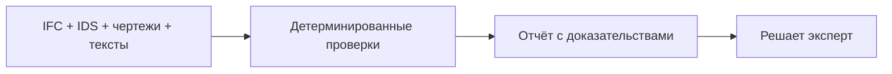

<!-- claims-lint: allow-file reason="Claims-boundary doc citing forbidden phrases as non-claims per pilot-claim-boundary / Claims Lock" -->
<p align="center">
  
  <br><br>
  <b>Презентация · 43 слайда</b>
  <br><br>
  <a href="submission/03-presentation/AeroBIM.pptx"></a>
  &nbsp;
  <a href="submission/03-presentation/AeroBIM.pdf"></a>
</p>

# AeroBIM

[English version](README.en.md)

[](https://github.com/KonkovDV/AeroBIM/actions/workflows/ci.yml)
[](docs/pilot-claim-boundary-2026.md)
[](audit/reports/CRITICAL_BLOCKERS.md)
[](https://www.python.org/downloads/)
[](LICENSE)

Зелёный бейдж — Checkpoint `GO`: регуляторно-измерительный MVP, код и учебные комплекты работают. Красный — нет подписи назначающей стороны (`customer_go` false). Его не читать как «продукт не запускается».

**AeroBIM** — прототип шлюза проверки согласованности комплекта ПД/РД: модель, лист, ведомость, ТЗ и расчёт сверяются между собой. Каждый файл может открываться чисто. Дефект живёт в шве и обычно всплывает на площадке.

Находка несёт пункт нормы, этаж или ось, GUID. Итоговый статус комплекта ставит аттестованный эксперт. На выходе HTML, JSON, PDF (черновик покрытия) и файл BCF. AeroBIM — не среда общих данных, не просмотрщик модели и не замена специалисту.

Три полки стоят в разных местах процесса. Интеграцию с ними не заявляем.

| Полка | Что делает | Чего не делает |
|---|---|---|
| СОД (10D, Pilot-BIM, Sarex) | Наличие, маршрут, версии | Не сверяет содержание файлов между собой |
| Проверка модели (Tangl, Solibri) | Модель, атрибуты, коллизии в среде автора | Не сверяет модель с ведомостью, запиской и расчётом |
| **Шлюз комплекта (AeroBIM)** | Непротиворечивость между файлами на публичных IDS | Не заменяет две полки выше |

Это не коннектор Tangl и не СОД. Репозиторий работает на **шве между файлами**.

**Как выглядит находка.** Учебный кейс из материалов показа, не данные заказчика канала: защитный слой 30 мм в модели, 40 мм на листе — расхождение 10 мм. Сверку считает детерминированный слой. Карточка ведёт к требованию, GUID и строке листа. Принять или отклонить решает человек. Выгрузка — файл BCF 2.1/3.0. Импорт в СОД не подтверждён. Подсветки находки на листе в интерфейсе нет: список, карточка и трасса.

## Для жюри

Программа Техлаба Москва, комиссия № 7, задача по автоматизированной верификации проектной и рабочей документации (заказчик канала в публичном дереве не называется). Статус программы — не измеренный результат на комплекте заказчика канала. Демо-день: 29–30.09.2026. Самооценка УГТ 4 по ГОСТ Р 58048; УГТ 5 и 6 не заявляем.

> Мы на стадии доработки контура заказчика. Одна команда показывает находку с доказательствами на учебном комплекте. Валидация эффективности и внедрение у назначающей стороны ещё не начались. Checkpoint `GO` — регуляторно-измерительный MVP. `customer_go` остаётся false, пока нет независимого размеченного корпуса, двух разметчиков, подписанного профиля назначающей стороны и подтверждения импорта в СОД.

| | |
|---|---|
| **Показ** | `python -m aerobim.tools.run_kt3_jury` — живой CLI на учебном комплекте из git. Файлов заказчика в репозитории нет |
| **Дека** | [`AeroBIM.pptx`](submission/03-presentation/AeroBIM.pptx) (43 слайда) · [`AeroBIM.pdf`](submission/03-presentation/AeroBIM.pdf) · [канон речи](submission/03-presentation/demo_day_slides.md) |
| **Пакет формы** | [`submission/README.md`](submission/README.md) — пять полей |
| **Карта** | [для жюри](docs/TIER0_INDEX.md) · [граница заявлений](docs/pilot-claim-boundary-2026.md) · [блокеры](audit/reports/CRITICAL_BLOCKERS.md) · [глоссарий](docs/partners/GLOSSARY_JURY_RU_2026_08.md) |
| **Речь** | [карточка показа](docs/demo/KT3_JURY_FAQ_2026_08_25.md) · [формула стадии](docs/demo/KT2_JURY_FAQ_2026_08_12.md) |

**Запрос.** Оплачиваемый пилот на одном корпусе, восемь недель от соглашения. Письмом: комплект одной ревизии с IFC, эксперт-валидатор, режим данных и лист целевых KPI. Цель пилота — минус один круг согласования; дельта ревизий видна в СОД заказчика. Окупаемость не считаем: измеренного эффекта нет. Не просим CAPEX и не называем рынок BIM своей выручкой.

С 2 апреля 2026 года ЦИМ АГР в IFC обязателен к подаче в Москве (постановление Правительства Москвы № 17-ПП от 16 января 2026; совместное распоряжение ДИТ и ДГП № ДГП-Р-1/26/64-16-6/26). С 18 августа 2026 совместное распоряжение ДГП/ДИТ № ДГП-Р-56/26/64-16-473/26 уточняет требования к трёхмерным моделям в информационных системах Москвы. Это **городские правила подачи**, не подписанный профиль приёмки заказчика канала и не заявление о точности продукта. Городской мэппинг АГР IFC опубликован под Revit; AeroBIM нативный RVT не принимает.

## Пять кресел

Говорим ролями. Состав приказа не равен явке. Два кресла оператора программы, три — партнёра по согласованию.

| Кресло | Что держим в кадре | Чего не говорим |
|---|---|---|
| **Пилотирование** (оператор) | Маршрут измерения: программа испытаний, методика, акт по формам оператора. Готовы измерить по согласованному предмету | «Команда в статусе NO_GO»; самодельный акт; внутренний стоп как последняя фраза защиты |
| **Спрос** (оператор) | Нулевой вход на MVP: веб и файловый обмен, без внедрения в контур. Оплата по подтверждённым находкам — план речи, не прайс | Объём рынка BIM как наши продажи; «инвестируйте»; чужой процент трудозатрат как наш эффект |
| **Техзаказчик** (партнёр) | Минус один круг согласования комплекта как цель пилота. Дельта ревизий: находки → устранено / проигнорировано / новое. HITL | Часы эксперта как экономия без недельного контура; внедрение закрыто; чужой убыток «закроем мы» |
| **Проектный офис** (партнёр) | Замечание уезжает файлом BCF (структурный T1). Черновик формулировки, если включён, не ставит итог: `summary.passed` пишет Shared-gate, статус ставит эксперт ([ADR-001](docs/architecture/ADR-001-verdict-ownership-2026.md)) | «Роли сданы» при `GET /v1/auth/bff` = 501; «BCF уже в СОД»; KPI демо как факт на вашем комплекте |
| **Информационное моделирование** (партнёр) | Шов документов, не проверка модели и не СОД. Нативные RVT/NWD/DWG отвергаются до загрузки. Сети и арматура не измерены — коллизии по ним не заявляются | «Пакет обработан»; состав комплекта владельца; MEP delivered не заявляется |

Две части защиты. Метрологическая: протокол на учебном комплекте (фикстура, симуляция разметки — не двое людей). Прикладная: готовность детерминированного отчёта после канонической ревизии согласованного предмета. Финальная реплика — «готовы измерить», не внутренний стоп.

## Что принимает клон

| | |
|---|---|
| Вход | IFC 2x3 / 4 / 4x3, IDS 1.0, PDF вектор/растр, текст спецификации |
| Сверка | Детерминированные IFC + IDS + междокументное сравнение (настраиваемая ε-полоса) |
| Рабочее место | Оверлей 2D, оболочка ревью 3D (Vite), шаблоны замечаний RU/EN, HITL эксперта |
| Отчёт | HTML + JSON + PDF (черновик покрытия) + структурный архив BCF 2.1 / 3.0 |
| Вердикт | `summary.passed` — Shared-gate. Языковая модель его не пишет ([ADR-001](docs/architecture/ADR-001-verdict-ownership-2026.md)) |

Нет данных — не «ок»: незавершённая обязательная проверка не позволяет выдать положительный результат по комплекту.

## Статус

| | |
|---|---|
| **Работает на этом клоне** | Учебные комплекты, проверка IDS с отказом при пропуске, CLI, CI, оверлей, структурный BCF, оболочка ревью (находки → замечание → лист/3D → BCF) |
| **Ждёт остатка** | Два разметчика-человека + заключение на тот же том (RT-001b) · подписанный профиль назначающей стороны (RT-002c) · system-aware clash (речь **RT-003c**) · федеративный IFC заказчика (`c_customer_federated_ifc`) · импорт BCF в их СОД |
| **Не заявляется** | Точность продукта >90% · SLA заказчика ≤30 мин · native DWG · native RVT/NWD · MEP delivered · CDE-ready BCF · production-ready |

## Показать

Python 3.12 и venv в `backend/.venv`:

```bash
git clone https://github.com/KonkovDV/AeroBIM.git
cd AeroBIM/backend

python3.12 -m venv .venv            # Windows: py -3.12 -m venv .venv
source .venv/bin/activate           # Windows PowerShell: .\.venv\Scripts\Activate.ps1
pip install -e ".[dev,raster]"
```

Показ для жюри — живой CLI, не снимок HTML. `summary.passed=false` ожидаем: в учебном комплекте посажены дефекты. Это не точность продукта.

```bash
python -m aerobim.tools.run_kt3_jury
# artifacts/kt3-jury/latest.json
# artifacts/kt3-without-customer/latest.json

python -m aerobim.tools.run_demo_ifc_acceptance_gate
python -m aerobim.tools.run_demo_vertical_slice

pytest tests -q
python -m aerobim.main   # http://127.0.0.1:8080/health
```

Оболочка ревью — не замена CLI жюри. FastAPI `http://127.0.0.1:8080`, Vite/React `http://127.0.0.1:5173` (не Next.js). UI не пишет `summary.passed`. Нативные RVT/NWD/DWG отвергаются до загрузки.

- Linux/macOS: `./start.sh`
- Windows PowerShell: `.\start.bat` (префикс `.\` обязателен; `start` — это Start-Process и запросит FilePath)
- из `backend/`: `python -m aerobim.tools.run_review_stand`
- скрипт: `python scripts/run_review_shell.py`

Если 8080 или 5173 заняты — остановить процесс и повторить. В development один клик репетиции: `POST /v1/demo/seed-fixture` (в OpenAPI нет; git-фикстуры). Подробности: [`frontend/README.md`](frontend/README.md).

Опциональные наборы `.[clash]`, `.[docling]`, `.[enterprise]`, `.[pdf-agpl]` для команд выше не нужны. `GET /v1/auth/bff` по умолчанию 501.

## Как устроен прогон



1. **Модель.** Свойства и величины — IfcOpenShell. IFC2x3 (схема buildingSMART; публикации ISO нет), IFC4 ADD2 (ISO 16739-1:2018) и IFC4x3 (ISO 16739-1:2024) идут через одно ядро. ISO/PAS 16739:2005 — это IFC2x Platform, не IFC2x3. Расхождение имён наборов свойств между релизами — `ValidationIssue`, не молчаливый пропуск. Правила: [`docs/ifc-compatibility-matrix.md`](docs/ifc-compatibility-matrix.md).
2. **Правила.** IDS 1.0 — IfcTester. Наборы Мособлгосэкспертизы и СПб ГАУ ЦГЭ (ЦИМ ОКС ред. 3.1.0 + ЦИМ РИИ ред. 1.1.0) лежат в `samples/`. Профиль ЦГЭ ([`samples/profiles/spb-cge/`](samples/profiles/spb-cge/manifest.json)) — опубликованный набор (OFFICIAL_PUBLISHED), не подписанный профиль приёмки. CI на `ubuntu-latest` гоняет `python -m aerobim.tools.validate_spb_cge_profile --no-write --verify-committed-evidence`. Незагруженный запрошенный набор роняет проверку.
3. **Документы.** Модель сверяется с пометками на чертеже, спецификациями и расчётными текстами (ε-полоса, русские и европейские группированные числа). Источники сравниваются, ничего не пересчитывается. Независимая корректность расчётов не реализована.
4. **Отчёт.** У находки есть `finding_id`, `source_id` и `evidence_refs` — без них она не сохраняется. HTML людям, JSON машинам, BCF 2.1 / 3.0 для обмена замечаниями. Оболочка ревью (web-ifc + Three.js) показывает модель и доказательство на листе.

`summary.passed` собирается из детерминированных ошибок и таблицы доступности проверок ([ADR-001](docs/architecture/ADR-001-verdict-ownership-2026.md)). Советующий текст языковой модели, если включён, только черновит формулировку замечания и никогда не пишет этот флаг; на профилях заказчика внешние вызовы запрещены. Каждая опциональная проверка отчитывается `ok` / `skipped` / `failed`; любое `FAILED` ставит `summary.passed=false`. Та же граница — `GET /v1/system/capabilities`. Это технический статус Shared-gate, не контрактная пригодность документации и не разрешение строить. Архитектура: [`docs/architecture/TARGET_HYBRID_ARCHITECTURE_TZ_2026.md`](docs/architecture/TARGET_HYBRID_ARCHITECTURE_TZ_2026.md).

## Checkpoint: `GO` (`regulatory_measurement_mvp`)

Продуктовый Checkpoint — **регуляторно-измерительный MVP**. `customer_go` остаётся **false**. Код и учебные комплекты работают. **Подмены измерения** закрывают то, чего нет от заказчика канала. Недифференцированные `closes_rt001/002/003` остаются false. Красный бейдж подписи заказчика не читать как продукт `NO_GO`.

| ID | Подмена измерения (без заказчика канала) | Остаток (не подменяется) |
|---|---|---|
| **RT-001** | `a_content_pairing` **CLOSED** (**RT-001a**) — типовые замечания экспертизы РФ (эксперимент Б) + публичные IDS + учебный комплект / инъекция. `b_protocol_rehearsal` **CLOSED** — два независимых симулированных прохода на том же учебном комплекте, живые κ/α/AC1 | `b_criterion_dual_rater` **OPEN** (**RT-001b**) (двое людей + заключение на *тот же* том). `c_customer_corpus` **OPEN**. Открытые бенчмарки — другой контур. Симуляция — не двое людей. Не точность продукта |
| **RT-002** | `a_regulatory` **CLOSED** (**RT-002a**) — публичные IDS (Мособлгосэкспертиза, СПб ГАУ ЦГЭ, городской АГР) как линейка измерения. `b_eir_carrier` **CLOSED** (**RT-002b**) — EIR v4.0 и BIM-стандарт v4.0 на канальном комплекте как **текст** (пин без имён файлов). Публичный IDS экспертизы — не EIR назначающей стороны | `c_corporate_signed` **OPEN** (**RT-002c**; `b_corporate` остаётся OPEN) — подпись заказчика канала / `customer_approved` IDS. Текст EIR — не подписанный профиль. Город-издатель — не подпись заказчика канала. Не писать недифференцированно «RT-002 CLOSED» |
| **RT-003** | `a_federated_geometric_rehearsal` **CLOSED** (**RT-003a**) — посаженный IfcClash (стены; труба против стены). `b_navis_federation_carrier` **CLOSED** — три NWD-федерации. `b_ifc_system_graph_rehearsal` **CLOSED** (**RT-003b**) — граф `IfcSystem` на HVAC-фикстуре (две системы, `IfcRelAssignsToGroup`); не труба против стены | `b_mep_system_clash` **OPEN** (**RT-003c**, `NOT_VERIFIED`) — 0 duct/pipe/cable в IFC заказчика; EIR называет LOD ОВ/ВК/ИТП/ЭОМ/СС, моделей нет. `c_customer_federated_ifc` **OPEN** — выгрузка NWD→IFC не поставлена. MEP delivered не заявляется |

Машинный источник: [`docs/evidence/rt-blocker-volumes-2026-09.md`](docs/evidence/rt-blocker-volumes-2026-09.md) · `python -m aerobim.tools.export_rt_blocker_volumes`.

Экспорт BCF ZIP — структурный T1 ([`audit/evidence/bcf-structural-handoff-2026-07-25.json`](audit/evidence/bcf-structural-handoff-2026-07-25.json)). Импорт в независимую СОД — **NOT_VERIFIED**. Чтение DWG и нативных RVT/NWD отсутствует: отказ, не молчание (вход — IFC). Независимая корректность расчётов не реализована.

ГОСТ Р 21.101-2026 (приказ Росстандарта № 129-ст от 12 февраля 2026; **в силе с 1 апреля 2026**, взамен 21.101-2020; GUID как идентификатор электронного документа ПД/РД) — правило **идентификации документа**. AeroBIM с первого дня ведёт находки к устойчивому идентификатору. Это совпадение механизма, а не заявление о полном соответствии стандарту. Дата введения стандарта (1 апреля) — не дата обязательной подачи ЦИМ АГР в Москве (2 апреля).

Реестр: [`audit/reports/CRITICAL_BLOCKERS.md`](audit/reports/CRITICAL_BLOCKERS.md). Речь: [`docs/demo/KT2_JURY_FAQ_2026_08_12.md`](docs/demo/KT2_JURY_FAQ_2026_08_12.md) · [`docs/demo/KT3_JURY_FAQ_2026_08_25.md`](docs/demo/KT3_JURY_FAQ_2026_08_25.md).

## Возможности клона

<details>
<summary>На учебных комплектах (не точность продукта; корпус заказчика — RT-001)</summary>

- Свойства и величины IFC; IDS 1.0 падает, если набор правил не загрузился
- Междокументные противоречия (`ConflictKind`) и аннотации чертежа ↔ IFC (заявленный GUID становится `ifc_guid` только после подтверждения в пространственном индексе)
- ε-полоса (SI); извлечение требований из текста по шаблонам — ни одна модель ничего не подписывает
- Честность доступности проверок; ACL к артефактам на профилях `customer_pilot` / `production` (в development выключено); HTML/JSON; PDF — черновик покрытия; BCF 2.1 / 3.0
- PDF: pypdfium2 + pdfminer, по умолчанию `AEROBIM_PDF_BACKEND=pdfium`
- Просмотр IFC в браузере и оверлей 2D; Docker `closed-contour --smoke`
- Паки нормативных правил (учебный пак ≠ подписанный профиль) и опциональный инвентарь комплектности
- Протокол измерения качества (Уилсон, планировщик выборки; ориентир 0.60) — протокол, не оценка продукта

Опционально или отсутствует: геометрические коллизии `.[clash]` (репетиция движка, не системные коллизии MEP); OCR `.[raster]`; PyMuPDF `pdf-agpl` (нет в runtime lock и в образе Docker); черновики LLM/VLM (не пишут `summary.passed`); экспериментальный OpenCDE BCF push; DXF через ezdxf (не DWG); открепленная подпись — только хеши, цепочка **NOT_VERIFIED**; OIDC в браузере по умолчанию 501.

</details>

## HTTP API

<details>
<summary>Локально: <code>python -m aerobim.main</code></summary>

`GET /health` без аутентификации. `/v1/*` требует `AEROBIM_API_BEARER_TOKEN`, если не задано `AEROBIM_ALLOW_ANONYMOUS_DEV=true` (только development). Мутирующие маршруты делят один `require_bearer_auth`.

| Метод | Путь | Назначение |
|---|---|---|
| `GET` | `/health` | Готовность |
| `GET` | `/v1/auth/bff` | Обнаружение входа. По умолчанию **501**. Лабораторный `200 LAB` — не SSO заказчика |
| `GET` | `/v1/system/capabilities` | Заявленная граница, включая то, чего нет |
| `POST` | `/v1/uploads` | Приём файлов |
| `POST` | `/v1/validate/ifc` | IFC против требований и IDS |
| `POST` | `/v1/analyze/project-package` | Полный анализ комплекта |
| `POST` | `/v1/analyze/project-package/submit` | Крупный комплект в **in-process** `BackgroundTasks` (не durable worker). `Idempotency-Key`; тот же ключ и другой payload → 409; лимит на арендатора → 429; отмена через `request_cancel`; вне development записи в Redis; после сбоя `QUEUED` снимает `reclaim_stale_queued` |
| `GET` | `/v1/analyze/project-package/jobs/{job_id}` | Статус задания |
| `POST` | `/v1/analyze/project-package/jobs/{job_id}/cancel` | Отмена |
| `GET` | `/v1/reports` | Список отчётов |
| `GET` | `/v1/reports/{id}` | Один отчёт |
| `GET` | `/v1/reports/{id}/coverage` | Карта покрытия |
| `GET` | `/v1/reports/{id}/revision-diff` | Дельта находок; «не воспроизведено» ≠ исправлено |
| `GET` | `/v1/reports/{id}/export/{json,html,pdf,bcf}` | Выгрузка; `?version=3` — BCF 3.0. PDF — черновик покрытия. XLSX нет |
| `POST` | `/v1/reports/{id}/review-events` | HITL; `summary.passed` не меняет |
| `GET` | `/v1/reports/{id}/review-events` | История HITL |
| `GET` | `/v1/reports/{id}/review-kpi` | Сводка разбора (не дни цикла в СОД) |
| `POST` | `/v1/demo/seed-fixture` | Только development; git-фикстура; в OpenAPI нет |

Анализ комплекта может принять отчёт OpenRebar (`reinforcement_report_path`) с дайджестом SHA-256: сверка источников, не пересчёт. `python -m aerobim.tools.openrebar_provenance_digest`. OpenCDE `POST .../export/bcf-api/push` — экспериментальная отправка, не доказательство импорта в СОД заказчика.

</details>

## Архитектура

Пять слоёв, зависимости только внутрь:

```
core/            DI-контейнер, токены, конфигурация
domain/          Неизменяемые модели, порты-Protocol, контракт логирования
application/     Сведение требований, поиск противоречий
infrastructure/  IfcOpenShell, IfcTester, Docling, IfcClash, BCF, хранилище
presentation/    FastAPI
```

**48 Protocol ports** связаны с **76 adapter modules** через **63 DI tokens** в `bootstrap_container()`. Инвентарь пересобирается в [`docs/evidence/runtime-baseline-latest.json`](docs/evidence/runtime-baseline-latest.json) и сверяется в CI против обоих README.

Артефакты за портом `ObjectStore` (локальный диск или S3 — один путь в коде). При `AEROBIM_DB_URL` сводки отчётов индексируются в Postgres; до промышленной эксплуатации схему лучше переносить миграцией вне приложения.

Локальный клон работает на значениях по умолчанию. Полная таблица `AEROBIM_*` — в [корневом README](README.md), раздел Configuration. CI проверяет её в обе стороны.

## Документация

| Тема | Документ |
|---|---|
| Начать здесь | [карта для жюри](docs/TIER0_INDEX.md) · [техническое обоснование](docs/docs.md) · [глоссарий](docs/partners/GLOSSARY_JURY_RU_2026_08.md) |
| Пакет подачи | [индекс для жюри](submission/README.md) |
| Презентация демо-дня | [PowerPoint, 43 слайда](submission/03-presentation/AeroBIM.pptx) · [PDF](submission/03-presentation/AeroBIM.pdf) · [канон речи](submission/03-presentation/demo_day_slides.md) |
| Карточка речи | [показ](docs/demo/KT3_JURY_FAQ_2026_08_25.md) · [формула стадии](docs/demo/KT2_JURY_FAQ_2026_08_12.md) |
| Блокеры | [критические блокеры](audit/reports/CRITICAL_BLOCKERS.md) |
| Что заявляется | [границы заявлений](docs/pilot-claim-boundary-2026.md) |
| УГТ | [самооценка УГТ 4](docs/quality/TRL_GOST_R_58048_SELF_ASSESS_2026.md) |
| Архитектура | [ADR-001](docs/architecture/ADR-001-verdict-ownership-2026.md) · [ADR-005 данные](docs/architecture/ADR-005-customer-data-handling-2026.md) |
| Оболочка ревью | [фронтенд](frontend/README.md) |
| Лицензии | [политика лицензий](docs/license-policy-2026.md) |

## Цитирование

[`CITATION.cff`](CITATION.cff) или [`docs/CITATION.bib`](docs/CITATION.bib). Цитируйте тег или SHA, не `latest`. Принципы FAIR для исследовательского ПО ([Chue Hong et al., 2022](https://doi.org/10.15497/RDA00068); [Barker et al., *Sci Data*](https://doi.org/10.1038/s41597-022-01710-x)) — цель документации, не сертифицированная оценка.

<!-- AEROBIM_DOCUMENTED_ENV:BEGIN -->
<!-- machine-checked parity list (export_runtime_baseline --check-readme)
AEROBIM_ALLOW_ANONYMOUS_DEV
AEROBIM_API_BEARER_TOKEN
AEROBIM_API_TENANT_ID
AEROBIM_APP_NAME
AEROBIM_APPLY_PILOT_UPLOAD_CAPS
AEROBIM_BCF_API_BASE_URL
AEROBIM_BCF_API_PROJECT_ID
AEROBIM_BCF_API_TOKEN
AEROBIM_BCF_API_VERSION
AEROBIM_BSI_API_TOKEN
AEROBIM_BSI_VALIDATION_URL
AEROBIM_CLASH_AFFECTS_PASS
AEROBIM_CLASH_MIN_AABB_VOLUME_M3
AEROBIM_CLASH_SKIP_TINY
AEROBIM_CORS_ALLOW_CREDENTIALS
AEROBIM_CORS_ORIGINS
AEROBIM_CROSS_DOC_SEVERITY
AEROBIM_CUSTOMER_PACK_LLM_EGRESS
AEROBIM_CUSTOMER_PACK_LLM_EGRESS_CONSENT_REF
AEROBIM_DB_URL
AEROBIM_DEBUG
AEROBIM_ENV
AEROBIM_GATES_ATTESTED
AEROBIM_HOST
AEROBIM_HTTP_RATE_LIMIT_PER_MINUTE
AEROBIM_HYBRID_PROVIDER_CONFIG
AEROBIM_IFC_PARSE_CACHE_DIR
AEROBIM_KIMI_API_BASE_URL
AEROBIM_KIMI_API_KEY
AEROBIM_KIMI_CACHE_DIR
AEROBIM_KIMI_CACHE_NAMESPACE
AEROBIM_KIMI_CACHE_PROJECT
AEROBIM_KIMI_MODEL
AEROBIM_KIMI_REASONING_EFFORT
AEROBIM_LLM_429_RETRIES
AEROBIM_LLM_ADVISORY_ENABLED
AEROBIM_LLM_ADVISORY_MAX_ISSUES
AEROBIM_LLM_ALLOWED_HOSTS
AEROBIM_LLM_API_KEY
AEROBIM_LLM_AUTH_SCHEME
AEROBIM_LLM_BASE_URL
AEROBIM_LLM_BUDGET_LEDGER
AEROBIM_LLM_BUDGET_TZ
AEROBIM_LLM_DATA_LOGGING_ENABLED
AEROBIM_LLM_FOLDER_ID
AEROBIM_LLM_LOCAL_ENABLED
AEROBIM_LLM_MAX_COMPLETION_TOKENS
AEROBIM_LLM_MAX_CONCURRENT
AEROBIM_LLM_MAX_TOKENS_PER_CALL
AEROBIM_LLM_MAX_TOKENS_PER_DAY
AEROBIM_LLM_MAX_TOKENS_PER_RUN
AEROBIM_LLM_MODEL
AEROBIM_LLM_MODEL_REVISION
AEROBIM_LLM_MODEL_SHA256
AEROBIM_LLM_PROVIDER
AEROBIM_LLM_RESPONSE_FORMAT_MODE
AEROBIM_LLM_SEND_SEED
AEROBIM_LLM_TIMEOUT_SECONDS
AEROBIM_MAX_IFC_BYTES
AEROBIM_MAX_MODEL_BYTES
AEROBIM_MAX_OFFICE_BYTES
AEROBIM_MEP_AABB_FILTER
AEROBIM_MEP_FEDERATED_SCOPE_PATH
AEROBIM_MEP_SCOPE_MEMO_REF
AEROBIM_NORM_RULE_PACK
AEROBIM_OIDC_AUDIENCE
AEROBIM_OIDC_BFF_AUTHORIZE_URL
AEROBIM_OIDC_BFF_CLIENT_ID
AEROBIM_OIDC_BFF_CLIENT_SECRET
AEROBIM_OIDC_BFF_COOKIE_SECRET
AEROBIM_OIDC_BFF_REDIRECT_URI_ALLOWLIST
AEROBIM_OIDC_BFF_TOKEN_URL
AEROBIM_OIDC_ISSUER
AEROBIM_OIDC_JWKS_EXTRA_HOSTS
AEROBIM_OIDC_JWKS_URL
AEROBIM_OIDC_ROLES_CLAIM
AEROBIM_OIDC_TENANT_CLAIM
AEROBIM_PDF_BACKEND
AEROBIM_PORT
AEROBIM_PRIORITY_PROFILE
AEROBIM_REDIS_URL
AEROBIM_REMARK_LOCALE
AEROBIM_REPORT_TTL_DAYS
AEROBIM_REQUIRE_CLASH
AEROBIM_REQUIRE_MEP_SYSTEM_CLASH
AEROBIM_S3_ACCESS_KEY_ID
AEROBIM_S3_BUCKET
AEROBIM_S3_ENDPOINT_URL
AEROBIM_S3_PREFIX
AEROBIM_S3_REGION
AEROBIM_S3_SECRET_ACCESS_KEY
AEROBIM_SIGNOFF_PROFILE
AEROBIM_STORAGE_DIR
AEROBIM_TRUSTED_PROXY_IPS
AEROBIM_VLM_ENABLED
-->
<!-- AEROBIM_DOCUMENTED_ENV:END -->

## Структура репозитория

```text
backend/      FastAPI: core → domain → application → infrastructure → presentation
frontend/     Оболочка ревью (Vite + React; IFC 3D и оверлей)
samples/      Учебные комплекты IFC, IDS, чертежей и спецификаций
docs/         Документация и доказательства
audit/        Claims lock, реестр блокеров
submission/   Пакет для жюри Техлаба (PowerPoint и PDF, 43 слайда)
```

Счётчики CI генерируются, а не пишутся руками:

<!-- AEROBIM_RUNTIME_BASELINE:BEGIN -->
<!-- regenerated by: python -m aerobim.tools.export_runtime_baseline -->
tests_passed: backend=3300, frontend=400; commit 4742d56d9574; see docs/evidence/runtime-baseline-latest.json · src ~106669 LOC; tests ~69812 LOC; extraction macro_f1=0.8600000000000001 (fixture corpus; not product accuracy)
<!-- AEROBIM_RUNTIME_BASELINE:END -->

## Стек

Python 3.12+, FastAPI, Uvicorn. IFC — IfcOpenShell, IfcTester, IfcClash. Оболочка ревью — Vite, React, web-ifc, Three.js. PDF — pypdfium2, pdfminer.six, reportlab; PyMuPDF, RapidOCR и Docling опциональны.

## Лицензия

MIT для кода этого репозитория. Сторонние компоненты сохраняют свои лицензии: pypdfium2, pdfminer.six, Pillow и reportlab — разрешительные; IfcOpenShell и IfcTester — LGPL-3.0+; web-ifc — MPL-2.0; PyMuPDF — AGPL-3.0 / Artifex, поэтому остаётся опциональным набором и отсутствует в runtime lock и в образе Docker.

Реестр: [`audit/dependency_license_inventory.json`](audit/dependency_license_inventory.json) · политика: [`docs/license-policy-2026.md`](docs/license-policy-2026.md). Это не юридическое заключение; продукт в целом нельзя описывать как MIT без раскрытия сторонних компонентов.
