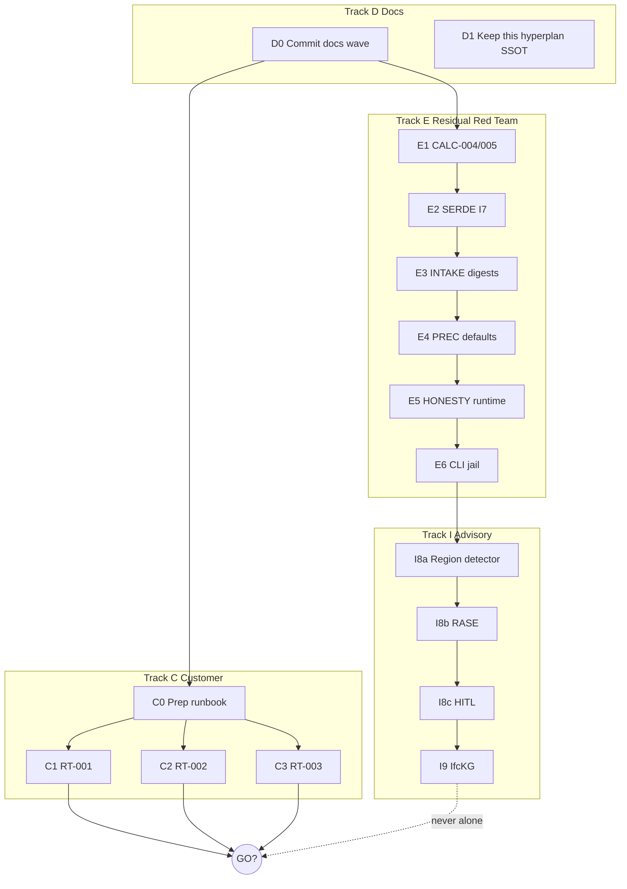

# Гиперглубокий план исполнения (post–I7)

**Checkpoint:** `NO_GO`  
**Operator posture:** act by default along this file; stop only for ESC-B (destructive), credentials, or customer NDA ambiguity.  
**Parent maps:** [`EXECUTION_PLAN_NEXT_2026_07.md`](EXECUTION_PLAN_NEXT_2026_07.md) · [`EXECUTION_PLAN_I8_I9_2026_07.md`](EXECUTION_PLAN_I8_I9_2026_07.md) · [`TARGET_HYBRID_ARCHITECTURE_TZ_2026.md`](TARGET_HYBRID_ARCHITECTURE_TZ_2026.md) §12

---

## 0. Thesis

AeroBIM already has deterministic sign-off seams (I0–I7). Remaining value splits into:

1. **Honesty polish (Track E)** — close PASS3 residual IDs that can greenwash or weaken gates **without** customer data.  
2. **Customer P0 (Track C)** — only path to GO (RT-001/002/003).  
3. **Advisory research (Track I)** — Blueprint/RASE/IfcLLM seams that stay MISSING/advisory.  
4. **Docs (Track D)** — keep SSOT wired; never claim GO from docs alone.

**Invariant:** DeterminismGate ≻ LLM; advisory never writes `summary.passed`; Claims Lock forbids >90% / MEP delivered / CDE-ready BCF until evidence.

---

## 1. Work graph



---

## 2. Track D — Docs

| Step | Action | Files | Done when |
|------|--------|-------|-----------|
| D0 | Commit/push pending docs (no zip) | architecture plans, README, Claims Lock, … | on `main` |
| D1 | This hyperplan + NEXT/I8/I9 cross-links | `EXECUTION_PLAN_HYPERDEEP_*`, README | linked from Tier 0 |

---

## 3. Track E — Residual Red Team (code-grounded)

### E1 — RT-CALC-004 / RT-CALC-005 (P1)

**Files**
- `backend/src/aerobim/infrastructure/adapters/spreadsheet_load_evidence_adapter.py`
- `backend/tests/test_consistency_ports.py` (extend)

**CALC-004 — non-dict JSON rows**
- Today: `if not isinstance(row, dict): continue` → silent drop; mixed arrays can still emit `AEROBIM-LOAD-OK`.
- Fix: emit `AEROBIM-LOAD-ROW` WARNING per bad index; **block** `LOAD-OK` if any malformed row (treat like mismatch set).
- Test: `loads: [{ok}, "bad", {ok}]` ⇒ no LOAD-OK; has LOAD-ROW.

**CALC-005 — text shadows path**
- Today: `text` preferred; `path` only if text empty.
- Fix: if `path` suffix is `.json` (case-insensitive), load path as SSOT for JSON verify; if both text and path present and disagree (normalized JSON or hash), emit `AEROBIM-LOAD-FORMAT` / conflict WARNING and do not OK from text alone.
- Minimal safe rule: **when path ends with `.json`, always read path**; if text also set and differs from path content, append FORMAT conflict and skip OK.
- Test: text tabular OK-looking + path JSON mismatch ⇒ not LOAD-OK from text.

### E2 — RT-SERDE (P1)

**Files**
- `backend/tests/test_filesystem_audit_store.py`
- Optionally harden reconstruct in `filesystem_audit_store.py` if non-dict blows up

**Fix:** `test_save_and_get_roundtrip_preserves_i7_fields` with non-empty:
- `divergences: (DivergenceRecord, …)`
- `advisory_ids_draft: IdsCompileDraft | …`
- `drawing_regions: (DrawingRegionRef, …)`

Assert field-level equality after save/get.

### E3 — RT-INTAKE-001 (P1)

**Files**
- `validate_customer_intake_gate.py`
- `tests/test_measure_adjudicator_agreement.py` / `test_i6_precision_intake.py`
- Schema note in `audit/evidence/customer-intake-gate.json` (gates stay false)

**Fix (fail-closed):**
- Evidence for `gate=true` must be object `{"path": str, "sha256": "<64 hex>"}` **or** legacy string **rejected** when gate true (prefer strict object-only for true gates).
- Resolve path relative to gate file / repo root; allowlist prefixes: `audit/evidence/`, `samples/customer/` (and optionally `docs/evidence/` for fixture digests).
- Verify sha256 of file bytes; reject missing/zero-size/non-file.
- String-only evidence → error when gate true.

**Compat:** all-false current fixture unchanged (no true gates → no digest checks).

### E4 — RT-PREC-001 (P2)

**Files**
- `evaluate_detection_precision.py`
- `tests/test_evaluate_detection_precision.py`, `test_i6_precision_intake.py`

**Fix:**
1. Empty class set: do **not** report macro F1=1.0; use `null` metrics + `empty_classes: true`; `--require-publishable` fails.
2. `--no-require-agreement` + `--require-publishable` → hard error (exit 2).
3. `--no-require-agreement` alone: stamp `debug_escape: true` + stderr warning.
4. Claims Lock / runbook already note customer packs need agreement — keep.

### E5 — RT-HONESTY-001 (P2)

**Files**
- `domain/system_capabilities.py` — add `enforce_honesty_capabilities(...)` raising domain error (not bare AssertionError for prod)
- `analyze_project_package.py` — call after `_build_capabilities`
- Keep `assert_*` as thin wrapper for tests

**Fix:** runtime fail-closed before save if honesty field illegally OK.

### E6 — RT-CLI-001 (P2)

**Files**
- `validate_customer_intake_gate.py` `main`
- `core/security/path_jail.py` (reuse)

**Fix:**
- Jail `--output` under repo `audit/` (or storage root) via `resolve_storage_path` / equivalent.
- Exit: `2` = validation errors; document NO_GO with exit `0` when ok∧all-false (intentional); optional warn on stderr.
- Tests for jail rejection outside audit/.

### E verification battery

```bash
cd backend
python -m ruff check src/aerobim/infrastructure/adapters/spreadsheet_load_evidence_adapter.py \
  src/aerobim/tools/validate_customer_intake_gate.py \
  src/aerobim/tools/evaluate_detection_precision.py \
  src/aerobim/domain/system_capabilities.py \
  src/aerobim/application/use_cases/analyze_project_package.py
python -m pytest tests/test_consistency_ports.py tests/test_filesystem_audit_store.py \
  tests/test_measure_adjudicator_agreement.py tests/test_i6_precision_intake.py \
  tests/test_evaluate_detection_precision.py tests/test_architecture_seams.py \
  tests/test_signoff_policy.py -q
```

**Track E done when:** PASS3 residual IDs (except RT-001/002/003) marked CLOSED/MITIGATED in a short delta note.

---

## 4. Track I — I8/I9 (after E, parallel with C wait)

See [`EXECUTION_PLAN_I8_I9_2026_07.md`](EXECUTION_PLAN_I8_I9_2026_07.md). Depth notes:

| Wave | Port/surface | Honesty | Atomic delivery |
|------|--------------|---------|-----------------|
| I8a | `DrawingRegionDetector` behind multimodal pipeline | `cv_human_level=MISSING` | port+adapter+token+wiring+tests |
| I8b | R/A/S/E on advisory issues | never → passed | schema + serializer |
| I8c | unmatched region → ReviewEvent | FE consumes regions | API + FE |
| I9 | `IfcKnowledgeGraphPort` | **advisory scaffold** only (not GraphRAG) | port+relational+stub fallback+KNOWN_BUGS |

Do **not** start I8a until E1–E2 landed (load/serde honesty baseline).

---

## 5. Track C — Customer P0 (GO gate)

| ID | Evidence artifact | Tooling already ready |
|----|-------------------|----------------------|
| RT-001 | labeled corpus + agreement.json + publishable precision | I6 tools + runbook |
| RT-002 | approved pack + approval_ref + hash | norm pack loader |
| RT-003 | federated IFC + real MepSystemGraphProvider | DI token present; Unconfigured today |

**GO:** RT-001 ∧ RT-002 ∧ RT-003 ∧ Claims Lock thaw for **specific** claims only ∧ Red Team Pass 4.

While waiting: dry-run C0 via intake runbook on fixtures only.

---

## 6. Session script (execute in order)

| # | Session | Track | Ship |
|---|---------|-------|------|
| **S0** | Write/link this hyperplan | D1 | docs |
| **S1** | Commit all pending docs | D0 | git |
| **S2** | E1 CALC-004/005 + tests | E | code |
| **S3** | E2 SERDE I7 | E | code |
| **S4** | E3 INTAKE digests | E | code |
| **S5** | E4 PREC + E5 HONESTY + E6 CLI | E | code |
| **S6** | Track E commit + PASS3 delta note | E | **done** `903a2ad` |
| **S7** | I8a region detector (heuristic priors) | I | in progress → ship |
| **S8+** | C when customer files arrive | C | evidence |

---

## 7. Non-goals / stop rules

- No GO / >90% / MEP delivered / CDE-ready BCF / customer SLA proved  
- No κ publish gate → 0.80 without customer protocol  
- No whole-sheet VLM product CV  
- No commit of `samples/customer/**` or scorecard zip  
- No `--no-verify` / force-push  

---

## 8. Evidence update on Track E close

Append to `audit/reports/RED_TEAM_DELTA_I0_I7_PASS3_2026_07_17.md` or new `..._TRACK_E_*.md`:
- CLOSED table for CALC-004/005, SERDE, INTAKE, PREC, HONESTY, CLI  
- RT-001/002/003 remain OPEN  
- SHA of remediation commit
