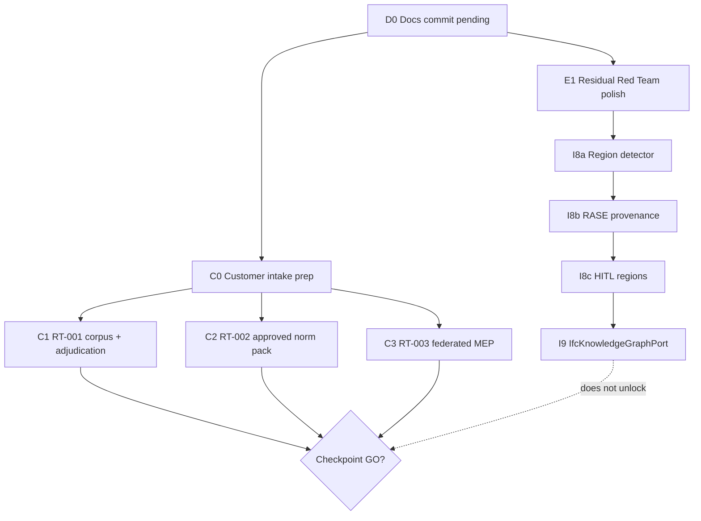

# План дальнейшей работы (post–I7)

**Вердикт чекпоинта:** `NO_GO`  
**Shipped:** I0–I7 + Red Team remediations (PASS1–3)  
**SSOT claims:** [`CLAIMS_LOCK_2026_07_17.md`](../../audit/reports/CLAIMS_LOCK_2026_07_17.md)  
**Blockers:** [`CRITICAL_BLOCKERS.md`](../../audit/reports/CRITICAL_BLOCKERS.md)  
**Гиперглубокий breakdown (исполнять по нему):** [`EXECUTION_PLAN_HYPERDEEP_2026_07.md`](EXECUTION_PLAN_HYPERDEEP_2026_07.md)

## 0. Принципы

| # | Правило |
|---|---------|
| 1 | Любая публичная точность / SLA / «нормы утверждены» / MEP delivered — только после RT-001/002/003 + evidence |
| 2 | DeterminismGate ≻ LLM/VLM; advisory никогда не пишет `summary.passed` |
| 3 | Параллельно: **Track C** (customer) и **Track E** (engineering honesty) не блокируют друг друга |
| 4 | I8–I9 улучшают advisory seams; **не** flip intake gates |
| 5 | Один atomic delivery на новый port (port + adapter + token + wiring + tests) |

## 1. Дорожная карта (порядок)



| Track | Цель | Зависит от клиента? | Разблокирует GO? |
|-------|------|---------------------|------------------|
| **D** Docs hygiene | Зафиксировать docs-волну I8/I9 links | Нет | Нет |
| **E** Residual honesty | Закрыть PASS3 open (кроме RT-001/002/003) | Нет | Нет |
| **C** Customer P0 | Corpus / norms / MEP | **Да** | **Да** (все три) |
| **I8–I9** Advisory | Blueprint / RASE / HITL / IfcLLM | Нет (stubs ok) | Нет |

---

## 2. Track D — Docs (сейчас)

- [ ] Commit + push docs-волны (I8/I9 plan, README 0.7.0, Claims Lock pointers) — **без** `samolet-techlab-scorecard-2026.zip`
- [ ] После merge: `docs/README` и TARGET §12 уже указывают на этот план

**Done when:** `EXECUTION_PLAN_I8_I9` + этот файл на `main`.

---

## 3. Track E — Residual Red Team (инженерный polish, 1–2 сессии)

Источник: PASS3 still-open (кроме RT-001/002/003).

| ID | Pri | Работа | Done when |
|----|-----|--------|-----------|
| **RT-CALC-004** | P1 | JSON load evidence non-dict → явный NOT_VERIFIED / FORMAT, не silent skip | тест + sign-off policy |
| **RT-CALC-005** | P1 | Text path не маскирует JSON path (порядок / приоритет источников) | тест dual-source |
| **RT-SERDE** | P1 | Roundtrip ValidationReport: divergences / IDS draft / drawing_regions | pytest serde |
| **RT-INTAKE-001** | P1 | Harden evidence digests / path strength в intake gate validator | validator + fixture |
| **RT-PREC-001** | P2 | Ужесточить defaults: publishable без agreement → fail; `--no-require-agreement` только explicit + logged | CLI + Claims Lock note |
| **RT-HONESTY-001** | P2 | Assert-пути только в tests / debug flag; prod path без assert-only gates | code audit |
| **RT-CLI-001** | P2 | CLI help / exit codes согласованы с capabilities honesty | smoke |

**Не делать в E:** flip `customer_intake_gate`, GO wording, κ gate → 0.80 без протокола заказчика.

**Verify:**

```bash
cd backend
python -m pytest tests/test_determinism_gate.py tests/test_signoff_policy.py tests/test_p0_remediation_fail_closed.py -q
python -m aerobim.tools.validate_customer_intake_gate
```

---

## 4. Track C — Customer P0 (блокирует GO)

Параллельно с E/I8, но **владелец = kickoff с Самолётом**.

### C0 — Prep (можно без файлов заказчика)

- [ ] Пройти [`docs/ops/intake-precision-runbook-2026.md`](../ops/intake-precision-runbook-2026.md) dry-run на fixture
- [ ] Подтвердить gitignore `samples/customer/**`
- [ ] Handoff: [`partners/SAMOLET_WHAT_WE_NEED_2026_07-ru.md`](../partners/SAMOLET_WHAT_WE_NEED_2026_07-ru.md)

### C1 — RT-001 Accuracy corpus

- [ ] NDA corpus → `samples/customer/` (не в git)
- [ ] Dual adjudicator labels + `measure_adjudicator_agreement` (κ/α)
- [ ] `evaluate_detection_precision --require-publishable`
- [ ] Обновить intake gate **только** с evidence digests

**Done when:** `PrecisionClaim.publishable` на customer + Claims Lock amendment для любых публичных %.

### C2 — RT-002 Approved norm pack

- [ ] Pack `status: approved` + `approval.*` + hash
- [ ] Analyze с real pack; capability FAILED/OK честно
- [ ] Intake gate cell для norms

### C3 — RT-003 Federated MEP

- [ ] Federated IFC (архитектура + MEP)
- [ ] Real `MepSystemGraphProvider` (не Unconfigured)
- [ ] Clearance / system matrix; capability `mep_system_clash` только с evidence
- [ ] Gap doc update: [`roadmap/MEP_SYSTEM_CLASH_GAP_2026_07.md`](../roadmap/MEP_SYSTEM_CLASH_GAP_2026_07.md)

**GO gate:** RT-001 ∧ RT-002 ∧ RT-003 closed + Red Team re-audit + Claims Lock thaw for specific claims only.

---

## 5. Track I — Research waves (advisory)

Канонический checklist: [`EXECUTION_PLAN_I8_I9_2026_07.md`](EXECUTION_PLAN_I8_I9_2026_07.md) · map: [`RESEARCH_ALIGNMENT_AEC_AI_2025_2026_07.md`](RESEARCH_ALIGNMENT_AEC_AI_2025_2026_07.md)

| Wave | Pri | Когда стартовать | Заметка |
|------|-----|------------------|---------|
| **I8a** Region detector | P1 | После E1 или параллельно с C0 | `cv_human_level=MISSING` |
| **I8b** RASE provenance | P1 | После/с I8a | никогда → `passed` |
| **I8c** HITL regions | P2 | После I8a + FE types | triage queue |
| **I9** IfcKnowledgeGraphPort | P2 | После I8b или отдельной сессией | Atomic Delivery + stub ok |

Опционально (TARGET §12): fixture-only nDCG для priority ranking — **не** product KPI.

---

## 6. Рекомендуемая последовательность сессий

| # | Сессия | Track | Outcome |
|---|--------|-------|---------|
| 1 | Docs commit/push | D | docs на main |
| 2 | CALC-004/005 + SERDE | E | меньше greenwash / drift |
| 3 | INTAKE harden + PREC defaults | E | честнее publish path |
| 4 | I8a region detector (stub→real) | I | Blueprint seam |
| 5 | I8b RASE tags | I | ACC provenance |
| 6 | Customer kickoff + C1/C2 intake | C | evidence или явный wait |
| 7 | I8c + I9 (по ёмкости) | I | HITL + KG query |
| 8 | C3 MEP когда есть federated IFC | C | RT-003 path |
| 9 | Hostile Red Team Pass 4 | E/C | GO только если C закрыт |

---

## 7. Explicit non-goals (до evidence)

- GO / production-ready / CDE-ready BCF / customer SLA proved  
- «>90%» / product accuracy  
- MEP delivered / DWG=DXF product claim  
- Whole-sheet GPT-4V as CV  
- Raw IFC в LLM context  
- κ publish gate → 0.80 без протокола заказчика  

---

## 8. Связанные документы

| Doc | Role |
|-----|------|
| [`TARGET_HYBRID_ARCHITECTURE_TZ_2026.md`](TARGET_HYBRID_ARCHITECTURE_TZ_2026.md) §8 / §12 | Architecture roadmap |
| [`EXECUTION_PLAN_I8_I9_2026_07.md`](EXECUTION_PLAN_I8_I9_2026_07.md) | I8–I9 checklist |
| [`RED_TEAM_DELTA_I0_I7_PASS3_2026_07_17.md`](../../audit/reports/RED_TEAM_DELTA_I0_I7_PASS3_2026_07_17.md) | Open residual IDs |
| [`intake-precision-runbook-2026.md`](../ops/intake-precision-runbook-2026.md) | Когда приедет корпус |
| [`INDUSTRY_IMPROVEMENT_PLAN_2026_07.md`](../INDUSTRY_IMPROVEMENT_PLAN_2026_07.md) | Industry W0–W3 context |
