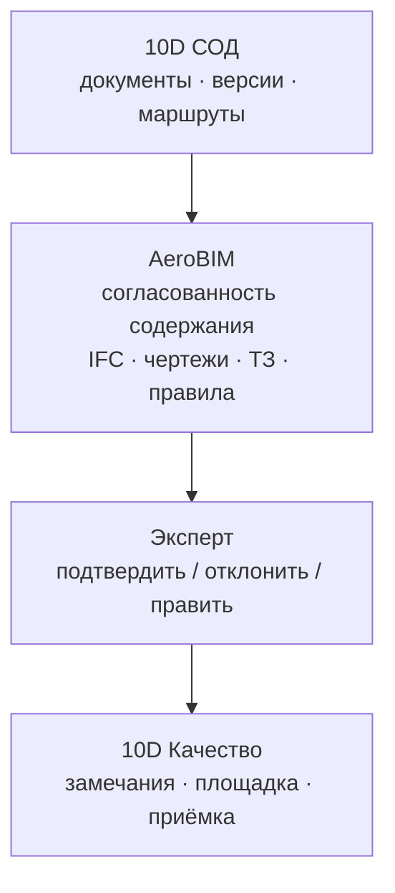

# 1. Место AeroBIM в контуре Самолёта

```mermaid
flowchart TB
  SOD["10D СОД\nдокументы · версии · маршруты"]
  AB["AeroBIM\nсогласованность содержания\nIFC · чертежи · ТЗ · правила"]
  EXP["Эксперт\nподтвердить / отклонить / править"]
  QUAL["10D Качество\nзамечания · площадка · приёмка"]
  SOD --> AB --> EXP --> QUAL
```

AeroBIM **не** заменяет СОД и **не** авторизует Shared→Published.
