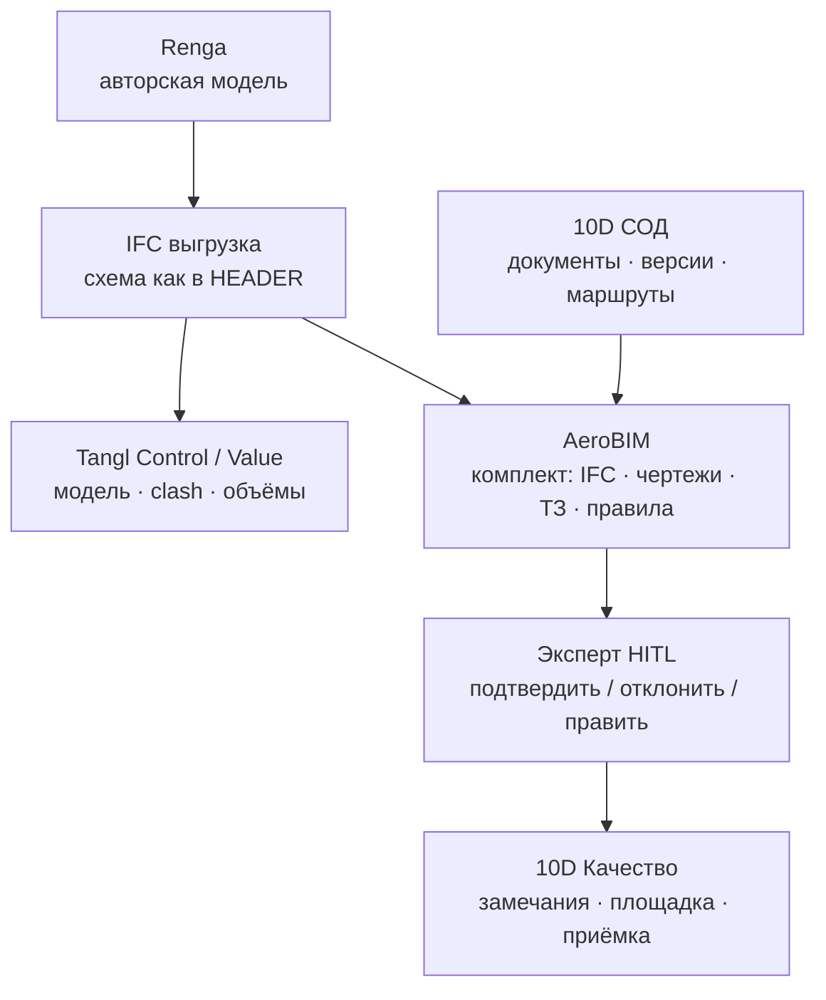

# 1. Место AeroBIM в контуре Самолёта

```mermaid
flowchart TB
  RENGA["Renga\nавторская модель"]
  IFC["IFC выгрузка\nсхема как в HEADER"]
  TANGL["Tangl Control / Value\nмодель · clash · объёмы"]
  SOD["10D СОД\nдокументы · версии · маршруты"]
  AB["AeroBIM\nкомплект: IFC · чертежи · ТЗ · правила"]
  EXP["Эксперт HITL\nподтвердить / отклонить / править"]
  QUAL["10D Качество\nзамечания · площадка · приёмка"]
  RENGA --> IFC
  IFC --> TANGL
  IFC --> AB
  SOD --> AB
  AB --> EXP --> QUAL
```

AeroBIM **не** заменяет Renga, Tangl, 10D СОД и **не** авторизует Shared→Published.
Tangl проверяет **модель**; AeroBIM — **комплект**.
