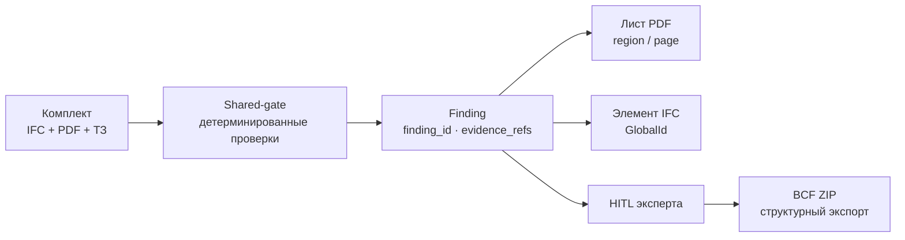

# 2. Путь находки: замечание → лист PDF → GUID в IFC

```mermaid
flowchart LR
  PKG["Комплект\nIFC + PDF + ТЗ"]
  GATE["Shared-gate\nдетерминированные проверки"]
  F["Finding\nfinding_id · evidence_refs"]
  PDF["Лист PDF\nregion / page"]
  IFC["Элемент IFC\nGlobalId"]
  HITL["HITL эксперта"]
  BCF["BCF ZIP\nструктурный экспорт"]
  PKG --> GATE --> F
  F --> PDF
  F --> IFC
  F --> HITL --> BCF
```

Без `finding_id` / `evidence_refs` отчёт не персистится (provenance contract).
