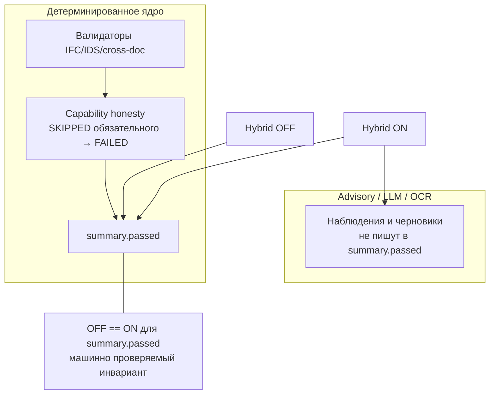

# 3. Fail-closed и инвариант OFF==ON

```mermaid
flowchart TB
  subgraph det [Детерминированное ядро]
    V["Валидаторы IFC/IDS/cross-doc"]
    C["Capability honesty\nSKIPPED обязательного → FAILED"]
    P["summary.passed"]
    V --> C --> P
  end
  subgraph adv [Advisory / LLM / OCR]
    A["Наблюдения и черновики\nне пишут в summary.passed"]
  end
  OFF["Hybrid OFF"]
  ON["Hybrid ON"]
  OFF --> P
  ON --> A
  ON --> P
  note["OFF == ON для summary.passed\nмашинно проверяемый инвариант"]
  P --- note
```

Вердикт Shared-gate не подменяется нейросетью. Пропуск обязательной проверки не даёт «зелёный» отчёт.
