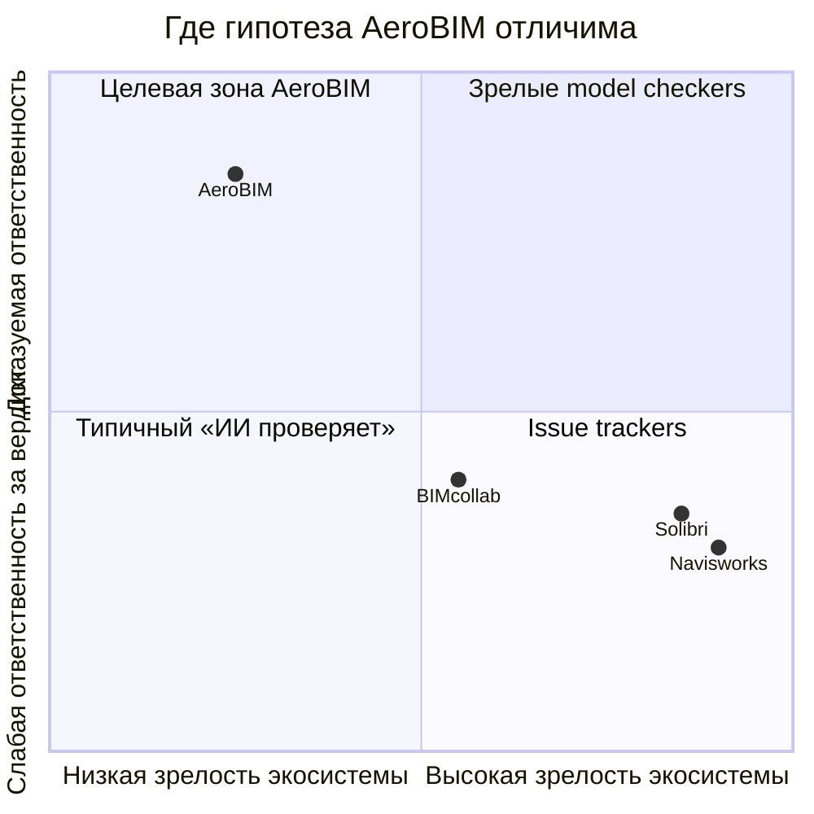

# 4. Конкурентные оси (сжатая матрица)

Полная таблица: [`../COMPETITIVE_MATRIX_2026_08.md`](../COMPETITIVE_MATRIX_2026_08.md).

Честные уступки: зрелость model checking и доля рынка — у зарубежных продуктов выше. Отличие AeroBIM — связка cross-doc + provenance + fail-closed + OFF==ON.
