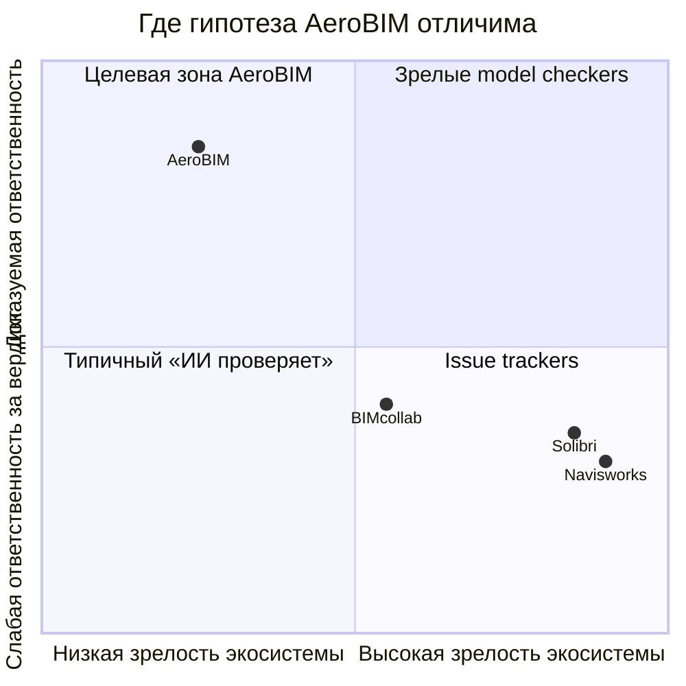

# 4. Конкурентные оси (сжатая матрица)

Полная таблица: [`../COMPETITIVE_MATRIX_2026_08.md`](04-competitive-matrix.md).

Честные уступки: зрелость model checking и доля рынка — у зарубежных продуктов выше. У Самолёта главный сосед — **Tangl + 10D**, не Solibri. Отличие AeroBIM — связка cross-doc + provenance + fail-closed + OFF==ON.

**Формула 28.08 (вечер):** не «платформа автоматизированной верификации», а **движок инженерной сверки с протоколом измерения**, встраиваемый в контур заказчика через импорт/экспорт файлов (п. 2.2.2 это разрешает). Заказчик сам продаёт СОД и BIM-данные другим застройщикам — дубли его платформы либо купят как компонент, либо закроют как конкурента. Три зоны, куда не зашли ни его платформа, ни вендор BIM-данных: сверка РД с расчётными записками (п. 2.1.1), замечание со ссылкой на норму/**СТО** (п. 2.1.5), неэффективные площади и мёртвые зоны в МОП (п. 2.1.4). Главный аргумент встречи — **измеримость** (протокол, два разметчика, κ/α), не заявленная точность.

**Уточнение 2026-08-28 (адрес ссылки подтвердил 10D как СОД заказчика):** у вендора есть собственный checker моделей (полнота атрибутов по ТЗ/EIR поверх RVT/DWG/IFC) и реестр замечаний с фильтрами и приоритетами. Готовый ответ «чем вы отличаетесь»: их контур проверяет **заполненность атрибутов модели**; AeroBIM проверяет **содержательные нормы по документации** (включая сканы) и сверяет расчётные документы с источниками — разные входы, разные классы ошибок. Позиционирование: замечания пишем **в реестр 10D** (публичный Swagger API, демо-лицензия разработчика), а не выкатываем свою панель как замену. Сравнение версий документации наложением у заказчика уже есть — не продавать как главную фичу. Городской «цифровой нормоконтроль» проверяет **оформление** по нацстандарту (состав, штампы); наша задача — сверка по существу. Это разные области; формулировать самим, не дожидаясь вопроса жюри.
