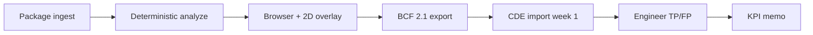

# Samolet × TechLab × AeroBIM — Academic Alignment (May 2026)

Single traceability document mapping **customer requirements** ([i.moscow/techlab/samolet](https://i.moscow/techlab/samolet), task **#07**) to **AeroBIM capabilities**, **openBIM standards**, and **pilot evidence**. Use with [`REPRODUCIBILITY-2026.md`](REPRODUCIBILITY-2026.md) and [`pilot-claim-boundary-2026.md`](pilot-claim-boundary-2026.md).

## 1. Customer mandate (plain language)

**Samolet** (via Moscow Innovation Cluster **TechLab**) requests a **reviewer-assist MVP** that:

1. Ingests **2D drawings**, **BIM models**, **technical specifications**, and **calculations**.
2. Cross-checks them against each other and **normative / project rules**.
3. Finds **clashes**, calculation errors, dimensional/area mismatches, logic gaps, and **missing elements**.
4. **Highlights** problem zones and **prioritizes** remarks for designers.
5. Produces **reports** suitable for coordination workflows.
6. Targets **≤ 30 minutes** analysis time on an **agreed document package** (not arbitrary production scale).
7. Keeps the **human expert in the loop** — automation reduces manual volume, not accountability.

**Program context:** applied AI track; applications until **2026-06-08**; paid pilot testing fund **2 000 000 ₽** (per task page); demo day autumn 2026.

## 2. World practice anchor (May 2026)

| Layer | Standard / practice | AeroBIM use |
|---|---|---|
| Model substrate | IFC2x3/4/4x3 ([`ifc-compatibility-matrix.md`](ifc-compatibility-matrix.md)) | IfcOpenShell validation kernel |
| Exchange requirements | **IDS 1.0** (buildingSMART final, 2024) | IfcTester + project IDS packs |
| Issue handoff | **BCF 2.1** (default), **BCF 3.0** (opt-in) | ZIP export + CDE week-1 import |
| Information management | **ISO 19650-1/-2** (lite: stage, revision, container) | Report/API optional fields — not full CDE |
| Quantities | ISO 12006-3 ε-band tolerance algebra | Cross-doc SI-normalised compare |
| Research software | FAIR + CODE ([`REPRODUCIBILITY-2026.md`](REPRODUCIBILITY-2026.md)) | Tag `pilot-2026-pre`, frozen corpus, CI gates |
| Academic evaluation | Precision/recall on extraction; ablation A0–A3 | RU ground truth; macro F1 ≈ 0.86 |
| Industry analogs | Solibri / Navisworks (rule+clash); open validators | Bounded claim: open pilot path, not global superiority |

**Explicit non-goals for Samolet claims:** full SP/GOST corpus automation; autonomous sign-off; universal 30-minute SLA without measured corpus.

## 3. Requirements traceability matrix

| # | Samolet requirement (task page) | AeroBIM module / artifact | Status | Evidence / limit |
|---|---|---|---|---|
| R1 | 2D drawings | Drawing evidence adapter, PDF/OCR baseline, 2D overlay UI | ✅ fixture | Vision-heavy path = planned, not pilot sign-off |
| R2 | BIM models | IFC + IDS validators | ✅ | `pytest`, benchmark packs |
| R3 | TZ + calculations | Narrative + structured requirements, cross-doc | ✅ | F1 gate ≥ 0.70 |
| R4 | Match docs + norms | IDS + rules files + cross-document engine | ✅ partial | Norms = agreed rule sets, not all codes |
| R5 | Collisions / clashes | Cross-doc `ConflictKind`; optional IfcClash extra | ✅ / opt-in | Clarify 3D clash vs doc contradiction with customer |
| R6 | Calculation / dimension / area errors | Quantity algebra + cross-doc | ✅ | Pilot pack informational 0 cross-doc on fixture |
| R7 | Logic / missing elements | IDS + requirement operators (`exists`, bounds) | ✅ | |
| R8 | Highlight problem zones | `problem_zone`, drawing overlay | ✅ | `run_live_review_smoke` |
| R9 | Prioritize remarks | `compute_issue_priority`, Samolet profile (`AEROBIM_PRIORITY_PROFILE=samolet`) | ✅ | [`domain/review_priority.py`](../backend/src/aerobim/domain/review_priority.py) |
| R10 | Designer comments | `TemplateRemarkGenerator` + BCF description | ✅ enhanced | Russian template strings |
| R11 | Faster review | SLA tool + pilot KPI protocol | 🚧 measure | [`measure_package_sla`](../backend/src/aerobim/tools/measure_package_sla.py) |
| R12 | Expert remains accountable | Claim boundary + adjudication KPI | ✅ | TP/FP by customer engineer |
| R13 | MVP + visualization + reports | API + HTML + JSON + BCF + browser shell | ✅ | |
| R14 | Typical error catalog | [`samolet-typical-errors-catalog.json`](../samples/benchmarks/samolet-typical-errors-catalog.json) | ✅ scaffold | Populate with Samolet corpus in intake |
| R15 | ≤ 30 min package SLA | Benchmark rail on agreed pack | 🚧 | Must run on **customer** package for contract |

## 4. Recommended pilot scope (repeatable scenario)

Aligns with internal dossier and [`pilot-kpi-protocol-2026.md`](pilot-kpi-protocol-2026.md):



1. **One** building typology (e.g. residential section).
2. **One** agreed corpus (IFC + IDS + TZ + calc + drawings).
3. **One** typical-error list (catalog JSON + customer additions).
4. **One** BCF/CDE toolchain (version 2.1 default).
5. **Measured** SLA on that corpus only.

Default benchmark pack: [`project-package-pilot-moscow-v1.json`](../samples/benchmarks/project-package-pilot-moscow-v1.json).

## 5. KPI and SLA protocol (Samolet-specific)

| Metric | Definition | Samolet page target | AeroBIM measurement |
|---|---|---|---|
| Package SLA | Wall-clock analyze on agreed pack | ≤ 30 min | `python -m aerobim.tools.measure_package_sla --max-minutes 30` |
| Time-to-first finding | Ingest → first actionable issue | Lower than manual | Logs + report timestamps |
| Confirmed findings rate | Engineer TP / (TP+FP) | Not specified | ≥ 60% hypothesis in KPI protocol |
| Traceability | GUID + source_id + problem_zone | Implied | Export audit |
| Noise control | FP rate by discipline | Qualitative | Weekly log + severity policy |

## 6. Operations commands

```powershell
cd AeroBIM\backend
.\.venv-pilot\Scripts\pip install -e ".[dev,vision]"

# Samolet priority profile (fire/structure/cross-doc boost)
$env:AEROBIM_PRIORITY_PROFILE = "samolet"

.\.venv-pilot\Scripts\python.exe -m aerobim.tools.measure_package_sla `
  --pack ..\samples\benchmarks\project-package-pilot-moscow-v1.json `
  --max-minutes 30 --output ..\docs\evidence\samolet-sla-pilot-moscow-2026-05-21.json

.\.venv-pilot\Scripts\python.exe -m aerobim.tools.summarize_conflict_breakdown `
  --pack samples/benchmarks/project-package-pilot-moscow-v1.json
```

## 7. Academic deliverables map

| Deliverable | Document / artifact |
|---|---|
| Methods | [`manuscript-draft-2026.md`](manuscript-draft-2026.md), ablation JSON |
| Limits | This doc §2 non-goals + claim boundary |
| Data availability | [`REPRODUCIBILITY-2026.md`](REPRODUCIBILITY-2026.md) |
| Case study | [`pilot-case-study-report-2026.md`](pilot-case-study-report-2026.md) (KPI TBD) |
| TechLab application | [`partners/TECHLAB_SAMOLET_APPLICATION_2026.md`](partners/TECHLAB_SAMOLET_APPLICATION_2026.md) |

## Clash policy (Samolet R5)

| Term in task page | AeroBIM meaning | Default pilot |
|-------------------|-----------------|---------------|
| Collisions (geometry; RU: «коллизии») | IfcClash / 3D interference | Opt-in `.[clash]` extra — enable if customer confirms |
| Logical discrepancies (RU: «логические расхождения») | `CROSS_DOCUMENT` + `ConflictKind` | Core sign-off path |
| Area / dimension mismatches (RU: «расхождения размеров/площадей») | Quantity algebra + cross-doc | Core |

**Week 1 action:** record customer interpretation in [`pilot-case-study-report-2026.md`](pilot-case-study-report-2026.md) and [`pilot-cde-handoff-2026.md`](pilot-cde-handoff-2026.md).

## 8. Gap backlog (post-alignment)

| ID | Gap | Owner | Target |
|---|---|---|---|
| S-01 | Customer document corpus + NDA | Samolet + pilot lead | Week 1 intake |
| S-02 | CDE BCF import proof | Joint | Week 1 |
| S-03 | SLA sign-off on production-sized pack | Joint | After corpus frozen |
| S-04 | Typical errors filled from Samolet QA history | Customer | Iteration 2 |
| S-05 | Discipline-specific norm packs (MEP full IFC) | AeroBIM | Post-pilot |

## 9. Citation

When citing results for Samolet / TechLab, use frozen tag **`pilot-2026-pre`** for metrics and note Samolet-specific SLA runs separately in evidence filenames (`samolet-sla-*.json`).
